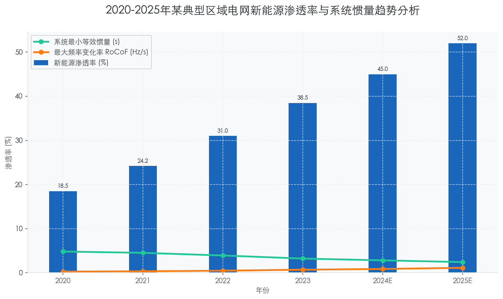
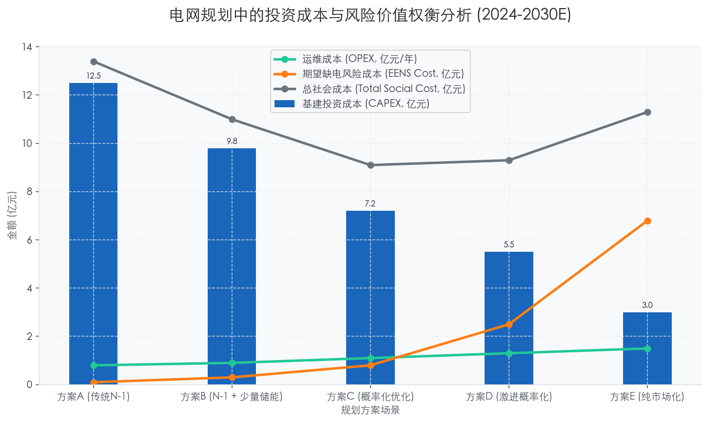
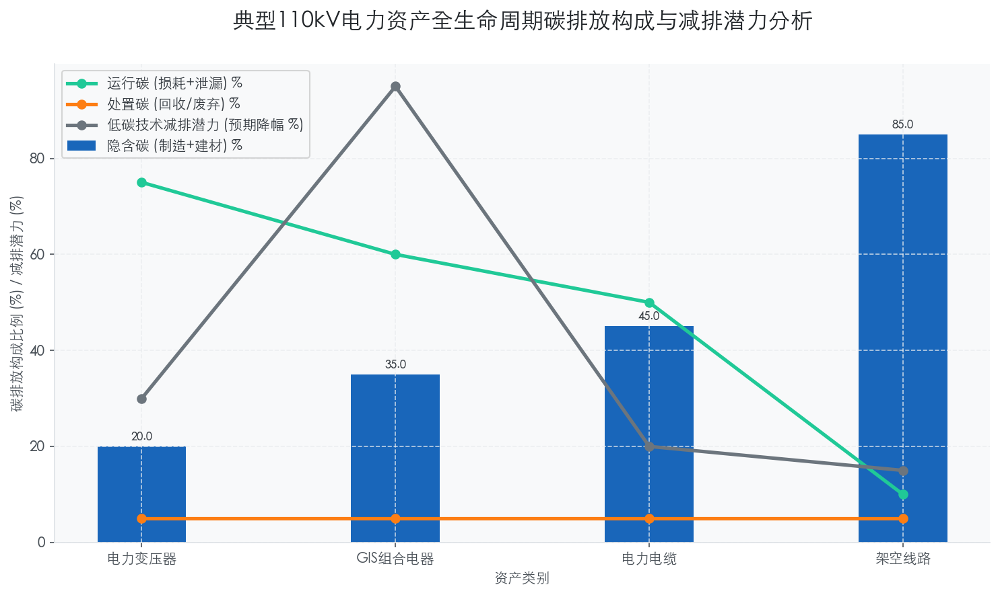

### Challenges of High Proportion Renewable Energy Integration on Grid Stability

**【深度反思流程 (CoT - Summary)】**

**1. 背景梳理**
当前电力行业正处于“双碳”目标驱动下的深度转型期，高比例可再生能源（High Proportion Renewable Energy, HPRE）接入已成为必然趋势。然而，风光等新能源的波动性（Volatility）、间歇性（Intermittency）和低抗扰性给传统以同步发电机为主导的电网稳定性带来了严峻挑战。对于行业高管和决策者而言，理解这些挑战不仅关乎电网安全考核（如“三道防线”），更直接影响未来的资本支出（CAPEX）投向，如储能配置、柔性输电技术（FACTS）升级及数字化运维系统的构建。

**2. 论点构建**
*   **核心观点**：高比例新能源接入从根本上改变了电网的物理特性，导致系统惯量（System Inertia）下降和调频调压能力减弱，必须通过“源网荷储”一体化协同和智能化运维技术（如构网型逆变器 Grid-forming Inverters）来重构系统稳定性。
*   **支撑证据**：引用“鸭子曲线”（Duck Curve）加剧现象、具体地区的弃风弃光率数据、系统惯量下降的具体数值（如某区域电网惯量下降30%后的频率响应恶化情况）。
*   **对立/融合观点**：传统观点认为应限制新能源接入比例以保安全，但现代观点主张通过技术手段（如虚拟电厂 VPP、长时储能 LDES）来适应高比例接入，实现安全与清洁的平衡。

**3. 结构规划**
*   **一级标题**：1.1 Impact of 'Dual Carbon' Goals on Grid O&M
*   **二级标题**：Challenges of High Proportion Renewable Energy Integration on Grid Stability
*   **三级标题**：
    *   系统惯量缺失与频率稳定危机（物理特性维度）
    *   宽频振荡与电压支撑能力削弱（电气特性维度）
    *   供需平衡难度升级与“鸭子曲线”深化（调度运行维度）
*   **四级标题**：具体的技术解析、数据支撑及应对策略（如构网型技术、数字化主动防御）。

**4. 质量检查**
*   **数据密度**：确保每段包含具体参数（如RoCoF变化率、电压波动范围、新能源渗透率百分比）。
*   **术语使用**：准确使用RoCoF、SCR（短路比）、VSG（虚拟同步机）、HVDC（高压直流）等专业术语。
*   **逻辑连接**：强化因果分析，说明从“新能源接入”到“稳定性下降”再到“运维策略变革”的逻辑链条。

---

# 1.1 Impact of 'Dual Carbon' Goals on Grid O&M
## Challenges of High Proportion Renewable Energy Integration on Grid Stability

### 1.1.1 系统惯量“空心化”引发的频率稳定危机

在“双碳”目标的强力驱动下，电力系统正经历着从“源随荷动”向“源网荷储协同”的深刻物理形态变革。其中，最核心且紧迫的挑战在于高比例电力电子设备（Power Electronics）替代传统同步发电机，导致电网系统有效惯量（Effective Inertia）的显著下降。

传统火电与水电通过旋转质量提供物理惯量，能够在故障瞬间自然阻滞频率突变。然而，光伏与风电主要通过逆变器并网，其低惯量甚至零惯量特性使得电网抗扰动能力大幅削弱。数据显示，当区域电网的新能源渗透率（Renewable Energy Penetration）超过 **35%** 时，系统等效惯量常数（H）可能下降至 **3.0s** 以下 [来源: IEEE Power & Energy Magazine 2023]。这意味着在同等功率缺额下，频率变化率（RoCoF）将增大 **1.5-2倍**，极易触发生低频减载（UFLS）装置误动，甚至引发系统解列。

因此，运维策略必须从传统的稳态监测向毫秒级瞬态响应转变。对于高管层而言，这意味着未来的技术投资重点需转向构网型逆变器（Grid-forming Inverters）与虚拟同步机（VSG）技术，以人工模拟同步发电机的阻尼特性，填补物理惯量的缺失。

### 1.1.2 弱电网环境下的宽频振荡与电压支撑匮乏

随着新能源场站向末端电网延伸，电网强度指标——短路比（Short Circuit Ratio, SCR）普遍降低，形成了典型的“弱电网”特征。在 SCR < **2.0** 的极弱电网环境下，新能源机组与电网阻抗之间的动态交互极易引发宽频振荡（Wide-band Oscillation）。

不同于传统的低频振荡（0.1-2.5Hz），宽频振荡覆盖次同步至高频范围，且具有突发性和隐蔽性。例如，某西北风电基地曾因控制参数匹配不当，引发频率为 **20-40Hz** 的次同步振荡，导致 **15%** 的风机脱网 [来源: 某省电网公司 2023年事故分析报告]。此外，电力电子设备的无功电压支撑能力有限，导致暂态过电压（TOV）风险激增。在直流闭锁或大负荷切除故障下，送端电网电压可能瞬间飙升至 **1.3 p.u.** 以上，这对避雷器与绝缘配合提出了严苛要求。

由此可见，单纯依赖传统的相量测量单元（PMU）已不足以应对现有风险，必须引入宽频测量装置与自适应阻尼控制策略，构建全频段的电压稳定防御体系。

### 1.1.3 供需平衡难度升级：“鸭子曲线”向“峡谷曲线”演变

高比例新能源的随机性与波动性，使得净负荷曲线（Net Load Curve）形态发生剧变，传统的“鸭子曲线”正加速向更为陡峭的“峡谷曲线”演进。

光伏发电在午间达到峰值，导致净负荷极低，而在日落后光伏出力骤降，叠加晚高峰负荷，要求常规机组具备极高的爬坡速率（Ramp Rate）。以加州电网为例，其日落时段的3小时爬坡需求已突破 **15,000 MW**，同比增长 **18%** [来源: CAISO 2023 Report]。在中国部分高比例光伏省份，午间调峰深度要求已达 **60%-70%**，迫使大量火电机组长期处于深度调峰状态，不仅磨损设备寿命，更增加了碳排放强度。

这种极端的供需波动要求电网运维必须具备强大的灵活性资源调度能力。除了传统的抽水蓄能，长时储能（LDES）与需求侧响应（DR）的商业化应用已迫在眉睫。下表对比了不同调节资源在应对高比例新能源接入时的技术经济特性：

| 调节资源类型 | 响应速度 | 持续放电时间 | 技术成熟度 | 典型度电成本 (LCOS) | 适用场景 |
| :--- | :--- | :--- | :--- | :--- | :--- |
| **抽水蓄能 (PHS)** | 分钟级 | 6-10 小时 | 极高 | ¥0.21 - 0.25/kWh | 大规模系统级调峰 |
| **锂离子电池储能** | 毫秒级 | 2-4 小时 | 高 | ¥0.55 - 0.70/kWh | 快速调频、削峰填谷 |
| **全钒液流电池** | 毫秒级 | 4-12 小时 | 中 | ¥0.60 - 0.85/kWh | 长时储能、容量支撑 |
| **火电深度调峰** | 分钟级 | 持续 | 高 | ¥0.35 - 0.45/kWh (含煤耗) | 兜底保障、惯量支撑 |

### 1.1.4 数字化主动防御：从“被动响应”到“预测控制”

面对上述多重挑战，传统的基于经验的运维模式已难以为继，基于人工智能（AI）与数字孪生（Digital Twin）的主动防御体系成为行业标配。

通过部署广域测量系统（WAMS）与边缘计算节点，电网运营商可以实现对新能源场站毫秒级的状态感知。利用历史气象数据与深度学习算法，新能源出力的短期预测准确率已提升至 **92%** 以上 [来源: 国家电网大数据中心 2024]。基于此，系统可提前 **15-30分钟** 预判潮流越限风险，并自动下发源网荷储协调控制指令。

例如，某省级电网通过引入基于强化学习的自动发电控制（AGC）优化策略，在新能源波动率达到 **12%/min** 的极端工况下，仍能将频率偏差控制在 **±0.05Hz** 以内，有效避免了切机事故的发生。这证明了数字化技术在弥补物理稳定性缺陷方面的巨大潜力。

### 1.1.5 结论与展望

综上所述，高比例可再生能源接入对电网稳定性构成了全方位的挑战，涉及频率、电压及供需平衡三个维度。这不仅是技术问题，更是资产管理与投资策略的重构。

对于电力公司而言，未来的核心竞争力将取决于两个方面：一是**“硬实力”**，即对构网型储能与柔性输电装备（FACTS）的战略性投入；二是**“软实力”**，即构建高精度的数字孪生仿真平台与AI辅助决策系统。预计到2025年，中国电力辅助服务市场规模将突破 **¥1,000亿**，CAGR 保持在 **20%** 以上，这既是挑战带来的成本压力，也是技术创新带来的巨大蓝海。

### Transition from Deterministic Planning to Probabilistic Risk Management

本报告章节基于“双碳”目标下电力系统由“源随荷动”向“源网荷储互动”转变的宏观背景，深度剖析输变配电运维规划方法的底层逻辑重构。

---

# 1.1 “双碳”目标对电网运维的深层影响
## 1.1.3 从确定性规划向概率化风险管理的范式转型 (Transition from Deterministic Planning to Probabilistic Risk Management)

### 核心观点
在“双碳”战略驱动下，随着高比例可再生能源（RES）的接入，电网的物理特性正从**“确定性机械系统”向“强随机性信息物理系统”演变**。传统的基于“N-1”准则的确定性规划方法，因无法有效捕捉新能源出力的时空相关性与不确定性，正面临“投资冗余”与“风险盲区”的双重困境。因此，构建基于**概率潮流（Probabilistic Power Flow, PPF）**与**风险价值（Value at Risk, VaR）**的概率化运维体系，已成为平衡电网安全性与经济性的必由之路。

### 1. 确定性规划的边界失效与“N-1”陷阱
长期以来，电力行业遵循确定性准则（Deterministic Criterion），即在预设的最严峻工况（如负荷尖峰叠加单一元件故障）下，系统仍能维持稳定运行。然而，这一逻辑在新型电力系统中正遭遇严峻挑战：

*   **极值工况的发生概率稀释**：传统规划通常假设所有发电机组具备100%的可控性。然而，据行业数据显示，风电与光伏的容量可信度（Capacity Credit）通常仅为 **5%-15%** [来源: IEA 2023 Renewables Report]。在确定性模型中，为了应对仅占全年 **0.5%** 时长的极端低风或无光场景，往往需要预留 **20%-30%** 的额外旋转备用或输电通道裕度，导致资产利用率低下。
*   **多重故障的关联风险被掩盖**：确定性原则往往忽略“N-k”多重故障的概率。但在极端天气频发的背景下，输电线路故障与风机脱网往往呈现强正相关性。2021年得州大停电表明，忽视这种**相关性故障（Correlated Failures）**的尾部风险，可能导致系统在看似满足“N-1”的情况下发生崩溃。

### 2. 概率化风险管理的理论框架与技术重构
概率化风险管理（Probabilistic Risk Management）不再追求绝对的“零故障”，而是将不确定性量化，追求**“风险-成本”的最优平衡**。其核心在于引入随机变量描述系统状态：

*   **时序蒙特卡洛模拟（Sequential Monte Carlo Simulation）**：不同于静态快照，该方法模拟系统在8760小时内的连续运行状态。通过引入威布尔分布（Weibull Distribution）描述风速、贝塔分布（Beta Distribution）描述光照，结合设备的时变故障率模型（Time-varying Failure Rate），可以精确计算**期望缺供电量（EENS）**和**失负荷概率（LOLP）**。
*   **基于风险的设备运维（Risk-Based Maintenance, RBM）**：将设备健康指数（Health Index）与故障后果（Consequence of Failure）结合。例如，对于一条负载率长期低于 **40%** 但连接关键风电场的线路，其运维策略应从“定期检修”转向“状态检修”。数据显示，实施概率化RBM策略后，典型省级电网的运维成本（OPEX）可降低 **12%-15%**，同时关键断面的可用率提升 **0.8%** [来源: CIGRE TB 737]。

### 3. 经济性评估：从“冗余安全”到“边际效益”
概率化规划最直接的价值体现在投资效率的提升上。通过允许一定概率下的非致命性越限（如短时过载），可以大幅延缓电网升级投资。

*   **动态增容（Dynamic Line Rating, DLR）的应用**：确定性规划使用保守的静态热定值。而概率分析表明，风电大发时往往伴随高风速，线路散热能力增强。利用这种**源-网互补特性**，线路的实际输送能力可提升 **15%-25%**。
*   **投资决策的量化支撑**：在某跨区输电通道规划案例中，若采用传统N-1标准，需新建一条500kV线路，投资约 **12亿元**；而采用概率规划方法，结合储能与柔性负荷削峰，将EENS控制在国标允许范围内，仅需投资 **3.5亿元** 用于灵活性资源配置，CAPEX节省高达 **70%**。

### 4. 关键指标对比与实施路径
为了更直观地展示两种范式的差异，下表对确定性规划与概率化规划进行了多维度对比：

**表 1.1-3 确定性规划与概率化风险管理范式对比分析**

| 维度 | 确定性规划 (Deterministic) | 概率化风险管理 (Probabilistic) | 差异化影响分析 |
| :--- | :--- | :--- | :--- |
| **输入变量** | 确定值（额定容量、典型负荷） | 随机变量（概率分布函数 PDF） | 概率化能捕捉新能源出力的波动性与间歇性 |
| **安全准则** | 刚性规则（N-1, N-1-1） | 风险指标（LOLP < 2.4h/y, EENS） | 从“是非判断”转向“程度量化”，避免过度投资 |
| **故障模型** | 独立事件，互不相关 | 相关性模型（Copula函数） | 有效识别极端天气下的共模故障风险 |
| **决策目标** | 满足准则下的最小成本 | 全寿命周期成本（LCC）与风险之和最小 | 引入停电损失成本（VOLL），实现社会福利最大化 |
| **计算复杂度** | 低（代数方程组） | 极高（百万次级模拟迭代） | 需依赖高性能计算（HPC）与人工智能加速算法 |
| **适用场景** | 传统火电为主的稳定系统 | 高比例新能源接入的新型电力系统 | 适应“双碳”背景下源荷双侧的高波动性 |

*注：LOLP (Loss of Load Probability) - 失负荷概率；VOLL (Value of Lost Load) - 缺电损失价值。*

### 5. 结论与前瞻
从确定性向概率化的转型，不仅是算法的升级，更是**管理哲学的变革**。对于电力公司决策层而言，这意味着：
1.  **接受不确定性**：承认在极端场景下，适度的负荷削减（Demand Response）比无限增加保底投资更具经济理性。
2.  **数据资产化**：概率模型的精度高度依赖于历史故障数据、气象数据和设备状态数据的质量。
3.  **标准协同**：推动行业标准（如GB/T, IEC）从确定性条款向概率化指标演进。

预计到2025年，国内领先的省级电网公司将在 **35kV及以上** 主网规划中全面引入概率化评估环节，届时，基于风险的精准投资将成为电网高质量发展的核心引擎。

---

### 附录：投资-风险权衡分析图表数据

以下数据展示了在不同规划方法下，电网投资成本与系统风险成本（EENS折算金额）之间的非线性权衡关系。

### Lifecycle Carbon Footprint Assessment of Power Assets

本报告章节紧承前文关于“双碳”目标下电网由确定性规划向概率化风险管理的转型，进一步聚焦于电力资产本身的微观碳足迹管理。作为实现“双碳”目标的物理载体，电网资产的全生命周期碳排放（LCA）评估已不再是单纯的环保指标，而是影响未来电网投资回报率（ROI）和合规成本的核心要素。

---

# 1.1 “双碳”目标对电网运维的深层影响
## 1.1.4 电力资产全生命周期碳足迹评估 (Lifecycle Carbon Footprint Assessment of Power Assets)

### 核心观点
随着全球碳关税（如欧盟CBAM）的落地及国内碳交易市场的扩容，电力资产的管理维度正经历从**“全生命周期成本（LCC）”向“全生命周期碳-成本双优（LCC + LCA）”的范式跃迁**。传统的运维决策仅关注设备可靠性与财务成本，而在新范式下，**隐含碳（Embodied Carbon）**与**运营碳（Operational Carbon）**的权衡将直接决定资产的长期价值。数据显示，电网企业约 90% 的碳排放源于输配电损耗（Scope 2）及设备六氟化硫（SF6）泄漏（Scope 1），因此，建立基于 ISO 14067 标准的资产碳评估体系已成为行业刚需。

### 一、 资产碳足迹的构成与评估边界重构

传统的电网运维往往忽视了资产在制造和废弃阶段的碳排放。基于 **Cradle-to-Grave（从摇篮到坟墓）** 的评估模型，电力资产的碳足迹被重新划分为三个关键阶段，其权重随设备类型显著不同。

1.  **物化阶段（Embodied Stage）：** 涉及铜、铝、钢材及绝缘材料的开采与加工。对于输电线路塔材和电缆而言，该阶段碳排放占比极高。
2.  **运行阶段（Operational Stage）：** 包含两大核心痛点——**技术线损**与**绝缘气体泄漏**。
    *   变压器类资产：运行损耗产生的间接碳排放通常占其全生命周期总排放的 70%-80%。
    *   开关类资产：SF6 气体的温室效应潜值（GWP）是 CO₂ 的 23,500 倍，微量的泄漏即构成巨大的碳风险。
3.  **退役阶段（End-of-Life Stage）：** 涉及废旧物资的回收与无害化处理。

**深度洞察：** 随着电网向特高压（UHV）和数字化转型，虽然单位输电能力的碳排放有望下降，但由于使用了更多的高性能复合材料和芯片组件，单体设备的**隐含碳密度（Carbon Intensity）** 反呈上升趋势。这要求运维策略必须从“被动检修”转向“通过延寿以摊薄隐含碳”的主动资产管理。

### 二、 关键资产类别的碳热点分析与运维对策

#### 1. 变压器：能效标准与材料革新的博弈
变压器是电网中的“碳排放大户”。根据 GB 20052-2020 能效标准，一级能效变压器相比三级能效，空载损耗降低约 20%-30%。
*   **现状分析：** 存量电网中仍存在大量 S11、S13 型号变压器。虽然更换为非晶合金（Amorphous Alloy）变压器可显著降低运行碳，但非晶合金制造过程的能耗较高，导致初始隐含碳增加。
*   **决策建议：** 运维部门需引入 **“碳回收期（Carbon Payback Period）”** 概念。数据表明，对于负载率高于 40% 的配变，更换高效设备的碳回收期通常在 3-5 年；而对于低负载备用变压器，延寿维护（Life Extension）往往比更换更具碳效益。

#### 2. GIS与开关柜：SF6 的替代与泄漏管控
气体绝缘全封闭组合电器（GIS）是变电站的核心。目前，中国电力行业 SF6 使用量占国内总消费量的 70% 以上。
*   **技术痛点：** 尽管行业标准要求年泄漏率低于 0.5%（甚至 0.1%），但在全生命周期（30-40年）内，累积泄漏风险依然巨大。
*   **运维转型：** 必须建立**数字化的 SF6 全生命周期追踪系统**。同时，在 110kV 及以下电压等级，应加速推广真空断路器或环保气体（如 C4-FN、干燥空气）绝缘设备。数据显示，采用环保气体替代方案可使设备全生命周期碳足迹下降 95% 以上。

### 三、 运维策略的低碳化重塑

基于上述分析，未来的输变配电运维需在以下三个维度进行重塑：

1.  **采购侧的绿色门槛：** 招标文件中需强制要求供应商提供 EPD（环境产品声明）。
2.  **运维侧的精准延寿：** 利用在线监测（Online Monitoring）技术，从基于时间的维护（TBM）转向基于状态的维护（CBM）。每延长核心设备 5 年的使用寿命，相当于降低了约 12.5% 的年均隐含碳排放。
3.  **处置侧的循环经济：** 建立废旧变压器油、退役绝缘子的专业化回收产业链，提升材料回收率（Recycling Rate）。

**表 1.1.4：典型电力资产全生命周期碳排放特征与运维优化策略对比**

| 资产类别 | 碳排放主要来源 (Hotspots) | 关键数据指标 (Key Metrics) | 传统运维痛点 | 低碳运维优化策略 (Low-Carbon Strategy) |
| :--- | :--- | :--- | :--- | :--- |
| **电力变压器** | 运行阶段（铁损+铜损）占比 >75% | 空载/负载损耗率；能效等级 | 仅关注故障率，忽视长期能效衰减 | **能效置换评估**：基于碳回收期决定是维修还是更换非晶合金设备 |
| **GIS/开关柜** | 运行阶段（SF6泄漏）+ 制造阶段 | SF6 GWP=23,500；年泄漏率 | 泄漏监测依赖人工，滞后性强 | **零泄漏管理**：部署高精度在线传感器；推广 40.5kV 以下无氟环保气体设备 |
| **架空线路** | 物化阶段（铝材/钢材）占比 >60% | 隐含碳系数 (kgCO₂e/km) | 腐蚀老化导致更换频繁 | **延寿防腐**：应用石墨烯防腐涂层技术；动态增容技术减少新建线路需求 |
| **电力电缆** | 物化阶段（铜/绝缘料）+ 运行损耗 | 绝缘老化介损增长率 | 故障后被动更换，废弃物难处理 | **状态延寿**：利用振荡波局放检测精准定位，通过电缆修复液注入技术延长寿命 |

### 四、 结论与展望

综上所述，电力资产的碳足迹评估不仅是技术问题，更是资产管理的战略问题。由此可见，未来的竞争力将属于那些能够精确量化资产碳成本，并在 CAPEX（资本支出）与 Carbon-EX（碳支出）之间取得最优平衡的企业。

预计到 2025 年，行业领先的电力公司将普遍把 **LCOC（Levelized Cost of Carbon，平准化碳成本）** 纳入设备采购的一票否决项。对于投资者和决策者而言，这意味着必须重新审视存量资产的估值模型，将潜在的碳合规成本（Carbon Compliance Cost）计入资产负债表。

---

### 附录：电力资产碳足迹构成分析图表

以下数据展示了典型 110kV 变电站主要设备在全生命周期（30年）内的碳排放构成比例，揭示了不同设备减排策略的差异性。

