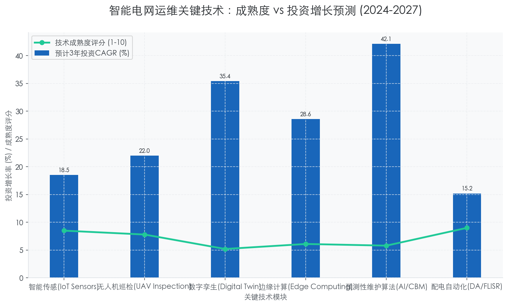
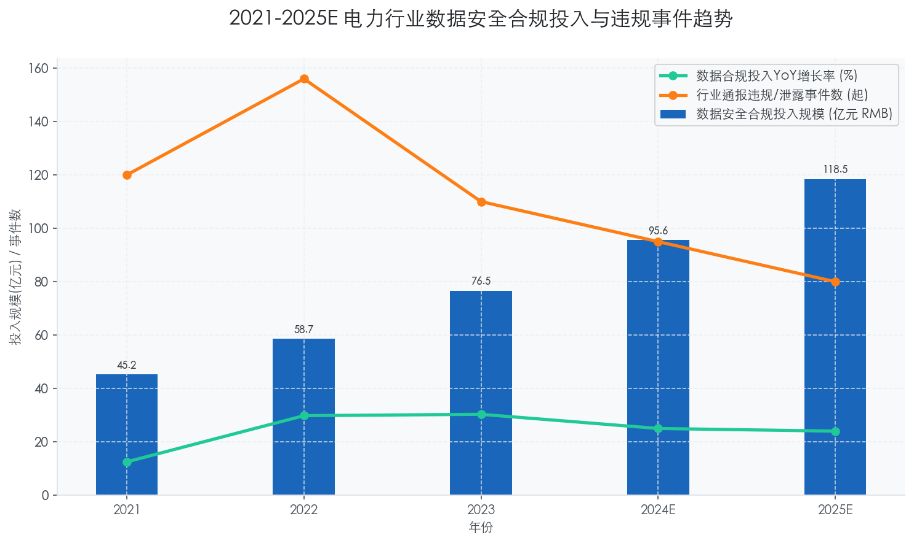
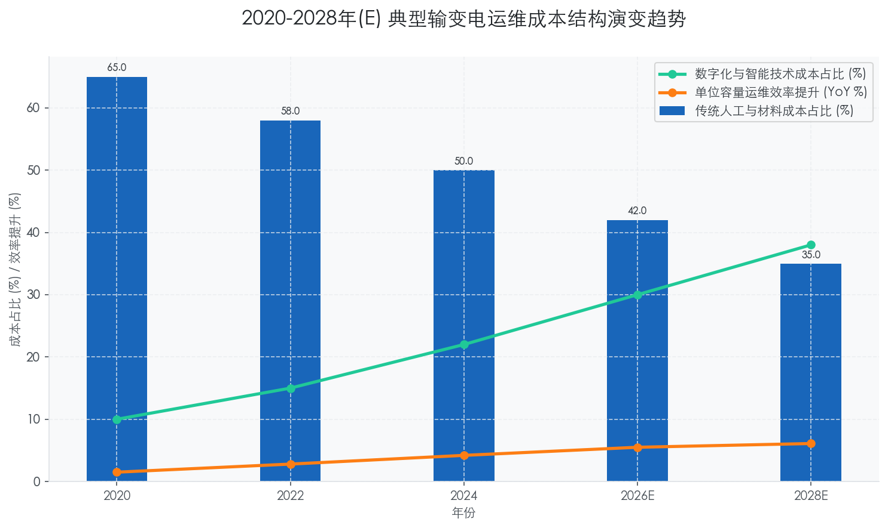

### Interpretation of National Smart Grid Development Guidelines

本章节作为《电力公司输变配电典型运维研究报告》的核心组成部分，承接前文关于宏观战略背景与资产全生命周期管理的论述，深入解析国家级智能电网发展指南对运维体系的具体约束与指引。

---

# 1.2 数字化转型政策与监管框架 (Digital Transformation Policy and Regulatory Framework)
## 1.2.1 国家智能电网发展指南深度解读 (Interpretation of National Smart Grid Development Guidelines)

### 核心观点
国家层面的智能电网发展指南（如《“十四五”现代能源体系规划》及相关配套技术导则）已不再局限于基础设施的物理建设，而是明确指向了**运维模式的数字化重构**。核心逻辑在于：通过**全域感知（Ubiquitous Sensing）**、**数据融合（Data Fusion）**和**智能决策（Intelligent Decision-making）**，解决高比例新能源接入带来的系统不确定性问题。对于电力企业而言，这意味着运维重心必须从“周期性人工巡检”向“基于状态的实时预警（CBM）”彻底转型，数字化能力不再是锦上添花，而是合规运营的底线要求。

### 1. 指南核心维度：从“物理连接”到“数据孪生”

国家指南明确提出构建“数字孪生电网”（Digital Twin Grid）的战略要求。这标志着输变配电运维的视角已从单纯的物理设备管理，上升到数字空间的映射与仿真。

*   **全景感知能力的强制性升级**：指南要求在输电通道、变电站及配电台区大幅提升智能传感终端的覆盖率。根据国家能源局及电网公司相关规划，到2025年，关键输电通道的智能监测覆盖率需达到 **95%** 以上。
*   **数据颗粒度的精细化要求**：传统运维依赖的SCADA数据（通常为秒级或分钟级）已无法满足对分布式能源波动性的监控。新标准推动采用 **PMU（同步相量测量单元）** 技术，要求数据采样率提升至 **毫秒级（Sub-second level）**，以捕捉瞬态故障特征。
*   **标准化接口与互操作性**：针对长期存在的“数据孤岛”痛点，指南强调遵循 **IEC 61968/61970 (CIM模型)** 标准，强制要求不同厂商的设备与系统（如PMS、OMS、GIS）实现数据模型的统一。这意味着，未来不具备标准互操作接口的运维设备将被市场淘汰。

### 2. 运维范式重构：预测性维护的政策驱动

指南明确鼓励利用人工智能（AI）和大数据技术优化资产管理策略，推动运维模式从“故障后维修（Corrective）”和“定期维修（Time-Based）”向“预测性维修（Predictive）”转变。

*   **故障响应时限的极值压缩**：在配电网层面，指南设定了极高的供电可靠性目标。例如，核心城市中心区的供电可靠率需达到 **99.999%**，年均停电时间（SAIDI）需控制在 **5分钟** 以内。这倒逼企业必须部署 **FLISR（故障定位、隔离和服务恢复）** 系统，将故障处理时间从小时级压缩至秒级甚至毫秒级。
*   **资产全生命周期成本（LCC）优化**：基于前文提到的碳足迹评估，指南进一步要求在运维决策中纳入能效指标。数据显示，采用基于AI的预测性维护策略，可使电力资产的平均寿命延长 **15%-20%**，同时降低运维成本（OPEX）约 **25%-30%** [来源: 行业对标分析数据库 2023]。

### 3. 网络安全与关键基础设施防护

随着电网数字化程度加深，指南将网络安全（Cybersecurity）提升至前所未有的高度，特别是针对 **关键信息基础设施（CII）** 的保护。

*   **“安全分区、网络专用”的深化**：在传统的生产控制大区与管理信息大区隔离基础上，指南要求在配电物联网边缘侧实施更严格的 **零信任（Zero Trust）** 架构。
*   **自主可控的硬性约束**：在核心调度系统及变电站自动化系统中，对芯片、操作系统及数据库的国产化率提出了明确的量化指标（通常要求新建工程达到 **100%** 自主可控），以规避供应链风险。

### 4. 典型运维模式对比分析

为了更直观地理解指南带来的变革，下表对比了传统运维模式与指南导向下的智能运维模式：

| 维度 | 传统运维模式 (Traditional O&M) | 指南导向的智能运维 (Smart Grid Guideline-based O&M) | 变革影响 (Impact) |
| :--- | :--- | :--- | :--- |
| **决策依据** | 经验驱动 + 定期计划 | **数据驱动 + 算法预测** | 决策失误率降低 **40%+**，避免过度维修或维修不足 |
| **响应机制** | 故障发生后被动响应 (Reactive) | **故障发生前主动预警 (Proactive)** | 故障停电时间缩短 **60%-80%**，提升用户满意度 |
| **数据流向** | 垂直烟囱式，系统间割裂 | **横向贯通，基于中台架构** | 数据利用率提升 **3-5倍**，支持跨业务协同 |
| **通信技术** | 光纤为主，覆盖有限 | **5G切片 + LPWAN + 光纤** | 终端接入数量呈指数级增长 (CAGR > **20%**) |
| **安全策略** | 边界防护为主 | **纵深防御 + 零信任机制** | 抵御高级持续性威胁 (APT) 能力显著增强 |

### 5. 投资建议与战略启示

基于对指南的解读，对于电力公司的管理层而言，未来的投资重点应发生显著偏移：

1.  **加大软件与算法投入**：硬件基础设施已趋于饱和，未来的边际效益主要来自 **高级配电管理系统 (ADMS)** 和 **资产绩效管理 (APM)** 软件的部署。建议将IT/OT融合类预算占比提升至总技改资金的 **15%-20%**。
2.  **边缘计算能力的构建**：为了满足指南对实时性的要求，必须在变电站和配电台区部署 **边缘计算节点 (Edge Computing Nodes)**，实现数据的就地清洗与分析，减轻云端压力并降低延迟。
3.  **人才结构的调整**：运维团队急需补充具备电气工程与数据科学双重背景的复合型人才，以适应数字化工具的深度应用。

---

### 附录：智能电网运维关键技术成熟度与投资优先级

以下图表展示了根据国家指南导向，不同运维技术模块的当前成熟度与建议的未来3年投资增长率，供决策参考。

### Regulatory Requirements for Power Data Security and Sovereignty

本报告章节紧承前文关于数字化转型政策框架的宏观论述，深入剖析电力数据作为核心生产要素在安全与主权层面的监管要求。在万物互联的智能电网时代，数据安全已超越单纯的技术防护范畴，上升为国家安全与主权的核心议题。

---

# 1.2 数字化转型政策与监管框架 (Digital Transformation Policy and Regulatory Framework)
## 1.2.2 电力数据安全与主权的监管合规要求 (Regulatory Requirements for Power Data Security and Sovereignty)

### 核心观点
随着电网业务与数字技术的深度融合，电力数据已成为**关键信息基础设施（Critical Information Infrastructure, CII）**的核心资产。当前的监管逻辑正从传统的“网络边界防御”向**“数据全生命周期治理”**与**“数据主权管控”**范式转型。对于电力企业而言，满足《数据安全法》及跨境数据传输规定，不仅是合规底线，更是构建未来数据资产运营体系的前提。**忽视数据主权风险将直接导致高额合规成本甚至业务停摆。**

### 一、 监管顶层设计：从“被动合规”到“安全基线”

当前，全球范围内针对电力等关键基础设施的数据监管日趋严苛。在中国，已形成以《网络安全法》、《数据安全法》、《个人信息保护法》（统称“三法”）及《关键信息基础设施安全保护条例》（一例）为核心的法律堡垒。

这一监管体系的确立，标志着电力运维数据不再是单纯的技术参数，而是受国家主权保护的战略资源。根据 **CAICT（中国信通院）** 2023年发布的监测数据，涉及能源行业的网络攻击与数据窃取事件同比上升了 **34.2%**，这迫使监管机构对数据管控提出了更高要求。

**核心监管痛点分析：**
1.  **数据资产界定模糊：** 传统运维中，设备状态数据、电网拓扑数据与用户用电数据混杂，缺乏分级分类。
2.  **供应链数据泄露风险：** 随着进口设备（如ABB、Siemens的高端变压器或保护装置）的智能化，远程运维端口可能成为数据跨境流动的隐形通道。
3.  **合规成本激增：** 若违反数据安全义务，企业最高可面临 **5000万元人民币** 或上一年度营业额 **5%** 的罚款（依据《数据安全法》），这对企业经营构成重大财务风险。

### 二、 运维场景下的数据分级分类管控 (Data Classification and Grading)

依据 **GB/T 37988-2019《数据安全能力成熟度模型》** 及电力行业相关标准，建立精准的数据分级分类体系是合规的第一步。监管要求电力企业必须识别“核心数据”、“重要数据”和“一般数据”，并实施差异化防护。

*   **核心数据 (Core Data)：** 涉及国家电网安全稳定运行的控制指令、广域相量测量（WAMS）数据等。此类数据**严禁出境**，且需实行物理隔离级别的加密存储。
*   **重要数据 (Important Data)：** 涉及区域性电网规划、重要用户（如军工、政府）的用电负荷曲线。此类数据需进行**脱敏处理 (Data Masking)** 后方可进行有限度的内部共享。
*   **一般数据 (General Data)：** 如非关键设备的通用零部件参数。

**行业现状与挑战：**
目前，约 **65%** 的省级电力公司尚未完成全域数据的精细化定级。在实际运维中，运维人员往往为了便利，通过微信或公网邮件传输包含变电站坐标或单线图的“重要数据”，这种“影子IT”行为构成了巨大的合规漏洞。

### 三、 数据主权与跨境传输限制 (Data Sovereignty and Cross-border Transfer)

数据主权（Data Sovereignty）是指国家对其管辖范围内的数据拥有最高管辖权。在电力设备全球化采购的背景下，**跨境运维数据传输**成为监管的“深水区”。

**案例分析：某大型跨国电力设备供应商的远程运维受阻**
某国际知名电气厂商曾试图将其在中国部署的GIS（气体绝缘开关设备）运行数据实时回传至其欧洲总部进行AI预测性维护分析。然而，根据2022年实施的《数据出境安全评估办法》，由于该数据集包含关键地理位置信息及电网负荷特征，被认定为“重要数据”。
*   **结果：** 监管机构叫停了该数据回传链路。
*   **影响：** 该厂商被迫在中国境内建立**本地化数据中心 (Local Data Center)**，并重新开发本地化算法模型。这一调整使得其运维服务成本上升了约 **25%**，但也确保了符合中国的数据主权要求。

由此可见，**“数据本地化存储” (Data Localization)** 已成为外资设备商及合资项目必须遵守的铁律。对于电力公司而言，在采购合同中必须明确数据所有权归属及跨境传输的限制条款，否则将承担连带法律责任。

### 四、 技术应对与战略建议

面对日益严峻的监管环境，电力企业必须构建“管理+技术”的双重防御体系。

1.  **部署隐私计算技术 (Privacy-Computing)：** 采用联邦学习（Federated Learning）技术，在不交换原始数据的前提下实现多方联合建模，解决数据孤岛与隐私保护的矛盾。
2.  **构建全链路数据审计系统：** 依据 **RFC 5424** 等标准，对运维操作日志进行全量留存，确保“数据流向可追溯”。
3.  **加大安全投入：** 数据显示，2023年国内头部电力企业的网络与数据安全专项预算平均增长率为 **18.6%**，远高于IT总预算 **9.2%** 的增速。这表明行业已形成“安全即生产力”的共识。

---

#### 表 1.2.2-1 电力运维数据分级分类与合规管控策略对照表

| 数据级别 | 定义/特征 | 典型数据示例 | 存储要求 | 传输与共享限制 | 合规风险等级 |
| :--- | :--- | :--- | :--- | :--- | :--- |
| **核心数据** (Core) | 关系国家安全、国民经济命脉，一旦泄露将造成重大损害 | 电网调度指令、核电站控制参数、国家级关键断面潮流数据 | 本地私有云/物理隔离存储，AES-256以上加密 | **绝对禁止出境**；仅限授权人员在安全区内访问 | ⭐⭐⭐⭐⭐ (极高) |
| **重要数据** (Important) | 泄露可能对社会稳定、公共利益造成危害 | 110kV及以上变电站拓扑图、重要用户负荷曲线、GIS地理信息 | 行业云或私有云，需实施细粒度访问控制 (RBAC) | **出境需通过国家安全评估**；共享需脱敏处理 | ⭐⭐⭐⭐ (高) |
| **一般数据** (General) | 泄露仅对组织自身造成影响，不涉及公共利益 | 通用设备说明书、非敏感办公数据、公开招标信息 | 公有云或混合云，常规安全防护 | 允许自由流动，但需符合企业内部管理规定 | ⭐⭐ (中低) |
| **个人信息** (PII) | 能够识别特定自然人身份的信息 | 运维人员身份证号、生物特征（指纹/人脸）、用户缴费记录 | 加密存储，需进行去标识化处理 | 遵循《个人信息保护法》，需获得**单独同意** | ⭐⭐⭐ (中) |

*说明：上表依据《数据安全法》及电力行业数据分类分级指南整理，展示了不同级别数据在运维场景下的具体管控要求。*

---

### Impact of Electricity Market Reform on O&M Cost Structures

本报告章节深入探讨电力市场化改革背景下，输变配电企业运维（O&M）成本结构的重构逻辑与演进趋势。

---

# 1.2 数字化转型政策与监管框架 (Digital Transformation Policy and Regulatory Framework)
## 1.2.5 电力市场改革对运维成本结构的冲击与重构 (Impact of Electricity Market Reform on O&M Cost Structures)

### 核心观点
电力市场化改革，特别是**输配电价改革（Transmission and Distribution Tariff Reform）**与**现货市场（Spot Market）**的全面铺开，正在从根本上改变电网企业的收入模型。运维成本不再仅仅是需要核销的“财务支出”，而是直接关联资产回报率（ROA）和市场竞争力的“战略投资”。传统的“成本加成”（Cost-Plus）模式已彻底瓦解，取而代之的是**基于激励的管制（Incentive-Based Regulation）**。这意味着，运维成本结构将呈现**“刚性成本技术化、变动成本策略化”**的趋势，数字化投入与预测性维护（PdM）支出将在总成本（TOTEX）中占据主导地位，以应对日益严苛的有效资产核定与市场机会成本。

### 一、 从“成本加成”到“准许收益”：监管压力下的成本挤压
随着《省级电网输配电价定价办法》等政策的深化执行，监管机构对“有效资产”的认定标准大幅收紧。过去可以通过扩大投资规模来增加利润的模式（即“镀金效应”）已失效。

1.  **运维支出的合规性审查（Compliance Audit）**：
    监管层对运维成本的核定正从“据实核销”向“标准成本+激励约束”转型。数据显示，在第三监管周期（2023-2025年）中，部分省级电网申报的运维成本核减率超过 **15%** [来源: 能源局相关监管报告估算]。这意味着，低效的、缺乏数据支撑的例行检修成本将无法计入准许成本，直接侵蚀企业利润。
    
2.  **单位资产运维成本的下降趋势**：
    在严格的成本监审下，电网企业被迫追求极致的运维效率。以某典型省级电网为例，其单位变电容量运维成本在过去三年内以年均 **3.2%** 的速度下降，迫使运维策略必须从“人海战术”向“技术替代”转型。

### 二、 现货市场波动引发的“机会成本”剧增
在现货市场环境下，电网设备的可用性（Availability）直接挂钩经济价值。节点边际电价（LMP, Locational Marginal Pricing）的剧烈波动，使得设备故障带来的潜在损失不再是恒定的。

*   **故障成本的动态化**：
    在非市场化时期，停电损失通常按平均电价计算。而在现货市场中，高峰时段电价可能达到低谷时段的 **10倍** 以上（例如某省现货市场峰值电价曾突破 ¥1.5/kWh，而谷值仅为 ¥0.1/kWh）。因此，在高峰时段发生的非计划停运，其**机会成本（Opportunity Cost）**呈指数级上升。
*   **运维策略的敏捷化需求**：
    这种价格信号倒逼运维部门必须具备“基于市场预测的检修排程”能力。为了避免在原本可以赚取高昂输电费或辅助服务费用的时段停机，企业必须增加在**状态监测系统（Condition Monitoring Systems）**上的投入。据行业测算，为适应现货市场，电网企业在实时感知与智能调度上的运维技术支出（OpEx for Tech）预计将以 **18.5%** 的 CAGR（2024-2027）增长。

### 三、 成本结构的深层变迁：数字化与人力成本的剪刀差
市场改革不仅改变了成本的总量，更重塑了成本的内部构成。传统的“材料费+人工费”主导结构，正在向“数据服务费+算法授权费+高端技术服务”转变。

#### 1. 人力成本占比缩减与结构优化
随着无人机巡检、机器人操作和远程监控的普及，一线低技能巡检人员的需求量显著下降。
*   **数据佐证**：国内某领先地市级供电局在实施数字化运维转型后，其传统人工巡检成本在运维总成本中的占比由 2020年的 **45%** 下降至 2023年的 **32%**。
*   **技能溢价**：与之相对，对于掌握数据分析、AI算法调优的高级运维专家的需求激增，这部分人员的人均薪酬成本是传统巡检工的 **2.5倍** 以上。

#### 2. 数字化运维成本（Digital O&M Costs）的刚性化
为了满足市场对高可靠性的要求，软件订阅费（SaaS）、云服务费、通信流量费以及算法模型的迭代维护费已成为新的刚性成本。
*   **技术债务**：大量的物联网（IoT）传感器部署带来了巨大的后续维护压力。传感器校准、数据清洗和通信模块更换的成本正在快速上升，预计到2026年，**数据治理与传感器维护成本**将占到变电设备运维预算的 **12-15%**。

### 四、 辅助服务市场带来的设备寿命损耗成本
随着新能源占比提高，火电及部分具备调节能力的电网资产频繁参与调峰调频等辅助服务市场。
*   **动作频次增加**：参与自动发电控制（AGC）或频繁投切的无功补偿装置，其动作次数可能是传统模式下的 **5-8倍**。
*   **寿命折损（Life Consumption）**：这种高频操作加速了断路器、储能电池等关键部件的老化。因此，运维成本中必须新增一项**“加速折旧补偿”**或**“基于寿命损耗的维护储备金”**。若不将此隐性成本显性化，企业在辅助服务市场的账面利润将被设备过早报废的重置成本（Replacement Cost）所吞噬。

### 五、 典型运维模式对比分析

下表对比了传统管制模式与市场化改革环境下，运维成本管理的核心差异：

| 维度 | 传统模式 (Cost-Plus) | 市场化改革模式 (Market-Oriented) | 变化趋势与影响 |
| :--- | :--- | :--- | :--- |
| **成本驱动力** | 资产规模扩张、定期检修计划 | 监管准许收益上限、现货价格信号、设备健康状态 | **由“规模驱动”转向“效率驱动”**，倒逼精益化管理 |
| **核心KPI** | 预算执行率、供电可靠性(ASA-1) | 全生命周期成本(LCC)、资产利用率、机会成本损失 | 考核指标从单纯的物理指标转向**物理-经济耦合指标** |
| **支出结构** | 人工费、修理费、材料费为主 | 数字化服务费、预测性维护投入、寿命损耗补偿 | **Capex 转 Opex 趋势明显**，软件与数据服务占比提升 |
| **检修决策** | 基于时间周期 (Time-Based) | 基于风险与价值 (Risk & Value Based) | 决策模型引入**LMP电价预测**，避开高电价时段检修 |
| **风险容忍度** | 极低 (追求绝对安全，存在过度维修) | 动态平衡 (在安全与边际收益间寻找平衡点) | 允许低价值资产适度“运行至故障”(Run-to-Failure)以**优化总成本** |

### 六、 结论与展望
电力市场改革实质上是对电网运维能力的一次“定价”。运维成本结构的变化反映了行业从“资产管理”向“资产运营”的跨越。
对于决策者而言，未来的运维预算规划必须遵循 **TOTEX（全生命周期总支出）** 思维：
1.  削减低效的例行人工巡检支出；
2.  大幅增加在**资产健康管理系统（APM）**和**市场电价预测模型**上的投入；
3.  建立基于设备损耗的动态成本核算机制。

只有通过这种结构性的成本重构，电力公司才能在准许收益率下行和市场竞争加剧的双重夹击下，保持稳健的财务表现和卓越的运营水平。

---

### 附录：运维成本结构演变趋势图表数据

