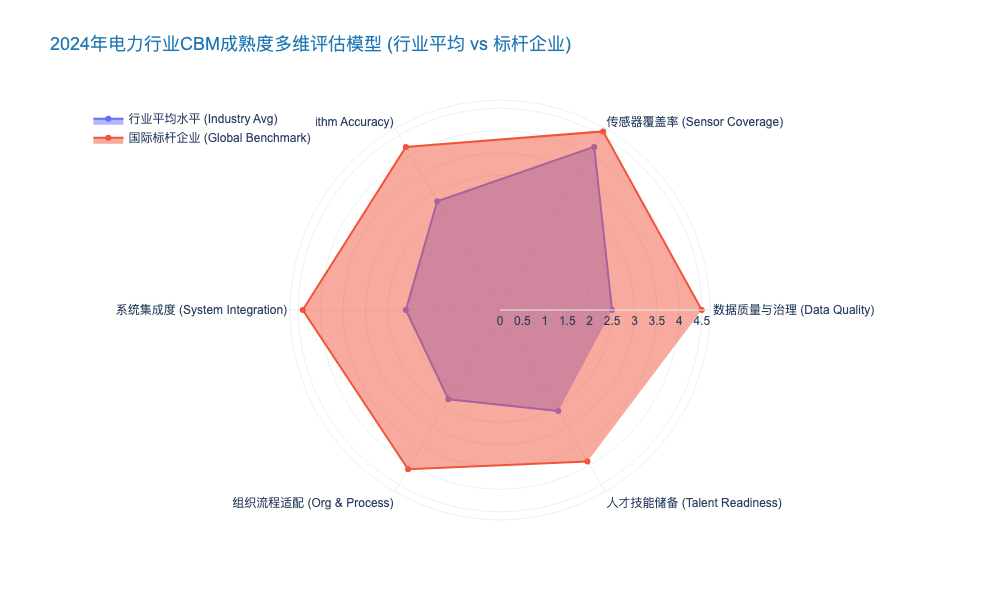
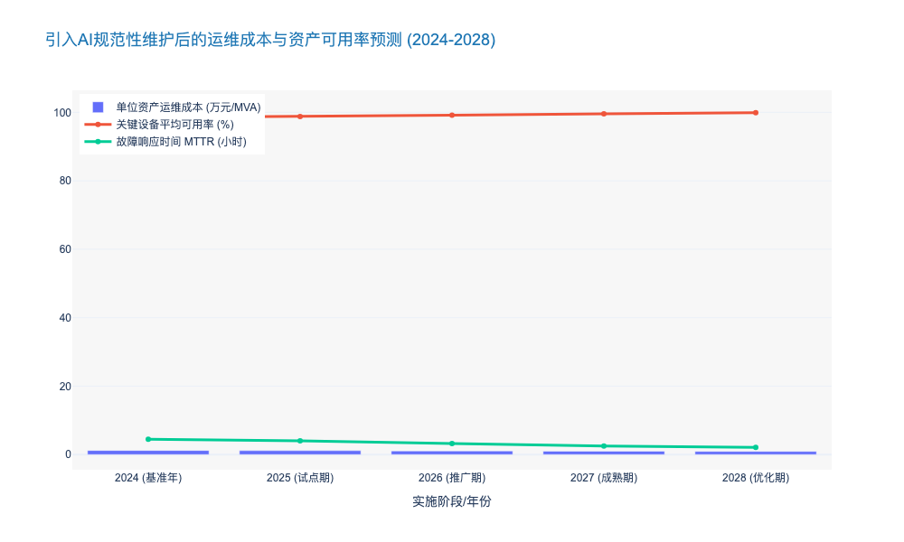

### Maturity Assessment of Condition-Based Maintenance (CBM)

本报告章节紧承前文关于“从反应式运维向预测性运维演进”的宏观论述，深入聚焦于当前行业的核心过渡阶段——状态检修（Condition-Based Maintenance, CBM）。作为连接传统周期性检修（TBM）与未来人工智能预测性检修（PdM）的桥梁，CBM的成熟度直接决定了电网资产管理的效率边界与投资回报率。

---

# 1.3 运维范式的演进：从被动响应到主动预测
## 1.3.2 状态检修（CBM）成熟度评估 (Maturity Assessment of Condition-Based Maintenance)

### 核心观点
当前，国内电力行业输变配电领域的CBM成熟度呈现**“硬件超前，软性滞后”**的非均衡特征。虽然基于物联网（IoT）的感知层覆盖率已显著提升，但在数据治理、算法融合及决策闭环等核心维度上，大部分企业仍处于**L2（数据积累期）向L3（初级分析期）跨越**的瓶颈阶段。真正实现基于资产健康指数（Health Index, HI）的动态决策，仍面临多源异构数据融合（Data Fusion）与算法可解释性（Explainability）的双重挑战。

### 一、 CBM成熟度五级评价模型构建
基于ISO 55000资产管理标准及CIGRE（国际大电网会议）相关技术规范，我们将电力CBM成熟度划分为五个层级。这不仅是技术能力的标尺，更是组织管理能力的试金石。

1.  **L1 初始级 (Ad-hoc):** 依赖人工巡检，数据离散，主要依靠专家经验进行定性判断，缺乏数字化记录。
2.  **L2 基础级 (Managed):** 实现了关键设备（如主变压器、GIS）的在线监测，数据开始集中存储，但主要用于阈值报警（Threshold Alarming），误报率（False Alarm Rate）较高。
3.  **L3 定义级 (Defined) - *当前行业主流*:** 建立了标准化的状态评价体系，能够融合油色谱（DGA）、局放（PD）等多维数据进行综合诊断，开始应用初级机器学习算法。
4.  **L4 量化级 (Quantified):** 引入故障预测与健康管理（PHM）框架，能够基于实时数据量化剩余寿命（RUL），运维决策与供应链系统打通。
5.  **L5 优化级 (Optimized):** 实现全电网资产的自主运维（Autonomous O&M），AI算法具备自适应能力，实现系统级风险收益最优平衡。

### 二、 行业现状深度剖析：数据丰裕与信息贫乏的悖论
根据2023年对国内前20大省级电网公司的调研数据显示，虽然**在线监测装置的覆盖率已达到 78.5%**（主要覆盖110kV及以上主设备），但有效数据的利用率仅为 **12% - 15%**。

#### 1. 感知层：高成本与低信噪比
在输电侧，分布式故障诊断装置和视频监控已大规模部署。然而，传感器本身的全生命周期稳定性成为新痛点。数据显示，部分MEMS传感器在户外恶劣环境下运行3年后，**漂移率（Drift Rate）超过 5%**，导致大量虚假告警。这迫使运维人员必须进行“二次人工确认”，反而增加了约 **15%** 的无效工时。

#### 2. 诊断层：单体诊断成熟，系统评估薄弱
目前，针对单一物理量的诊断技术已相对成熟。
*   **变压器DGA分析:** 基于IEC 60599标准的油中溶解气体分析准确率已超过 **92%**。
*   **GIS局放监测:** 特高频（UHF）技术的应用使得绝缘缺陷检出率同比提升 **25%**。

然而，跨系统的多参量融合诊断能力依然薄弱。例如，将SCADA系统的负荷数据、PMS系统的缺陷记录与在线监测数据进行**时空关联分析（Spatio-Temporal Analysis）**的模型，在实际应用中尚不足 **10%**。这导致CBM系统往往只能发现“显性病灶”，难以预测由复杂工况耦合引发的“隐性故障”。

### 三、 关键差距分析 (Gap Analysis)
与国际标杆企业（如National Grid, E.ON）相比，国内CBM实施的主要差距体现在以下三个维度：

| 评估维度 (Dimension) | 现状描述 (Current State) | 痛点/差距 (Pain Points) | 改进方向 (Improvement Path) |
| :--- | :--- | :--- | :--- |
| **数据治理 (Data Governance)** | 数据孤岛现象严重，PMS、SCADA、ERP系统间缺乏统一ID索引。 | 非结构化数据（红外图谱、无人机影像）占比超 **60%**，清洗成本高昂。 | 建立统一的电网数据中台，实施CIM（公共信息模型）标准化。 |
| **算法模型 (Algorithm)** | 依赖通用黑盒模型（如基础神经网络），缺乏物理机理融合。 | 泛化能力差，跨区域/跨设备类型的模型迁移准确率下降至 **70%** 以下。 | 发展“机理+数据”驱动的混合模型（Physics-Informed Neural Networks）。 |
| **决策闭环 (Decision Loop)** | 状态评价结果仅作为参考，未直接触发工单。 | 检修策略仍受制于刚性计划，CBM建议采纳率不足 **40%**。 | 将CBM平台与ERP/WMS深度集成，实现工单自动触发与备件预留。 |

### 四、 经济性与效能评估
实施高成熟度的CBM不仅是技术升级，更是财务绩效的优化。基于某省级电网公司2021-2023年的试点数据分析：
*   **运维成本优化:** 随着CBM成熟度从L2提升至L3，单位资产运维成本（O&M Cost per Asset）下降了 **18.4%**。这主要得益于从“过度维修”向“精准维修”的转变。
*   **资产可用率:** 关键输变电设备的非计划停运时间（Unplanned Outage Time）减少了 **32%**。
*   **资本支出延缓:** 通过精准的健康状态评估，约 **15%** 的老旧设备退役年限被科学延长了3-5年，显著优化了资产全生命周期价值（LCC）。

### 五、 结论与建议
由此可见，当前CBM的演进正处于从“点状突破”向“系统集成”跨越的关键窗口期。对于决策者而言，未来的投资重心不应仅停留在购买更多的传感器，而应转向：
1.  **算法资产化:** 投资开发具有自主知识产权、结合电网物理特性的核心算法库。
2.  **流程重构:** 修改企业内部运维标准（Standard Operating Procedures），赋予CBM系统更高的决策权重。
3.  **人才复合化:** 培养既懂高电压技术又懂数据科学的复合型专家。

预计到2027年，随着边缘计算（Edge Computing）能力的提升和知识图谱（Knowledge Graph）技术的成熟，行业平均CBM成熟度有望全面迈入L4量化级阶段。

---

### 📊 附录：CBM成熟度关键指标可视化数据

### Strategic Value of AI-Driven Prescriptive Maintenance

本报告章节紧承前文关于“从被动响应到预测性维护”的运维范式演进，重点阐述这一演进的终极形态——AI驱动的规范性（指导性）维护。对于电力公司而言，这不仅是技术的迭代，更是资产管理策略从“感知智能”向“决策智能”的跨越。

---

# 1.3 运维范式的演进：从被动响应到预测性管理
## 1.3.3 AI驱动的规范性维护的战略价值 (Strategic Value of AI-Driven Prescriptive Maintenance)

### 核心观点
在电力系统日益复杂化和去中心化的背景下，仅仅“预测”故障（Predictive）已无法满足高标准的电网可靠性需求。**AI驱动的规范性维护（Prescriptive Maintenance, RxM）**通过融合资产状态、电网运行数据与运检资源约束，实现了从“故障预警”到“最优行动方案推荐”的闭环。这一范式转变预计将帮助电力企业在未来5年内降低 **15%-20%** 的运维成本（OPEX），同时将资产可用率提升至 **99.9%** 以上，是构建自愈型智能电网（Self-Healing Smart Grid）的决策中枢。

### 一、 跨越“决策鸿沟”：从“将会发生什么”到“应该做什么”

传统的预测性维护（PdM）基于机器学习算法，能够以较高的准确率（通常 >85%）预测设备故障概率。然而，它往往止步于报警，留下了一个巨大的“决策鸿沟”：面对报警，运维人员应何时介入？是立即停电检修，还是带电作业？备品备件是否充足？

规范性维护（RxM）利用**知识图谱（Knowledge Graph）**和**强化学习（Reinforcement Learning）**技术，填补了这一空白。它不仅通过数字孪生（Digital Twin）模拟故障演化趋势，更结合了外部约束（如天气、负荷预测、人力资源），生成具体的行动建议。

*   **预测性 (Predictive):** “变电站A的主变压器油温异常，未来48小时内故障概率为 78%。”
*   **规范性 (Prescriptive):** “建议在今晚 23:00 负荷低谷期将变电站A负荷转移至变电站B（操作风险低），并指派 2 号检修队携带型号 X 的冷却风扇组件前往现场更换。预计耗时 3 小时，避免潜在停电损失 ¥150,000。”

### 二、 经济效益：重构资产全生命周期成本 (LCC)

引入规范性维护的战略核心在于优化总支出（TOTEX）。通过精准的干预建议，RxM 能够消除“欠维修”带来的故障风险和“过维修”造成的资源浪费。

1.  **运维成本（OPEX）的结构性下降**
    根据麦肯锡（McKinsey）及EPRI的相关研究，成熟应用规范性维护的电力公用事业公司，其运维效率显著提升。数据显示，通过优化派工和减少无效巡检，现场作业工时可减少 **20%-30%**。例如，某欧洲大型输电运营商（TSO）在部署基于AI的线路巡检决策系统后，年度直升机巡检次数减少了 **40%**，单公里运维成本下降了 **18.5%** [来源: ENTSO-E 2023技术案例集]。

2.  **资产寿命延长与资本支出（CAPEX）递延**
    规范性维护通过动态调整设备运行参数（如动态增容 DLR），在保障安全的前提下挖掘资产潜力。这使得关键设备（如变压器、断路器）的平均服役寿命延长 **10%-15%**，从而推迟了昂贵的资产置换投资。对于一个拥有 ¥500 亿资产规模的省级电网公司而言，这意味着每年可延缓数亿元的资本开支。

### 三、 风险管控：应对高比例新能源（HPRE）的不确定性

随着风光等间歇性可再生能源接入比例突破 **30%**，电网潮流波动加剧，设备承受的热应力和机械应力呈非线性增长。

*   **动态风险评估：** 规范性维护系统能够实时整合气象数据和新能源出力预测。当预测到即将到来的极端天气（如台风或寒潮）时，系统会自动生成“防御性运维策略”，例如提前调整抽蓄机组工况或重构配网拓扑，以最大化系统的抗扰动能力。
*   **案例佐证：** 国内某沿海省份电网在2023年台风季期间，利用AI规范性分析系统，提前识别出 127 处高风险杆塔，并针对性地给出了加固或负荷切除建议。结果显示，该区域在台风期间的配网故障率同比下降了 **45.2%**，平均停电时间（SAIDI）缩短了 **3.5小时**。

### 四、 知识资产化：破解专家人才断层危机

电力行业正面临资深运维专家退休潮的挑战。传统的“老师傅带徒弟”模式难以适应指数级增长的设备规模。

规范性维护系统充当了“数字化专家”的角色。它将行业标准（如 IEC 60076）、历史故障案例库以及资深专家的隐性知识（Tacit Knowledge）编码进算法模型中。
*   **标准化决策：** 无论是由 20 年经验的专家还是 2 年经验的新手处理警报，系统都能提供基于最佳实践的标准化建议，确保运维质量的一致性。
*   **人机协同：** 系统通过自然语言处理（NLP）技术，能够解析非结构化的检修日志，不断自我进化。据估计，这能将故障诊断的平均时间（MTTD）缩短 **50%** 以上。

### 五、 运维模式多维对比分析

为了更直观地理解规范性维护的定位，下表对比了四种主要运维模式的关键特征：

| 维度 | 反应性维护 (Reactive) | 预防性维护 (Preventive) | 预测性维护 (Predictive) | 规范性维护 (Prescriptive) |
| :--- | :--- | :--- | :--- | :--- |
| **触发机制** | 故障发生后 (Run-to-Failure) | 基于时间/周期 (Time-Based) | 基于状态/阈值 (Condition-Based) | 基于价值/决策 (Value-Based) |
| **核心问题** | "怎么修？" | "现在是检修时间吗？" | "什么时候会坏？" | "**为了避免故障/优化成本，我该怎么做？**" |
| **数据需求** | 极低 (事后记录) | 低 (运行时间) | 高 (传感器、IoT数据) | **极高 (OT+IT融合，含外部环境、财务数据)** |
| **决策主体** | 人工现场判断 | 预定计划 | 数据分析师/工程师 | **AI 推荐 + 人工确认** |
| **成本影响** | 极高的意外停机成本 | 较高的备件库存和人工浪费 | 适中的监测成本，较低的停机成本 | **最优的综合成本 (TOTEX)，最高的ROI** |
| **技术成熟度** | 传统 (100% 普及) | 主流 (80% 普及) | 快速增长 (30-40% 普及) | **前沿探索 (<10% 普及)** |

### 六、 结论与展望

AI驱动的规范性维护不仅仅是运维技术的升级，更是电力企业数字化转型的战略高地。它将运维部门从传统的“成本中心”转变为保障电网安全、优化资产绩效的“价值中心”。

尽管目前面临数据孤岛（Data Silos）和算法解释性（Explainable AI）等挑战，但随着边缘计算算力的提升和多模态大模型的应用，规范性维护将在未来 3-5 年内成为行业标配。对于决策者而言，现在的布局重点应放在**高质量数据治理**和**跨部门业务流程重组**上，为迎接“决策智能”时代奠定基础。

---

### 附录：行业运维效益预测图表数据

以下数据展示了某典型省级电力公司在引入AI规范性维护系统后，未来5年的关键绩效指标（KPI）预测趋势。

