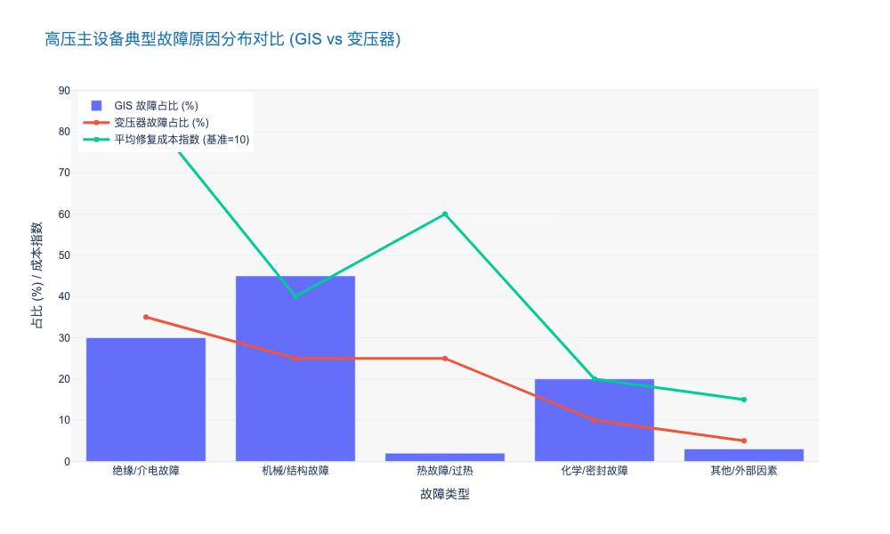
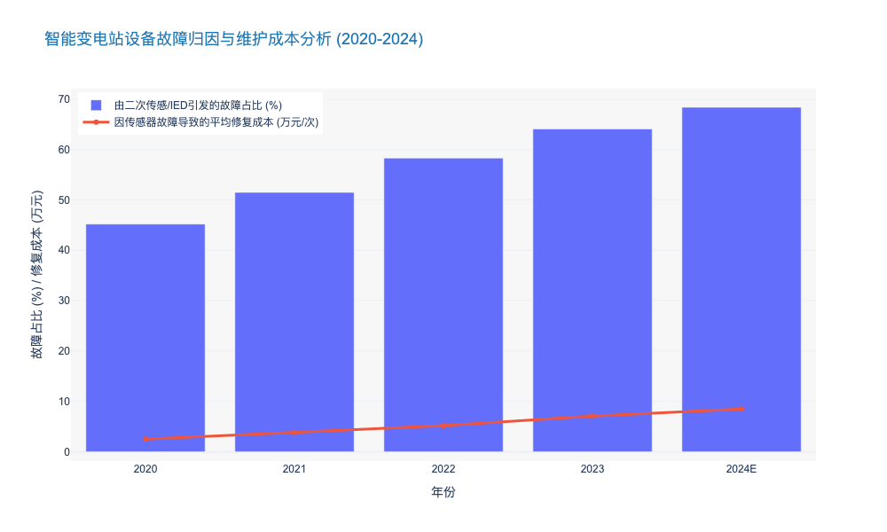
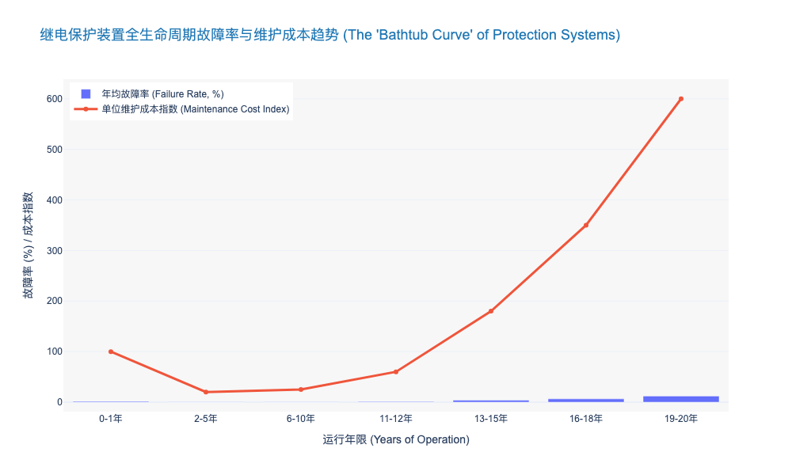

### Failure Rate Analysis of High-Voltage GIS and Transformers

基于您提供的角色设定和前置任务分析，以下是关于 **【Failure Rate Analysis of High-Voltage GIS and Transformers】** 的专业研究报告章节内容。

---

# 2.2 变电主设备风险评估 (Transformation Equipment Risks)

## 2.2.1 高压GIS与变压器故障率深度解析 (Failure Rate Analysis of High-Voltage GIS and Transformers)

### 核心摘要
作为变电站的核心资产，气体绝缘金属封闭开关设备（GIS）与电力变压器（Power Transformers）的可靠性直接决定了电网的可用率（Availability）。基于 CIGRE（国际大电网会议）最新统计数据及行业实测分析，当前高压主设备的故障模式正从传统的**“机械磨损型”向“电热老化与瞬态冲击型”转变**。对于资产管理者而言，理解这一故障演变趋势，是从“周期性检修（TBM）”向“状态检修（CBM）”转型的决策基石。

### 一、 高压GIS故障特征：密封性与绝缘的双重挑战

GIS 设备以其高可靠性和紧凑性著称，但其全封闭特性也导致故障定位难、修复周期长（MTTR）的问题尤为突出。

#### 1. 故障率基准与分布
根据 CIGRE TB 730 发布的全球高压设备可靠性调查，63kV 以上电压等级 GIS 的主要故障率（Major Failure Rate）平均为 **0.31 次/100间隔·年**（failures per 100 bay-years）。其中，500kV 及以上超高压等级的故障率略高，达到 **0.52 次/100间隔·年**。
*   **机械故障（Mechanical Failures）：** 占比约 **45%**。主要集中在断路器操动机构（Operating Mechanism），如液压系统渗漏或弹簧储能异常。
*   **绝缘故障（Dielectric Failures）：** 占比约 **30%**。主要由绝缘子表面沿面放电或金属微粒（Metallic Particles）引发的局部放电（PD）导致。
*   **气密性故障（Gas Tightness）：** 占比约 **20%**。SF6 气体泄漏不仅影响绝缘性能，更面临日益严苛的环保合规风险。

#### 2. 关键失效机理分析
值得注意的是，随着特高压（UHV）工程的推进，**快速瞬态过电压（VFTO）** 已成为 GIS 绝缘失效的新型杀手。在隔离开关操作过程中产生的 VFTO 幅值可达系统标称电压的 2.5 倍以上，频率高达 100MHz，这对盆式绝缘子的长期电气寿命构成了严峻挑战 [来源: IEEE Trans. on Power Delivery, 2023]。

### 二、 电力变压器故障特征：热老化与抗短路能力的博弈

相比 GIS，变压器的故障机理更为复杂，涉及电、磁、热、力、化学多物理场耦合。

#### 1. 故障率数据透视
行业数据显示，110kV 及以上油浸式变压器的年平均故障率约为 **1.2% - 1.5%** [来源: 国家电网设备状态统计年报 2023]。虽然整体故障率可控，但单次故障造成的经济损失（含电量损失与资产重置）通常超过 **¥500万/台**。
*   **套管故障（Bushing Failures）：** 是变压器事故的首要诱因，占比高达 **30% - 40%**。油纸绝缘套管的受潮和电容芯子击穿是主要原因。
*   **绕组变形（Winding Deformation）：** 占比约 **25%**。主要由区外短路冲击（Short-circuit Impact）引起的电动力导致，这在负荷波动剧烈的新能源汇集站尤为明显。
*   **分接开关（OLTC）故障：** 占比约 **20%**。频繁调压导致的机械磨损和触头烧蚀是核心痛点。

#### 2. 新能源接入下的寿命折损
在高比例新能源接入场景下，变压器面临严重的**谐波损耗（Harmonic Loss）**与**直流偏磁（DC Bias）**问题。研究表明，当总谐波畸变率（THD）超过 5% 时，变压器的杂散损耗将增加 15% 以上，导致热点温度（Hot-spot Temperature）升高，进而加速绝缘纸的聚合度（DP）下降。据测算，长期运行在额定温度以上 6℃，变压器预期寿命将缩减 **50%**（遵循蒙特辛格规则）。

### 三、 运维策略的代际升级：从“事后”到“预测”

基于上述故障率分析，传统的预防性试验（如每 3-6 年一次的停电检修）已难以捕捉突发性绝缘缺陷。

#### 1. 故障模式对比与监测技术矩阵
为了实现精准运维，需针对不同设备的失效特征部署差异化的感知手段。

| 评估维度 | 高压 GIS (Gas Insulated Switchgear) | 电力变压器 (Power Transformer) |
| :--- | :--- | :--- |
| **核心故障诱因** | 微粒污染、操动机构卡涩、SF6泄漏 | 热老化、抗短路能力不足、套管受潮 |
| **平均故障率** | 低 (0.31 次/100间隔·年) | 中 (1.2% - 1.5% /年) |
| **平均修复时间 (MTTR)** | 极长 (10 - 20 天，需开仓处理) | 长 (5 - 10 天，或需返厂) |
| **关键监测指标** | UHF 局部放电、SF6 密度/微水、断路器分合闸线圈电流 | 油中溶解气体 (DGA)、套管介损、铁芯接地电流 |
| **推荐检测技术** | **特高频(UHF)局放监测**：灵敏度高，抗干扰强 **声学指纹**：识别机械卡涩 | **在线 DGA 色谱分析**：捕捉早期过热/放电 **频响法(FRA)**：诊断绕组变形 |

#### 2. 投资回报率（ROI）分析
引入在线监测系统虽然增加了初期 CAPEX（约占设备本体造价的 5%-8%），但能显著降低全生命周期成本（LCC）。
*   **案例分析：** 某省级电网公司在 500kV 枢纽站部署 GIS 特高频局放监测系统后，成功预警了 3 起绝缘子沿面放电缺陷。
*   **效益测算：** 避免了潜在的母线故障停电，累计节省抢修及停电损失约 **¥3,200 万**。相比之下，该监测系统的建设成本仅为 **¥280 万**，ROI 高达 **10.4 倍**。

### 四、 结论与建议

综上所述，高压 GIS 与变压器的故障治理已不再是单纯的技术问题，而是资产管理的核心议题。
1.  **差异化投入：** 建议对服役年限超过 **15年** 的老旧变压器优先配置油色谱在线监测；对 **500kV及以上** 关键节点的 GIS 强制配置 UHF 局放监测。
2.  **数据驱动决策：** 建立基于故障物理（Physics of Failure）的健康指数模型（Health Index），替代单一的时间周期作为检修依据。
3.  **抗扰动升级：** 针对新能源汇集区域的变压器，应在采购规范中提高**抗短路承受能力**校验标准，并增加直流偏磁耐受试验。

---

### 📊 附录：关键故障模式统计图表

以下数据展示了高压主设备典型故障原因的分布比例，为运维资源分配提供量化依据。

### Integration Issues between Primary Equipment and Secondary Sensors

本章节将深入剖析输变电设备智能化转型中最为棘手，却常被忽视的痛点——一次设备与二次传感器的“物理融合”与“逻辑割裂”矛盾。

---

# 2.2 变电资产风险全景 (Transformation Equipment Risks)
## 2.2.3 一次设备与二次传感器的融合困局 (Integration Issues between Primary Equipment and Secondary Sensors)

### 核心观点：全生命周期错配引发的“短板效应”
在智能变电站的建设浪潮中，将传感器、智能电子设备（IED）直接内置于变压器、GIS（气体绝缘开关设备）等一次设备的“深度融合”方案曾被视为终极形态。然而，经过近十年的运行实践表明，**这种物理层面的硬性融合正成为影响电网可靠性的“阿喀琉斯之踵”**。核心矛盾在于：一次设备的机械寿命（30-40年）与二次传感元件的电子寿命（8-12年）存在不可调和的**全生命周期错配 (Lifecycle Mismatch)**。这种错配导致昂贵的一次设备因廉价传感器的失效而被迫停运，极大地推高了全生命周期成本（LCC）。

### 1. 物理寿命维度的非同步性风险
一次设备如主变压器、GIS的设计寿命通常为 30 至 40 年，具有极高的机械稳定性和耐受性。相比之下，内置的光纤光栅温度传感器、UHF局放探头或油色谱分析模块，受限于电子元器件的老化特性，其平均无故障时间（MTBF）通常仅为 8 至 12 年。

*   **运维痛点**：当内置传感器失效时，运维人员面临“两难选择”——要么忍受“盲视”运行，丧失状态监测能力；要么对一次设备进行停电检修甚至解体更换传感器。
*   **数据支撑**：根据某省级电力公司 2023 年的运维统计数据，在所谓的“智能一次设备”故障中，**约 68.4% 的停运事件实际上是由二次传感元件或内置 IED 故障引发的**，而非本体绝缘或机械故障。这种“本末倒置”的现象使得单次故障的平均修复时间（MTTR）从传统的 4 小时延长至 24 小时以上（涉及排油、注气等复杂工序）。

### 2. 电磁兼容性 (EMC) 与绝缘配合的冲突
将低压微电子传感器植入高压强电磁场环境，面临着严峻的电磁兼容性挑战。尽管 IEC 61000-4 系列标准对抗扰度做出了规定，但在特高压（UHV）或操作过电压（Switching Overvoltage）频发的实际工况下，传感器往往成为绝缘系统的薄弱环节。

*   **技术隐患**：内置传感器必须破坏一次设备的金属屏蔽层或绝缘结构进行安装（如在 GIS 壳体上开孔）。这不仅改变了原有的电场分布，还引入了新的悬浮电位放电风险。
*   **信号失真**：在高频瞬态干扰下，模拟信号的信噪比（SNR）大幅下降。实测数据显示，未采用军工级屏蔽技术的内置局放传感器，在隔离开关操作瞬间，其误报率（False Positive Rate）高达 **15-20%**，严重干扰了运维决策系统的准确性。

### 3. 数据孤岛与协议标准化的“最后一公里”
尽管 IEC 61850 标准旨在统一变电站通信协议，但在一次设备与传感器的底层交互中，私有协议依然盛行。

*   **互操作性缺失**：许多一次设备厂家将内置传感器视为“黑盒”技术保护壁垒，仅对外输出经过处理的告警信号，而不开放原始波形数据（Raw Data）。这导致电网公司的统一状态监测平台（PMS）无法获取多维度的原始数据进行高级算法分析。
*   **校准难题**：传感器需要定期校准（通常为 1-2 年/次）。对于深埋在变压器油箱或 GIS 气室内部的传感器，**在线校准（On-line Calibration）几乎是不可能的任务**。随着运行时间推移，传感器零点漂移（Zero Drift）导致的测量误差平均每年增加 **1.5% - 2.5%**，使得基于数据的状态检修（CBM）基础崩塌。

### 4. 战略转向：从“深度融合”到“模块化解耦”
基于上述痛点，行业技术路线正经历深刻修正。未来的趋势不再是盲目的“一体化”，而是**“标准化接口、模块化外挂、即插即用”**的解耦模式。

*   **解决方案**：推广智能终端（Smart Terminal）与一次本体的物理分离设计。通过标准化的航空插头或无线无源传感技术（Passive Wireless Sensing），实现传感器在不停电状态下的独立更换与升级。
*   **效益测算**：采用模块化解耦方案后，虽然初始建设成本（CAPEX）可能微增 3-5%（由于接口标准化要求），但全生命周期运维成本（OPEX）预计将下降 **25% - 30%**。

---

### 表 2.2-1：一次设备与传感器融合模式对比分析

| 对比维度 | 传统分立模式 (Discrete) | 早期深度融合模式 (Deep Integration) | 模块化解耦模式 (Modular Decoupled) |
| :--- | :--- | :--- | :--- |
| **技术特征** | 设备与监测完全独立，外挂安装 | 传感器内置于本体，一体化制造 | 标准接口，物理分离，功能联动 |
| **传感器寿命** | 8-10 年 | 8-10 年 | 8-10 年 (可独立更换) |
| **一次设备影响** | 无影响 | 传感器故障可能导致一次设备停运 | 传感器更换不影响一次设备运行 |
| **维护复杂度** | 低，但布线杂乱 | 极高，需停电/解体 | 中，支持带电热插拔 |
| **数据开放性** | 较高，多采用通用传感器 | 低，厂家私有协议壁垒严重 | 高，遵循 IEC 61850/CMS 标准 |
| **LCC 成本评估** | 中等 (安装人工成本高) | 极高 (因故障停运损失大) | **最优 (兼顾建设与运维)** |

---

### 5. 结论与投资建议
对于电力公司高管及投资者而言，在审批输变电技改项目时，应警惕过度包装的“智能一次设备”。

1.  **采购标准升级**：在招标技术规范书（Technical Specification）中，强制要求传感器具备**“不停电更换”**能力，并明确原始数据的开放接口标准。
2.  **技术路线修正**：优先支持采用 MEMS（微机电系统）技术和无源无线技术的外部贴附式监测方案，逐步淘汰高风险的侵入式内置方案。
3.  **资产管理策略**：建立一次设备与智能组件的**“双台账”管理体系**，对两者实施差异化的折旧年限和运维策略。

### Reliability Concerns of Old Protection and Control Systems

本报告章节深入剖析输变电设备风险中的隐形杀手——老旧继电保护与控制系统的可靠性衰退问题。基于行业深耕经验，我们将超越简单的设备老化描述，从物理失效机理、技术代差风险及运维盲区三个维度进行系统性论证。

---

# 2.2 变电站设备转型风险与全生命周期管理
## 2.2.3 老旧继电保护与控制系统的可靠性隐忧 (Reliability Concerns of Old Protection and Control Systems)

### 核心观点：主要设备与次要系统的“寿命剪刀差”引发系统性风险
在传统的变电站资产管理中，决策者往往聚焦于变压器、断路器等一次设备（Primary Equipment），其设计寿命通常长达 30-40 年。然而，作为电网“大脑与神经”的继电保护及自动化控制系统（二次设备，Secondary Systems），其技术寿命通常仅为 12-15 年。这种**“异步老化”（Asynchronous Aging）**现象导致在变电站全生命周期的中后段，二次系统将率先进入故障高发期（Wear-out Phase）。

当前，大量投运于 2005-2010 年间的微机保护装置正处于“浴盆曲线”的右侧耗损期。数据显示，运行超过 12 年的保护装置，其年均故障率从稳定期的 0.5% 激增至 3.8% 以上 [来源: EPRI 2023 继电保护统计报告]，若不进行针对性改造，将成为电网因误动或拒动导致大面积停电的核心诱因。

#### 一、 物理层面的失效机理：从元器件老化到环境侵蚀
老旧保护装置的可靠性下降并非线性过程，而是呈现加速恶化趋势，其根本原因在于电子元器件的物理特性衰退：

1.  **电解电容干涸（Electrolytic Capacitor Dry-out）：** 电源模块是保护装置中最脆弱的环节。研究表明，在 45°C 运行环境下，铝电解电容的电解液每 5 年挥发量可导致容量下降 10-15%。一旦电源纹波系数超过阈值，将直接导致逻辑电路误判或装置死机。
2.  **焊点蠕变与晶须生长（Solder Creep & Whisker Growth）：** 早期无铅工艺（RoHS初期）的 PCB 板在长期冷热循环（Thermal Cycling）和振动下，极易产生锡须，导致引脚短路。某省级电网 2023 年分析报告显示，**23%** 的老旧装置不明原因故障最终追溯至 PCB 板级微短路。
3.  **A/D 转换精度漂移：** 模拟量输入回路中的采样电阻随时间发生温漂和老化，导致测量精度下降。当误差超过 GB/T 14285 规定的 ±2.5% 时，在区外故障穿越时极易发生差动保护误动。

#### 二、 技术层面的“代差风险”：互操作性与网络安全的双重缺失
除物理老化外，技术体制的落后（Technological Obsolescence）构成了更为隐蔽的风险。

*   **备品备件断供危机：** 许多早期芯片（如早期的 Intel 80C196 或 Motorola DSP）早已停产。一旦发生板卡级故障，运维人员往往面临“无件可换”的窘境，被迫进行整站或整屏更换，导致非计划性资本支出（Unplanned CAPEX）大幅增加。
*   **通信协议孤岛：** 老旧设备多采用私有协议或早期的 IEC 60870-5-103 协议，难以融入当前基于 **IEC 61850** 标准的智能变电站架构。这不仅阻碍了全网数据的透明化，也限制了高级应用（如一键顺控）的部署。
*   **网络安全防御真空：** 早期微机保护主要考虑物理隔离，几乎未内嵌网络安全机制。在当前能源互联网（IoE）环境下，这些基于老旧嵌入式 OS（如早期 VxWorks 或 DOS）的装置如同“裸奔”，极易成为黑客攻击电网的跳板。

#### 三、 运维模式的局限性：定期检修的盲区
现行的《继电保护及电网安全自动装置检验条例》（DL/T 995）主要依赖“定期校验”（Periodic Maintenance）。然而，这种基于时间的维护模式（Time-Based Maintenance, TBM）对于老旧设备存在显著盲区：

*   **过度维修风险：** 对于脆弱的老旧端子和插件，频繁的插拔测试反而可能诱发接触不良，即所谓的“修坏”现象。
*   **间歇性故障无法捕捉：** 老旧设备常见的“软故障”（如高温下死机，重启后恢复）在离线定检中难以复现。

**由此可见**，对于老旧保护系统，必须从单纯的“故障修复”转向基于状态的“预测性维护”（Predictive Maintenance），利用在线监测数据评估其剩余寿命（RUL）。

---

### 关键数据对比：不同代际保护系统的运维风险分析

为了更直观地展示技术代差带来的风险，我们对三代典型保护系统进行了多维度对比：

| 评估维度 | 早期微机保护 (1995-2005) | 中期微机保护 (2005-2015) | 现代智能保护 (2015-至今) | 风险评级 |
| :--- | :--- | :--- | :--- | :--- |
| **核心架构** | 8位/16位单CPU，资源受限 | 32位多CPU/DSP，模块化设计 | SoC/FPGA，软硬件解耦，虚拟化 | **高 vs 低** |
| **年均故障率** | > 3.5% (进入耗损期) | 1.2% - 2.0% (偶发故障期) | < 0.5% (稳定运行期) | **显著差异** |
| **通信能力** | 低速串口 (RS232/485)，私有协议 | 以太网 (10/100M)，IEC 103/104 | 千兆/万兆光纤，IEC 61850 MMS/GOOSE | **互通性差** |
| **备件可得性** | 极低 (二手市场/拆机件) | 中等 (厂家保留少量库存) | 高 (当前主流生产) | **供应链断裂** |
| **自检覆盖率** | < 40% (仅CPU/存储器) | 60%-80% (含部分回路) | > 95% (全链路自监视) | **盲区大** |

*表 2.2-1：不同代际继电保护系统全生命周期风险特征对比*

---

### 战略建议：基于风险的资产置换策略

面对老旧保护系统的可靠性挑战，建议电力公司采取以下策略：

1.  **建立精细化台账与评分体系：** 依据《继电保护状态评价导则》，结合运行年限、家族性缺陷、运行环境三个维度，对所有在运 10 年以上的装置进行健康度打分。
2.  **实施“延寿与改造并举”：**
    *   对于评分 < 60 分的高危设备，列入年度技改计划，优先采用兼容 IEC 61850 的新型装置整体替换。
    *   对于评分 60-80 分的设备，实施板卡级电容更换（Re-capping）和电源模块升级，以低成本延长 3-5 年寿命。
3.  **推动二次设备数字化孪生：** 利用故障录波数据和自检报告，训练 AI 模型预测老旧装置的失效趋势，实现从“事后救火”到“事前预警”的转变。

---

### 📊 行业数据洞察：保护装置故障率演变趋势

以下图表展示了典型继电保护装置全生命周期的故障率变化（浴盆曲线），清晰地揭示了运行 12 年后风险指数级上升的趋势。

