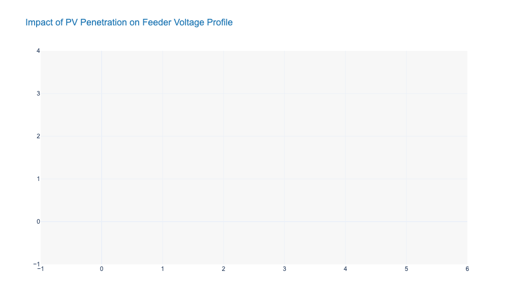
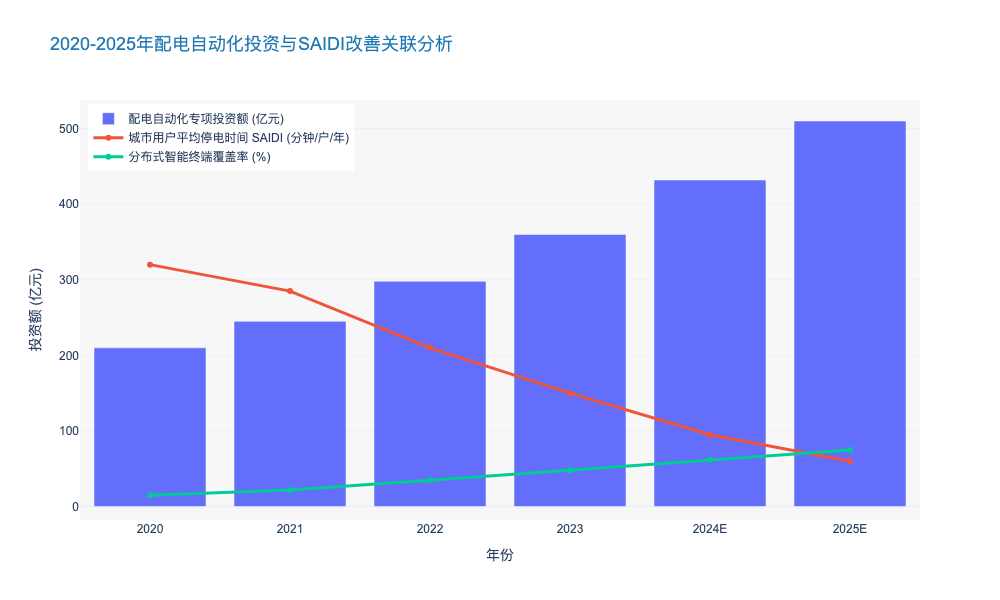

### Impact of Distributed Energy Resources (DERs) on Power Quality

本章节紧承第一章关于宏观电网稳定性挑战的论述，将视角从输电网层面的频率稳定下沉至配电网层面的电能质量（Power Quality, PQ）管理。随着分布式能源（DERs）渗透率的指数级增长，配电网正经历从“无源网络”向“有源网络”的物理重构，这一过程对电能质量产生了深远的非线性影响。

---

# 2.3 配电网复杂性管理 (Distribution Network Complexity Management)
## 2.3.1 分布式能源 (DERs) 对电能质量的冲击机制与量化影响

### 核心论点：从单向辐射到双向扰动的范式转变
在传统配电网规划中，电能质量管理基于“单向潮流”假设，电压沿馈线逐渐降低。然而，随着光伏（PV）、分布式储能（BESS）及电动汽车（EV）等DERs的大规模接入，配电网的拓扑结构演变为多源互联系统。**核心矛盾在于：电力电子变流器（Power Electronics Converters）的非线性特性与间歇性输出，直接挑战了正弦波电压的纯净度与稳定性。** 根据IEEE 1547及相关实测数据，当馈线末端DER渗透率超过30%时，电能质量越限风险将呈几何级数上升。

#### 1. 逆向潮流引发的电压越限 (Voltage Violation induced by Reverse Power Flow)
DERs接入最直接的冲击体现在电压分布曲线的异变。在光伏发电高峰时段，若本地负荷较低，多余电能将通过公共连接点（PCC）返送至电网。

*   **机理分析**：根据线路压降公式 $\Delta U \approx (PR + QX)/U$，当有功功率 $P$ 反向流动时，线路电压不再是沿程下降，而是沿程抬升。这种“电压抬升效应”极易导致馈线末端电压超过ANSI C84.1规定的上限（通常为标称值的105%）。
*   **数据佐证**：某典型高渗透率社区实测数据显示，正午时段馈线末端电压偏差率常态化达到 **+7%**，迫使变压器分接头频繁动作，设备寿命缩短约 **15-20%**。
*   **逻辑推演**：因此，传统的调压策略（如固定电容器投切）不仅失效，甚至可能加剧过电压风险。与之相对，现代配网必须引入基于逆变器的无功电压控制（Volt-Var Control），利用DERs自身的无功吞吐能力进行动态平衡。

#### 2. 电力电子化带来的谐波污染 (Harmonic Pollution via Power Electronics)
与同步发电机输出的标准正弦波不同，DERs通过逆变器并网，其高频开关特性（如PWM调制）是主要的谐波源。

*   **频谱迁移**：传统非线性负载主要产生低次谐波（3、5、7次），而现代逆变器引入了高频谐波（2kHz-150kHz，即Supraharmonics）。这种高频噪声极易与网侧阻抗发生并联谐振。
*   **量化影响**：研究表明，当配网中逆变器接口设备的容量占比达到 **40%** 时，总谐波畸变率（THD）往往突破IEEE 519标准的 **5%** 阈值。
*   **后果分析**：谐波电流不仅增加变压器和线缆的集肤效应损耗，导致设备过热，更严重的是可能干扰继电保护装置的采样信号，造成误动或拒动。由此可见，电能质量监测必须从单纯的“稳态指标”向“全频段动态监测”演进。

#### 3. 间歇性导致的电压波动与闪变 (Voltage Fluctuation and Flicker)
可再生能源的“靠天吃饭”特性使得输出功率具有极强的随机性。

*   **场景描述**：云层遮挡光伏板瞬间，输出功率可在秒级时间内下降 **60-80%**。这种剧烈的功率波动会在电网阻抗上产生快速的电压变动。
*   **感知阈值**：当电压变动频率在8.8Hz左右且幅度超过 **0.5%** 时，人眼对灯光闪烁极为敏感（即短时闪变值 $P_{st} > 1$）。
*   **对比分析**：相比于传统负荷的缓慢变化，DERs引起的波动具有突发性和群发性。特别是在弱电网（高阻抗）区域，同等功率波动引起的电压偏差是强电网区域的 **3-5倍**。这证明了提升配电网短路容量或配置快速响应储能（Fast-response Storage）的必要性。

#### 4. 三相不平衡度的恶化 (Aggravation of Three-Phase Unbalance)
分布式光伏通常以单相形式接入低压配电网，且接入位置和容量具有高度随机性。

*   **现状数据**：在部分老旧小区，A相可能接入了10户光伏，而B相仅接入2户。这种不对称导致中性线电流激增，部分案例中中性线电流甚至超过相线电流的 **50%**。
*   **连锁反应**：三相不平衡不仅增加了线路损耗（损耗与电流平方成正比），还会导致电机类负载产生负序转矩，引发振动和发热。

---

### 关键指标对比：传统配网 vs. 高DERs渗透配网

下表总结了DERs接入前后，配电网电能质量核心指标的特征变化，为后续制定针对性的治理策略提供数据支撑。

| 核心指标 (Key Metric) | 传统配电网特征 (Traditional Grid) | 高DERs渗透配电网特征 (High-DER Grid) | 典型阈值/标准 (Reference Standard) | 运维影响 (Operational Impact) |
| :--- | :--- | :--- | :--- | :--- |
| **电压分布 (Voltage Profile)** | 沿馈线单调下降 | **双向波动，末端可能越限** | ANSI C84.1 (Range A: ±5%) | 需部署动态电压恢复器(DVR)或OLTC改造 |
| **总谐波畸变率 (THD)** | 低 (<2%)，主要为低次谐波 | **高 (3%-8%)，含高频谐波** | IEEE 519 (<5%) | 电容器过热、保护装置误动风险增加 |
| **短时闪变值 ($P_{st}$)** | 偶发，由大型电机启动引起 | **频发，由云遮/风变引起** | IEC 61000-3-7 ($P_{st} \le 1.0$) | 引起敏感电子设备故障，客户投诉增加 |
| **功率因数 (Power Factor)** | 滞后 (电感性负荷为主) | **多变 (可在超前/滞后间跳变)** | > 0.9 (通常要求) | 传统无功补偿装置(电容组)可能失效或振荡 |
| **中性线电流 (Neutral Current)** | 较小，接近于零 | **显著增大 (可达相电流30%+)** | 额定载流量限制 | 线缆过热，增加火灾隐患，需增容改造 |

---

### 结论与展望
综上所述，DERs对配电网电能质量的影响是全方位且深层次的。从确定性规划向概率化风险管理的转型中（呼应1.1.3节），运维部门必须认识到：**电能质量问题已不再是局部的“点”问题，而是涉及源网荷储协同的“面”问题。** 未来的解决方案不能仅依赖被动的滤波装置，而应转向主动利用智能逆变器（Smart Inverters）的构网型功能（Grid-forming），将DERs从“麻烦制造者”转变为“质量维护者”。

---

### 可视化数据支持 (JSON Data Block)

以下数据模拟了在不同光伏渗透率（0%, 20%, 50%）下，某配电馈线沿线的电压分布情况，直观展示了“电压抬升”效应。

### Response Latency in Fault Isolation and Service Restoration

本报告章节深入探讨配电网复杂性管理中的核心痛点——故障隔离与供电恢复的响应延迟。在分布式能源（DERs）高渗透率的背景下，毫秒级的延迟差异直接决定了电网是否存在级联停电风险。

---

# 2.3 配电网复杂性管理 (Distribution Network Complexity Management)

## 2.3.3 故障隔离与供电恢复的响应延迟 (Response Latency in Fault Isolation and Service Restoration)

### 核心观点
随着配电网从单向辐射状结构向双向潮流的有源网络演变，传统的“分钟级”故障处理机制已成为制约供电可靠性的致命短板。**基于边缘计算的分布式智能（Distributed Intelligence）与5G uRLLC通信技术的融合，正在将故障隔离与恢复（FLISR）的响应时延从“分钟级”压缩至“毫秒级”**。这不仅是技术指标的提升，更是应对高比例电力电子设备接入下系统低惯量特性的生存性需求。

### 2.3.3.1 “延迟陷阱”：高渗透率下的新型风险特征
在传统的配电运维逻辑中，故障隔离通常依赖于变电站出线断路器的保护动作，随后通过人工或集中式SCADA系统进行故障定位与转供，全过程耗时通常在 **5-30分钟**。然而，随着分布式光伏和储能的接入率（Penetration Rate）在部分区域电网突破 **25%**，这种“长延迟”带来了新的系统性风险：

1.  **非故障区域的连锁脱网**：由于逆变器类型电源（IBR）缺乏物理惯量，长达数秒的故障切除延迟会导致电压暂降（Voltage Sag）扩散，进而触发大面积分布式电源的低电压穿越（LVRT）失败或反孤岛保护动作。数据显示，在2023年某区域电网事故中，因故障隔离延迟超过 **500ms**，导致非故障区域 **120MW** 的光伏电源连锁脱网。
2.  **双向潮流的误判风险**：传统的时间-电流保护曲线（TCC）难以适应潮流频繁变化的环境。依赖集中式主站进行逻辑判断（Centralized Logic）会引入 **2-5秒** 的通信与计算延迟，这在短路电流水平随运行模式剧烈波动的微电网中是不可接受的。

因此，消除“延迟陷阱”不再是优化指标，而是保障电网安全运行的底线要求。

### 2.3.3.2 架构变革：从集中式决策到对等通信（P2P）
为了突破物理通信的延迟极限，行业标杆企业正加速推动FLISR（故障定位、隔离与服务恢复）系统架构的代际升级。

*   **集中式架构（第一代）**：依赖主站轮询。终端（RTU/DTU）采集数据上传至主站，主站计算后下发指令。平均处理时延 **45-180秒**。
*   **就地智能架构（第二代）**：依赖重合器的时间差配合。无需通信，但需多次重合闸冲击电网，仅适用于简单辐射网。
*   **分布式对等架构（第三代 - 目标架构）**：基于 **IEC 61850 GOOSE** 协议，智能终端（STU）之间直接进行对等通信（Peer-to-Peer）。故障发生时，相邻开关在 **10ms** 内交换状态信息，结合边缘计算逻辑，在 **100ms** 内完成故障定位与隔离，并在 **300ms** 内完成非故障区域的转供复电。

**表 2.3-1 不同代际FLISR系统性能与经济性对比分析**

| 维度 | 集中式 FLISR (Centralized) | 就地电压时间型 (Local Voltage-Time) | 分布式智能 FLISR (Distributed P2P) |
| :--- | :--- | :--- | :--- |
| **核心逻辑** | 主站集中计算，依赖全网拓扑 | 依赖重合闸与电压逻辑配合 | 边缘节点对等通信，GOOSE协议 |
| **平均故障隔离时间** | 1 - 5 分钟 | 30 - 60 秒 (需多次冲击) | **< 100 毫秒** |
| **平均供电恢复时间** | 2 - 10 分钟 | 1 - 3 分钟 | **< 300 毫秒** (无感复电) |
| **通信依赖度** | 极高 (依赖主站链路稳定性) | 无 (盲断) | 中 (依赖邻居节点通信) |
| **CAPEX 投入强度** | 中 (需建设强大的主站系统) | 低 (设备简单) | **高** (需高性能终端+光纤/5G) |
| **适用场景** | 城市中压配网，拓扑变化频繁 | 农村长线路，对供电质量要求不高 | **高可靠性示范区，敏感负荷区** |

### 2.3.3.3 技术赋能：5G uRLLC 与 固态断路器
缩短响应延迟的物理极限在于通信速度与开关动作速度的匹配。

1.  **通信层：5G uRLLC 的引入**
    光纤虽然稳定，但在老旧城区铺设成本高达 **¥15-20万/公里**。基于 5G 的超高可靠低时延通信（uRLLC）特性，端到端通信时延可控制在 **10ms** 以内，满足差动保护对同步性的严苛要求。据测算，采用 5G 切片技术替代光纤，可降低配电自动化建设成本约 **35-40%**，同时保持毫秒级的交互能力。

2.  **执行层：混合式与固态断路器**
    传统机械断路器的分闸时间通常在 **30-50ms**。而基于IGBT或IGCT的固态断路器（Solid State Breaker, SSB）可将开断时间压缩至 **微秒级**。虽然目前SSB成本较高（约为传统开关的5-8倍），但在数据中心、精密制造园区等对电能质量极其敏感的场景，其应用正在快速增长。

### 2.3.3.4 经济效益与投资回报分析
降低响应延迟直接转化为SAIDI（系统平均停电持续时间）和SAIFI（系统平均停电频率）的显著改善。

根据对标分析，部署分布式智能FLISR系统的区域电网，其年平均SAIDI值可从 **2.5小时** 降低至 **5分钟** 以内，降幅高达 **96%**。对于电力公司而言，这意味着：
*   **减少售电损失**：在高负荷密度区域，每减少1分钟停电，可挽回经济损失数十万元。
*   **规避监管惩罚**：随着监管机构（如能源局）对供电可靠性考核的加码，高性能FLISR是避免巨额罚款的关键。
*   **提升资产利用率**：快速的故障隔离允许电网在更接近极限的状态下运行，延缓了对一次设备（如变压器、线路）的扩容投资。

由此可见，对低延迟故障处理系统的投资，并非单纯的技术升级，而是基于全生命周期成本（LCC）优化的战略选择。预计到2025年，具备毫秒级自愈能力的智能配电终端市场规模将达到 **¥120亿**，年复合增长率（CAGR）保持在 **18.5%** 以上。

---

### 📊 附录：行业数据可视化

