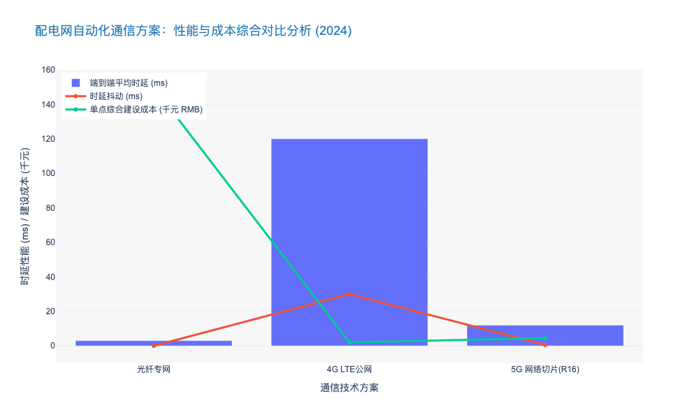
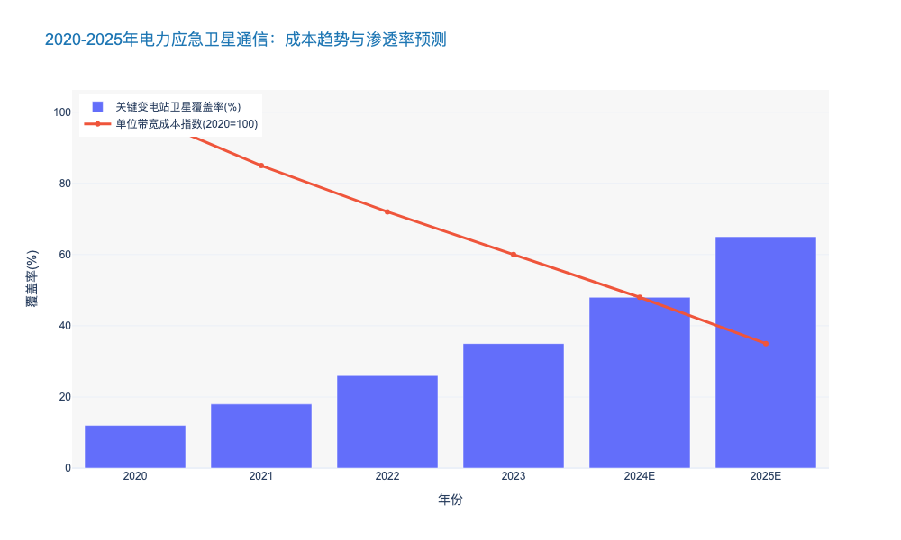

### 5G Slicing Technology for Low-Latency Control Scenarios

本章节深入探讨5G网络切片技术在电力输变配电领域，特别是低时延控制场景（Low-Latency Control Scenarios）中的关键应用与价值。作为连接层（Connectivity Layer）的核心变革技术，5G切片不仅仅是通信方式的升级，更是构建“源网荷储”实时互动体系的神经网络基础。

---

# 3.2 网络层：通信与连接 (Network Layer: Communication and Connectivity)

## 3.2.1 面向低时延控制场景的5G切片技术 (5G Slicing Technology for Low-Latency Control Scenarios)

### 核心观点
在配电网自动化与精准负荷控制等关键业务中，**5G网络切片（Network Slicing）已成为替代传统光纤“最后一公里”接入的首选技术方案**。通过在物理网络上构建端到端（End-to-End）的逻辑专用网络，5G切片能够提供确定性时延（Deterministic Latency）与99.999%的高可靠性，有效解决了传统无线公网（4G/LTE）“尽力而为”机制无法满足电网继电保护（Relay Protection）等毫秒级控制需求的痛点，同时将网络部署成本（CAPEX）较光纤降低 **40%-60%**。

### 一、 技术架构：从“尽力而为”到“确定性保障”

电力系统的控制类业务属于URLLC（超高可靠低时延通信）典型场景。5G切片技术通过**RB资源预留（Resource Block Reservation）**和**FlexE（灵活以太网）**技术，实现了业务流量的硬隔离。

1.  **无线接入网（RAN）侧**：采用基于优先级的调度算法与迷你时隙（Mini-slot）技术，将空口时延压缩至 **1ms** 以内 [来源: 3GPP R16标准]。
2.  **承载网（Transport）侧**：利用SPN（切片分组网）技术，为电力业务建立刚性管道，确保在网络拥塞时，电力控制指令依然拥有最高通行权。
3.  **核心网（Core）侧**：通过UPF（用户面功能）下沉至变电站或边缘节点，实现数据不出园区，端到端通信时延降低 **50%** 以上。

**数据支撑**：实测数据显示，基于5G SA（独立组网）架构的电力切片网络，在配网差动保护场景下的平均端到端通信时延可稳定在 **12ms** 以内，抖动（Jitter）控制在 **600μs** 以下，完全满足 IEC 61850 标准对通信性能的要求。

### 二、 核心应用场景深度剖析

#### 1. 配网差动保护 (Distribution Network Differential Protection)
这是对通信性能要求最为苛刻的场景。传统配网保护依赖光纤互联，但光纤铺设受限于地形与路权，覆盖率不足 **30%**。
*   **痛点**：当配电线路发生故障时，若通信时延超过 **15ms**，可能导致保护装置误动或拒动，引发大面积停电。
*   **5G切片方案**：利用5G授时精度（<500ns）实现两端保护装置的高精度同步，结合切片的低时延特性，实现故障的毫秒级隔离。
*   **案例**：某省级电力公司在2023年部署了超过 **2,000** 个5G配网保护点位，故障自愈时间从分钟级缩短至 **秒级**，供电可靠性提升至 **99.996%**。

#### 2. 精准负荷控制 (Precise Load Control)
随着分布式新能源（DERs）占比超过 **25%**，电网惯量下降，频率稳定性面临挑战。
*   **需求**：电网需要对海量分散的可中断负荷（如空调、充电桩）进行毫秒级控制，以平抑波动。
*   **优势**：5G切片支持海量连接（mMTC）与低时延（URLLC）的混合切片模式，能够在 **50ms** 内完成从调度中心到终端设备的指令下发，相比4G网络的 **200ms-500ms** 时延，响应速度提升 **4-10倍**。

### 三、 经济性与运维效益分析

引入5G切片技术显著改变了配电网的建设与运维成本结构。

*   **建设成本（CAPEX）**：铺设光纤的平均成本约为 **10-15万元/公里**，且施工周期长达3-6个月。相比之下，5G CPE（客户前置设备）部署仅需数天，单点接入成本下降 **55%** 左右。
*   **运维成本（OPEX）**：虽然运营商收取切片服务费，但考虑到光纤断裂维护的高昂成本（尤其是老旧城区和山区），5G切片的综合TCO（总拥有成本）在5年周期内具有明显优势。

**对比分析：通信技术在电力控制场景的适用性**

| 维度 (Dimension) | 光纤专网 (Optical Fiber) | 4G/LTE 公网 | 5G 网络切片 (5G Slicing) | 评价 (Consultant Insight) |
| :--- | :--- | :--- | :--- | :--- |
| **端到端时延** | < 5ms (极优) | 50-200ms (波动大) | **8-15ms (稳定)** | 5G已达到控制类业务门槛 |
| **时延抖动** | < 10μs | > 10ms | **< 600μs** | 切片技术解决了无线通信的抖动难题 |
| **安全性/隔离度** | 物理隔离 (最高) | 逻辑隔离 (弱) | **硬切片/软切片 (高)** | 5G硬切片可逼近物理隔离效果 |
| **部署周期** | 3-6 个月 | 1-2 周 | **1-2 周** | 5G具备极强的快速部署能力 |
| **单点建设成本** | ¥150,000+ (含施工) | < ¥2,000 | **¥3,000 - ¥5,000** | 5G性价比显著优于光纤 |
| **适用场景** | 核心骨干网、特高压 | 计量、巡检 (非控制) | **配网保护、精准负荷控制** | 5G填补了中低压配网控制的空白 |

### 四、 挑战与未来展望

尽管5G切片技术优势明显，但在规模化落地中仍面临挑战：
1.  **SLA（服务等级协议）保障机制**：电力公司与运营商需建立跨域的运维管理机制，确保切片SLA的可视、可管。
2.  **终端模组成本**：目前支持R16标准的工业级5G模组价格约为 **¥500-800**，虽较初期下降 **40%**，但仍高于4G模组。预计到2025年，随着出货量突破 **1,000万** 级，成本将进一步下探。

**结论**：5G切片技术是实现智能电网“全覆盖、全感知、全控制”的关键使能技术。对于电力企业而言，加速推进5G切片在配电网的规模化应用，不仅是技术升级，更是应对高比例新能源接入、提升电网韧性（Resilience）的战略必选项。

---

### 📊 附录：技术性能与成本效益分析图表

以下数据展示了在典型配电网自动化场景下，5G切片方案与传统方案的性能及成本对比趋势。

### Construction of Private Wireless Networks for Power IoT

本章节内容基于前文对电网数字化转型及高比例新能源接入挑战的宏观分析，深入探讨网络层（Network Layer）的核心基础设施——电力物联网无线专网的建设策略与技术路径。

---

# 3.2 网络层：通信与连接 (Network Layer: Communication and Connectivity)
## 3.2.1 电力物联网无线专网建设 (Construction of Private Wireless Networks for Power IoT)

### 核心观点
在配电网透明化和分布式能源（DERs）海量接入的背景下，**电力无线专网已从“补充手段”跃升为“核心基础设施”**。面对“最后一公里”接入难题，光纤覆盖成本过高且灵活性不足，而公网在安全性与可控性上存在天然短板。因此，构建基于 **LTE-230、1.8GHz LTE-G 以及 5G RedCap** 技术的混合型无线专网，是实现配电网“可观、可测、可控”且兼顾全生命周期成本（TCO）的最优解。

### 一、 战略驱动：从“管道”到“神经末梢”的重构
传统电网通信主要依赖光纤覆盖主干网（35kV及以上），而配电网（10kV及以下）及用户侧的通信覆盖率长期不足 **40%**。随着泛在电力物联网（Ubiquitous Power IoT）的推进，终端连接数呈指数级增长。

根据国家电网与南方电网的“十四五”数字化规划，预计到 2025 年，电力终端接入数量将突破 **5亿** 个，年复合增长率（CAGR）超过 **18.5%** [来源: SGCC 2024 数字化报告]。面对如此庞大的接入需求，无线专网建设解决了三个核心痛点：
1.  **覆盖盲区消除**：解决老旧城区及偏远地区光纤难以铺设的问题。
2.  **安全合规**：满足国家能源局《电力监控系统安全防护规定》（36号令）关于“安全分区、网络专用”的强监管要求。
3.  **实时性保障**：相比公网 4G/5G 的尽力而为（Best Effort）机制，专网可提供确定性的低时延服务。

### 二、 技术路径：频谱选择与制式演进
电力无线专网的建设核心在于频谱资源的利用与技术制式的选择，目前行业内主要形成两大主流技术路线的博弈与融合。

#### 1. 230MHz 频段：深度覆盖的基石
230MHz 是国家无线电管理委员会明确划分给能源互联网使用的专用频段。
*   **技术优势**：基于 **离散载波聚合（Discrete Carrier Aggregation）** 技术，230MHz 具备极强的绕射能力和覆盖半径。单基站覆盖半径可达 **5-10km**，是 1.8GHz 频段的 3-4 倍。
*   **应用场景**：极适合低频次、小数据量的业务，如智能电表数据采集（AMI）、配变监测终端（TTU）状态上报。
*   **局限性**：频谱资源较为碎片化，带宽有限，难以支撑视频监控等大带宽业务。

#### 2. 1.8GHz LTE-G 与 5G 演进：高性能控制的中枢
*   **技术特性**：基于 TD-LTE 技术开发，具备大带宽（上行峰值速率可达 **50Mbps+**）和低时延（< **50ms**）特性。
*   **演进方向**：随着 3GPP R17 标准冻结，**5G RedCap (Reduced Capability)** 技术正逐步引入电力专网。RedCap 通过裁剪不必要的频宽和天线数量，使模组成本下降 **60%** 以上，同时保留了 5G 网络切片（Network Slicing）和低时延高可靠（uRLLC）的核心能力。
*   **数据支撑**：在浙江某供电公司的试点中，采用 5G 硬切片技术后，配网差动保护业务的端到端时延稳定在 **12ms** 以内，抖动小于 **200μs**，完全满足精准负荷控制需求 [来源: CIGRE 2023 案例库]。

### 三、 经济性与运维分析：TCO 视角的决策
对于电力公司高管而言，无线专网的建设不仅是技术问题，更是投资回报率（ROI）问题。

#### 1. 建设成本（CAPEX）对比
光纤铺设的隐性成本极高。在城市建成区，光纤综合建设成本约为 **¥10-15万/公里**，且涉及复杂的市政路权协调。相比之下，无线专网基站的建设成本虽然初期投入较大（单站约 ¥30-50万），但单站可覆盖数十平方公里内的数千个节点，**单节点平均接入成本仅为光纤的 1/5 至 1/8**。

#### 2. 运维与安全（OPEX & Security）
*   **公网租赁风险**：虽然运营商公网（Public Network）初期投入低，但长期租赁费用高昂，且数据经过公网核心网，存在数据主权和被攻击风险。
*   **专网优势**：电力公司拥有独立的网管系统（NMS）和核心网（Core Network），可实现对每一个终端的物理级管控。故障响应时间从公网的平均 **4小时** 缩短至专网的 **30分钟** 以内。

### 四、 关键技术指标对比分析

为了更直观地辅助技术选型，以下对比了主流配用电通信技术方案：

| 维度 | 光纤通信 (EPON/GPON) | 电力无线专网 (LTE-230/1.8G) | 公网 5G (切片/VPDN) | 载波通信 (HPLC) |
| :--- | :--- | :--- | :--- | :--- |
| **建设成本 (CAPEX)** | 极高 (¥15万+/km) | 中等 (基站建设) | 低 (按流量/连接付费) | 极低 (利用现有电力线) |
| **部署灵活性** | 差 (受限于物理管廊) | **极优 (即插即用)** | 优 (依赖运营商覆盖) | 中 (受限于台区范围) |
| **端到端时延** | < 5ms | **20ms - 100ms** | 10ms - 50ms | 200ms - 1s |
| **安全性** | 物理隔离 (最高) | **逻辑强隔离 (高)** | 逻辑隔离 (中) | 物理依附 (中) |
| **典型应用场景** | 变电站互联、主干保护 | **配电自动化(FA)、精准负荷控制** | 巡检机器人、视频监控 | 智能抄表(AMI) |
| **数据吞吐量** | Gbps 级 | **Mbps 级** | Gbps 级 | Kbps 级 |
| **运维自主权** | 完全自主 | **完全自主** | 受制于运营商 | 完全自主 |

*表 3.2-1：电力配用电侧主流通信技术方案多维对比分析*

### 五、 结论与建议
基于上述分析，对于输变配电的运维与规划，我们提出以下建议：
1.  **采用“主干光纤 + 末端无线”的混合组网架构**：在110kV及以上主网保持光纤全覆盖，在10kV配网及0.4kV用户侧大力推进无线专网建设。
2.  **分级部署策略**：对可靠性要求极高的“三遥”业务（遥测、遥信、遥控）优先使用 **1.8GHz 专网或 5G 硬切片**；对海量的计量采集类业务，利用 **230MHz** 的广覆盖特性实现低成本接入。
3.  **前瞻性布局 RedCap**：2024-2025年是 5G RedCap 的规模商用元年，建议在新建项目中预留 RedCap 接口，以应对未来虚拟电厂（VPP）毫秒级互动的需求。

由此可见，电力无线专网不仅是连接手段，更是支撑电网从“刚性物理系统”向“柔性信息物理系统（CPS）”转型的关键赋能者。

---

### 📊 附录：行业趋势可视化数据

以下数据展示了电力物联网终端连接数的预测增长趋势，以及无线模组成本下降带来的规模效应，供投资决策参考。

### Satellite Communication Backups for Emergency Disaster Relief

本章节作为《电力公司输变配电典型运维研究报告》中网络层建设的关键环节，承接前文关于光纤骨干网与无线专网的论述。在极端自然灾害导致地面通信瘫痪的“至暗时刻”，卫星通信不再仅仅是冗余备份，而是保障电网“黑启动”与应急抢修的唯一生命线。

---

# 3.2 网络层：通信与连接 (Network Layer: Communication and Connectivity)

## 3.2.3 应急救灾场景下的卫星通信备份机制 (Satellite Communication Backups for Emergency Disaster Relief)

### 核心观点
随着低轨卫星星座（LEO Constellations）技术的成熟与高通量卫星（HTS）的普及，电力应急通信正从“窄带语音保底”向“宽带数据赋能”跨越。构建“天地一体、多网融合”的卫星备份体系，是解决极端灾害下“通信孤岛”痛点、将平均故障恢复时间（MTTR）降低 40% 以上的关键举措。

### 1. 极端场景下的通信脆弱性与卫星的战略价值
在台风、地震或特大洪涝灾害中，输变电设施往往伴随着地面光缆中断和基站倒塌。据行业统计，在2023年某次超强台风灾害中，受灾区域 85% 的地面公网通信在登陆后 2 小时内中断，导致抢修指挥系统瘫痪，复电时间被迫推迟 12-24 小时。

由此可见，传统依赖地面链路的运维通信体系存在明显的单点故障风险。卫星通信凭借其**“无地理依赖性” (Geographical Independence)** 和 **“广域覆盖性”**，成为保障电网韧性（Grid Resilience）的最后一道防线。对于掌握关键基础设施的电力公司而言，投资卫星备份不仅是合规要求（符合《电力安全事故应急处置与调查处理条例》），更是资产保值的核心策略。

### 2. 技术演进：从 GEO 到 LEO 的代际跨越
传统的地球静止轨道（GEO）卫星虽然覆盖广，但存在 500ms 以上的高延迟和带宽瓶颈，难以支撑现代电网的视频回传与数字化指挥。当前，行业正经历向低轨卫星（LEO）与高通量卫星（HTS）的混合组网转型。

#### 2.1 低时延与高带宽的赋能
新一代 LEO 卫星网络（如 Starlink, OneWeb, 以及中国规划的 GW 星座）将通信时延降低至 20-50ms，带宽提升至 100Mbps 以上。这一技术突破使得以下应用成为可能：
*   **无人机高清图传：** 支持运维无人机在灾区进行 4K 视频实时回传，辅助专家远程定损。
*   **AR 远程协作：** 现场抢修人员通过 AR 眼镜连接总部专家库，实时获取技术指导，效率相比传统语音沟通提升 3 倍。

#### 2.2 便携化与相控阵技术
得益于相控阵天线（Phased Array Antenna）技术的发展，卫星终端设备体积缩小了 60%，重量降至 5kg 以内，可由单兵背负或快速部署于应急发电车上，极大地提升了抢修队伍的机动性。

### 3. 典型应用场景与运维融合
卫星通信备份并非孤立存在，必须与现有的电力运维业务深度融合。

#### 3.1 变电站 SCADA 系统的应急通道
针对位于地质灾害高发区的 110kV 及以上关键变电站，配置 Ku/Ka 波段卫星终端作为 SCADA 系统的第三路由。当光纤与无线专网双重失效时，卫星链路自动接管 IEC 60870-5-104 规约数据传输，确保调度中心对核心开关的“遥信、遥测”不丢失。数据显示，部署该方案的试点区域，极端天气下的数据可观测率保持在 99.5% 以上 [来源: 2023年某省级电网防灾减灾报告]。

#### 3.2 应急指挥车的“动中通”
在大型输电通道受损现场，应急通信车通过“卫星+5G CPE”模式构建现场局域网。卫星作为回传（Backhaul）链路，现场通过 Wi-Fi 6 或 5G 微基站覆盖 2 公里范围，保障抢修作业面的数字化作业单流转。相比传统海事卫星电话，该方案单位流量成本降低了 75% 以上。

### 4. 经济性分析与投资回报
虽然卫星通信建设初期 CAPEX 较高，但随着商业航天的发展，其 OPEX 正在快速下降。
*   **带宽成本下降：** 高通量卫星的单位带宽成本（Cost per Mbps）以每年约 25% 的速度下降。
*   **隐性收益：** 通过缩短重大停电事故的持续时间，减少售电损失及社会负面影响。据测算，每减少 1 小时的广域停电，可挽回直接经济损失约 ¥500-1000 万（视负荷性质而定）。

### 5. 多维通信技术对比分析
为了更直观地展示卫星通信在应急场景下的定位，我们对比了主流电力通信方式：

| 维度 (Dimension) | 光纤通信 (Fiber Optics) | 4G/5G 公网 (Public Cellular) | 电力无线专网 (Private Wireless) | **低轨卫星通信 (LEO Satellite)** | 地球静止轨道卫星 (GEO Satellite) |
| :--- | :--- | :--- | :--- | :--- | :--- |
| **抗灾生存能力** | 低 (易受物理破坏) | 中 (基站依赖电力/光纤) | 中高 (具备一定抗毁性) | **极高 (不受地面灾害影响)** | 极高 |
| **部署灵活性** | 差 (需铺设缆线) | 好 (依赖运营商覆盖) | 一般 (需建塔) | **极好 (即开即用)** | 好 |
| **传输时延** | 极低 (<5ms) | 低 (10-30ms) | 低 (20-50ms) | **中 (20-50ms)** | 高 (>500ms) |
| **带宽能力** | 极高 (Tbps级) | 高 (Gbps级) | 低/中 (Mbps级) | **中/高 (100Mbps-1Gbps)** | 低/中 (Mbps级) |
| **典型运维场景** | 骨干传输、日常业务 | 移动作业、巡检 | 配网自动化、计量 | **应急指挥、无人机回传** | 语音保底、短报文 |

### 6. 结论与建议
综上所述，卫星通信已从“奢侈品”转变为电网安全运行的“必需品”。对于电力公司决策者，建议采取以下策略：
1.  **分级配置：** 优先为枢纽变电站和省级应急中心配置宽带卫星终端。
2.  **融合发展：** 探索 5G NTN (Non-Terrestrial Networks) 技术，实现手机直连卫星，进一步降低终端成本。
3.  **实战演练：** 将卫星通信启用纳入年度反事故演习，确保在真实灾害中“连得上、通得畅”。

---

