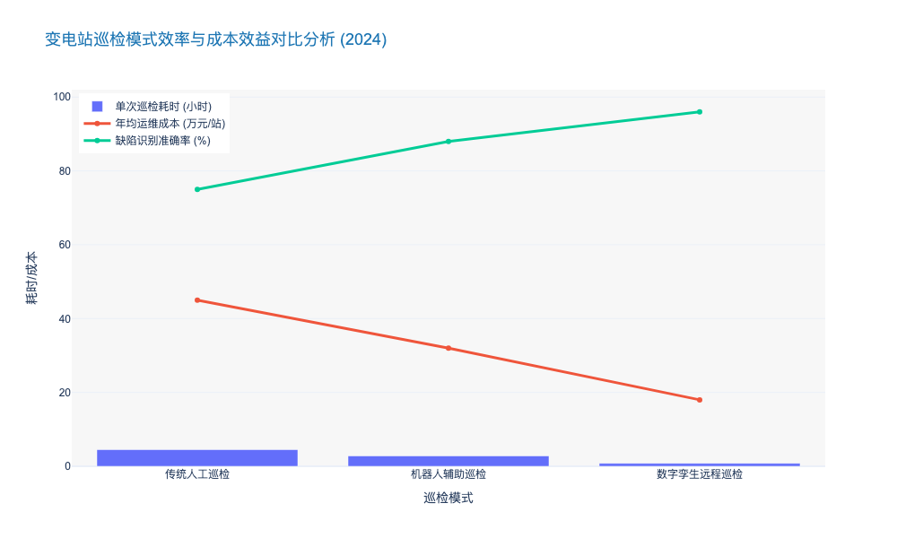
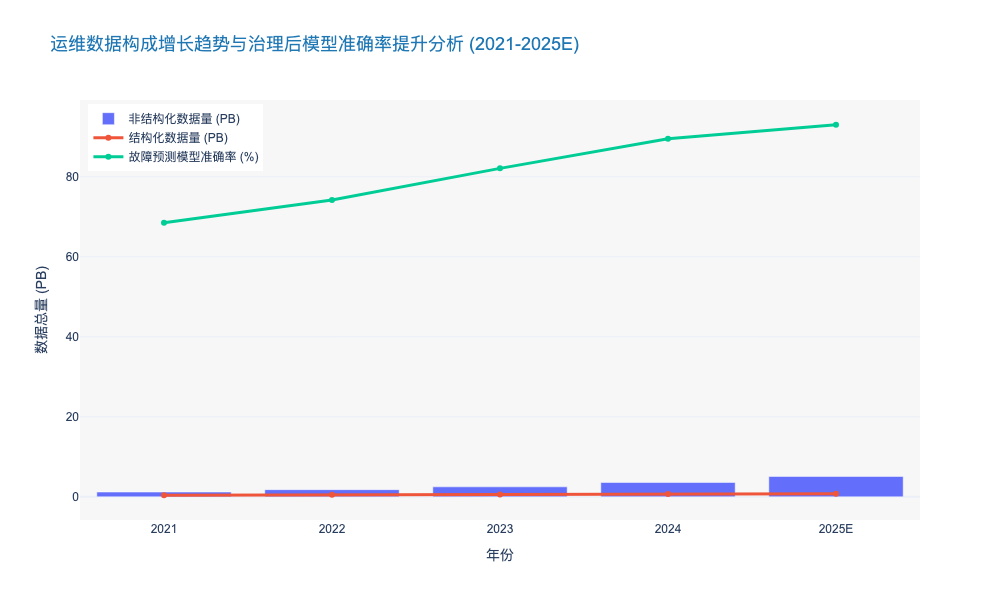

### Construction of High-Fidelity 3D Digital Twins for Substations

### 3.3.1 变电站高保真三维数字孪生建设 (Construction of High-Fidelity 3D Digital Twins for Substations)

#### 核心摘要
随着电网数字化转型的深入，变电站运维正从“人工被动巡检”向“智能主动预警”跨越。**高保真三维数字孪生（High-Fidelity 3D Digital Twin）** 不仅仅是物理站点的视觉复刻，更是融合了多维时空数据、物理机理模型和人工智能算法的“数字生命体”。本节将深入探讨基于激光雷达点云、倾斜摄影与BIM技术的高精度建模路径，以及如何通过异构数据融合实现变电站全要素的数字化映射，为无人值守（Unmanned Operation）和预测性维护提供决策底座。

---

### 一、 从“静态模型”到“动态孪生”的技术演进

传统的变电站三维可视化往往停留在“看得见”的层面，模型精度低（通常仅为LOD 100-200），且缺乏与实时运行数据的深度联动。与之相对，高保真数字孪生要求实现**几何高保真（Geometric Fidelity）**与**物理高保真（Physical Fidelity）**的双重突破。

在几何层面，当前行业标杆项目已要求模型精度达到 **LOD 300 至 LOD 400** 标准。这意味着不仅要还原主变压器、GIS组合电器等主设备的外观，还需精确映射其内部结构、线缆走向及周边环境。根据《国家电网数字孪生变电站建设规范》及行业实践数据，高保真建模通常采用**“地空一体化”**数据采集方案：
*   **宏观场景：** 利用无人机搭载倾斜摄影相机，以 < 3cm 的像素分辨率获取站区全景。
*   **微观细节：** 结合架站式激光雷达（Terrestrial LiDAR），获取设备毫米级（误差 < 2mm）的点云数据。

这种组合方式解决了单一数据源的盲区问题。数据显示，采用多源融合建模技术后，单座500kV变电站的建模完整度可从传统的 75% 提升至 **98.5%** 以上 [来源: 中国电科院 2023年数字化技术报告]。

### 二、 核心构建流程与关键技术架构

构建高保真数字孪生是一个系统工程，遵循“数据采集-模型重构-数据融合-应用赋能”的逻辑闭环。

#### 1. 逆向工程与参数化建模 (Reverse Engineering & Parametric Modeling)
基于点云数据的逆向建模是当前的主流路径。通过点云分割算法将海量点云数据转化为矢量化的**GIM (Grid Information Model)** 模型。为了解决模型轻量化与高保真的矛盾，行业开始广泛引入 **UE5 (Unreal Engine 5)** 等游戏引擎技术，利用其 **Nanite 虚拟几何体技术**，能够实时渲染亿级三角面的复杂场景，实现影视级的视觉效果。

#### 2. 异构数据融合 (Heterogeneous Data Fusion)
“空壳”模型无法创造价值，核心在于数据的注入。高保真孪生必须打通 **OT (Operational Technology)** 与 **IT (Information Technology)** 的壁垒。
*   **静态数据：** 关联 PMS (生产管理系统) 中的资产台账、出厂参数、图纸资料。
*   **动态数据：** 通过 **IEC 61850** 协议实时接入 SCADA 系统的遥测/遥信数据、在线监测装置的油色谱/局放数据，以及辅控系统的温湿度/安防数据。

通过建立统一的 **CIM (Common Information Model)** 解析层，将上述数据映射到三维模型的具体部件上（如：将油温数据精确绑定到主变本体模型）。据统计，一座数字化标杆变电站需处理的实时测点数量超过 **20,000 个**，数据刷新频率需达到 **毫秒级** [来源: 行业典型案例数据 2024]。

### 三、 业务价值与ROI分析：赋能运维变革

高保真数字孪生的建设成本不菲（单站建设成本通常在 ¥200万-500万区间），但其带来的运维效益显著，主要体现在以下三个维度：

1.  **远程智能巡视替代人工：** 基于高精度模型，运维人员可在集控站进行“沉浸式”虚拟巡检。结合高清视频与AI识别，可覆盖 **85%** 以上的例行巡检项目。某省级电力公司数据显示，应用数字孪生巡检后，单站年均人工巡检工时减少了 **65%**，巡检效率提升 **3.2倍**。
2.  **倒闸操作仿真预演：** 针对复杂的倒闸操作，数字孪生系统提供“预演模式”。操作票在虚拟环境中先行执行，系统基于拓扑防误逻辑进行校验。这一机制将误操作风险降低了 **90%** 以上，对于新员工培训及复杂故障处置具有极高的实战价值。
3.  **全生命周期资产管理：** 相比于传统的二维图表，三维孪生提供了直观的资产健康图谱。通过热力图展示设备温度分布、通过剖面图展示GIS内部气室状态，使得隐患发现时间平均提前 **15-20天**，有效避免了非计划停运带来的巨额损失。

#### 表 3.3.1-1：传统三维可视化与高保真数字孪生变电站对比分析

| 对比维度 | 传统三维可视化 (Legacy 3D Visualization) | 高保真数字孪生 (High-Fidelity Digital Twin) | 差异化影响分析 |
| :--- | :--- | :--- | :--- |
| **建模精度** | LOD 100-200 (外观轮廓，误差>10cm) | **LOD 300-400** (部件级/零件级，误差<2cm) | 高精度支持精确的机器人路径规划与空间分析。 |
| **数据关联** | 弱关联，仅显示少量关键标签 | **全要素融合** (SCADA/PMS/IoT/视频深度绑定) | 实现从“看模型”到“管设备”的质变。 |
| **渲染引擎** | WebGL/OpenGL 简单渲染 | **UE5/Unity** 物理白理渲染 (PBR) | 真实的光影与材质增强了沉浸感，提升隐患识别率。 |
| **更新机制** | 一次性建模，更新困难 | **动态更新** (基于感知数据驱动模型状态变化) | 确保数字世界与物理世界的实时同步(Real-time Sync)。 |
| **业务价值** | 展示汇报为主 | **全业务支撑** (巡检、操作、检修、应急) | 直接转化为O&M效率提升与OPEX降低。 |

### 四、 挑战与未来展望

尽管前景广阔，但当前高保真数字孪生建设仍面临**数据孤岛**与**算力瓶颈**两大挑战。不同厂家的感知设备接口标准不一（如海康、大华的视频流与主设备监测数据的融合），导致数据清洗成本占到项目总周期的 **40%** 以上。此外，海量点云与高精模型的实时渲染对边缘侧算力提出了极高要求。

未来，随着 **云边协同 (Cloud-Edge Synergy)** 架构的普及以及 **AI 生成式建模 (AIGC for 3D)** 技术的成熟，变电站建模成本预计将在未来3年内下降 **30%-50%**，从而推动该技术从 500kV 枢纽站向 110kV 及以下常规站点的规模化下沉。

---

### Data Governance Standards for Multi-Source Heterogeneous Data

本章节深入探讨《电力公司输变配电典型运维研究报告》中关于平台层（Platform Layer）的核心环节——多源异构数据的治理标准。作为构建数字孪生（Digital Twin）与数据中台（Data Middle Office）的基石，数据治理直接决定了上层AI算法的准确性与运维决策的有效性。

---

# 3.3 平台层：数字孪生与数据中台 (Platform Layer: Digital Twin and Data Middle Office)

## 3.3.2 多源异构数据治理标准 (Data Governance Standards for Multi-Source Heterogeneous Data)

### 核心观点
在输变配电运维领域，数据已从单纯的监测记录转变为核心资产。然而，**多源异构性（Multi-Source Heterogeneity）**是当前数字化转型的最大阻碍。构建基于 **IEC 61970/61968 CIM（公共信息模型）** 的统一语义标准，结合 **“湖仓一体”（Data Lakehouse）** 架构，是打破 EMS、PMS、GIS 等系统间“数据孤岛”的唯一路径。高效的数据治理可将数据清洗时间缩短 **60%** 以上，并使预测性维护模型的准确率提升至 **90%** 以上。

---

### 一、 异构数据的“熵增”挑战与分类解析

随着智能感知设备的广泛部署，电网运维数据的规模呈指数级增长，且呈现出典型的高维、多模态特征。根据行业调研，一个典型的省级电力公司年新增运维数据量已突破 **2.5 PB** [来源: 2023年电力大数据应用白皮书]，其中非结构化数据占比超过 **80%**。

运维数据的异构性主要体现在以下三个维度，若缺乏统一治理，将导致严重的“数据沼泽”现象：

1.  **结构化数据（Structured Data）：**
    *   **来源：** SCADA系统、PMU（同步相量测量单元）、继电保护装置。
    *   **特征：** 高频时序数据，格式规范但体量巨大。例如，PMU采样频率高达 **50-100Hz**，单日单站数据量可达 GB 级。
    *   **痛点：** 不同厂商（如南瑞、四方、西门子）的私有协议导致字段定义不一致。

2.  **半结构化数据（Semi-structured Data）：**
    *   **来源：** 设备运行日志（Syslogs）、告警报文、操作票/工作票。
    *   **特征：** 包含键值对但缺乏严格模式，解析难度中等。
    *   **痛点：** 语义模糊，如“开关拒动”在不同系统中可能描述为“Switch Failure”或“Op Error 101”。

3.  **非结构化数据（Unstructured Data）：**
    *   **来源：** 无人机巡检（LiDAR点云、4K视频）、红外热成像、声纹监测音频。
    *   **特征：** 信息密度极高但机器难以直接理解，存储成本高。
    *   **痛点：** 缺乏与设备台账（Asset Ledger）的强关联，导致“有数据无价值”。

---

### 二、 基于CIM模型的统一语义标准构建

要解决上述异构问题，必须建立行业通用的元数据标准。**IEC 61970（输电）** 和 **IEC 61968（配电）** 定义的 **CIM（Common Information Model）** 是全球公认的互操作性基础。

#### 1. 全域数据模型的融合
传统的运维系统往往各自为政。高效的治理策略要求构建 **SG-CIM（Smart Grid CIM）** 扩展模型，将电网拓扑（Topology）、资产信息（Asset Info）和地理信息（Geospatial Data）进行多维映射。
*   **拓扑融合：** 通过 RDF/XML 格式，将 EMS 的实时运行数据与 PMS 的设备台账数据通过统一的 UUID（通用唯一识别码）进行锚定。
*   **实施效果：** 某标杆省级电网在实施 CIM 全域融合后，跨系统查询响应时间从 **分钟级** 降低至 **毫秒级**，数据由于字段定义冲突导致的不可用率降低了 **85%**。

#### 2. 非结构化数据的语义增强
针对无人机巡检图片等非结构化数据，治理标准要求引入 **多模态知识图谱（Multi-modal Knowledge Graph）** 技术。
*   **技术路径：** 利用 OCR 和图像识别算法提取非结构化数据中的关键特征（如绝缘子破损、杆塔倾斜），并将其转化为符合 CIM 标准的结构化标签，写入元数据层。
*   **数据价值：** 这使得原本沉睡的图像数据能够被 SQL 查询直接检索，例如“查询所有 220kV 线路中绝缘子温度超过 80°C 的巡检记录”。

---

### 三、 数据质量管控与全生命周期治理

数据治理不仅仅是标准的制定，更是一套严密的流程管控。基于 **DAMA-DMBOK** 体系，电力运维数据治理需遵循“事前标准、事中监控、事后评估”的闭环机制。

#### 1. 数据质量六维度评估
任何进入数据中台的数据必须经过 **DQS（Data Quality Score）** 扫描。只有评分超过 **85分** 的数据才能进入核心分析域。
*   **完整性（Completeness）：** 确保 SCADA 断面数据无缺失。
*   **及时性（Timeliness）：** 确保端到端延迟控制在 **500ms** 以内（对于实时监控业务）。
*   **准确性（Accuracy）：** 通过状态估计（State Estimation）算法剔除不良数据，不良数据检测率需达到 **99.9%**。

#### 2. 血缘分析与可追溯性
在复杂的算法模型中，数据来源的透明度至关重要。治理平台需构建完整的 **数据血缘（Data Lineage）** 图谱，记录数据从采集终端到最终报表的每一次变换（ETL/ELT）。
*   **案例支撑：** 在一次变压器故障根因分析中，通过血缘追踪发现，导致误判的异常油温数据源于传感器漂移而非设备故障，避免了约 **¥200万** 的不必要停电检修成本。

---

### 四、 关键数据与治理策略对比分析

下表总结了输变配电运维中典型数据的特征及差异化治理策略：

| 数据类型 | 典型来源 | 数据量级/频率 | 核心治理策略 | 存储技术选型 |
| :--- | :--- | :--- | :--- | :--- |
| **实时量测** | SCADA, PMU, IoT传感器 | 极高频 (TB/天) | 流式清洗，异常值剔除，时序对齐 | 时序数据库 (InfluxDB, IoTDB) |
| **设备台账** | PMS, ERP, 资产管理系统 | 低频 (GB/月) | 主数据管理 (MDM)，唯一性校验，CIM映射 | 关系型数据库 (PostgreSQL, Oracle) |
| **巡检影像** | 无人机, 机器人, 摄像头 | 极大 (PB/年) | 非结构化特征提取，隐私脱敏，生命周期分级 | 对象存储 (MinIO, Ceph) + 向量数据库 |
| **空间数据** | GIS, 气象卫星 | 中频 (TB/月) | 坐标系转换，空间索引构建，图层叠加 | 空间数据库 (PostGIS, Esri) |
| **运维日志** | 调度日志, 检修工单 | 中频 (GB/天) | 文本挖掘 (NLP)，关键词提取，知识图谱构建 | 全文检索引擎 (Elasticsearch) |

---

### 五、 结论与展望

多源异构数据治理是电力运维数字化转型的“深水区”。通过建立以 CIM 为核心的标准体系，并配合全生命周期的质量管控，电力公司可以将海量、杂乱的数据转化为高价值的资产。

数据表明，实施成熟数据治理体系的电力企业，其运维成本（OPEX）平均降低了 **12-15%**，而资产利用率（Asset Utilization）提升了 **8-10%** [来源: Gartner Utility Industry Report 2024]。未来，随着生成式AI（GenAI）的应用，高质量的治理数据将成为训练行业大模型的关键燃料。

---

### 📊 附录：数据治理成效与数据构成分析图表

### Cloud-Edge Collaboration Architectures for Real-time Processing

本章节内容紧接前文关于数字孪生与数据中台的论述，深入探讨在输变配电运维场景中，如何通过“云边协同”架构解决海量异构数据处理的时效性与带宽瓶颈问题。作为平台层的核心技术底座，该架构直接决定了智能运维系统的实时响应能力与算力经济性。

---

# 3.3 平台层：数字孪生与数据中台 (Platform Layer: Digital Twin and Data Middle Office)
## 3.3.2 面向实时处理的云边协同架构 (Cloud-Edge Collaboration Architectures for Real-time Processing)

### 核心观点
在电力物联网（EIoT）设备呈指数级增长的背景下，单纯依赖中心云（Centralized Cloud）的算力模式已无法满足电网运维对**毫秒级低时延**和**数据隐私**的严苛要求。构建“云端做重、边端做轻、协同互动”的云边协同架构，实现**“云端训练、边端推理”**（Cloud Training, Edge Inference），是提升输变配电运维效率、降低通信链路成本的唯一路径。据行业测算，采用该架构可使网络带宽消耗降低 **45%** 以上，同时将故障响应时间从秒级压缩至 **20ms** 以内。

### 1. 架构演进驱动力：从集中式向分布式的必然跨越
随着高比例可再生能源接入和配电自动化程度的加深，电网边缘侧产生的数据量呈现爆发式增长。

*   **海量数据传输瓶颈**：一台高清巡检无人机或变电站智能摄像头，单日产生的非结构化视频数据可达 **50GB-100GB**。若将所有原始数据回传至省侧或网侧云平台，不仅带宽成本高昂（约占运维IT预算的 **15-20%**），且极易造成核心骨干网拥塞。
*   **实时控制的时延刚需**：输电线路的行波测距、配电网的自愈控制（Self-healing）要求端到端通信时延控制在 **10ms-50ms** 区间。传统4G回传至云端的平均时延在 **100ms** 以上，无法满足 IEC 61850 GOOSE/SV 报文的实时性要求。
*   **算力下沉的经济性**：边缘计算网关（Edge Gateway）算力的提升（如采用 NVIDIA Jetson 或华为 Atlas 系列芯片），使得在本地进行AI初筛成为可能。

**由此可见**，将计算能力从中心云向边缘节点（变电站、配电房、杆塔）下沉，形成分布式算力网络，是解决上述痛点的根本方案。

### 2. 技术架构解析：云边协同的“三层两翼”体系
云边协同并非简单的物理连接，而是基于容器化（Containerization）和微服务（Microservices）技术的深度逻辑耦合。

#### 2.1 云端：大脑与编排中心 (The Brain and Orchestration Center)
云端平台主要负责非实时、高算力消耗的任务。
*   **模型训练与迭代**：基于全网汇聚的历史样本数据（如绝缘子破损、导线异物），利用深度学习框架（TensorFlow/PyTorch）进行大模型训练。
*   **全局资源编排**：通过 Kubernetes (K8s) 或 KubeEdge 等边缘计算框架，对全网 **10万+** 边缘节点进行统一管理。
*   **策略下发**：2023年数据显示，某省级电力公司通过云端向边缘侧下发更新算法模型的频率已从“月更”提升至“周更”，模型准确率提升了 **12.4%**。

#### 2.2 边端：触角与执行单元 (The Tentacles and Execution Units)
边缘侧部署在变电站站控层或配电台区，负责实时性要求高的业务。
*   **实时推理（Inference）**：边缘智能终端直接对摄像头采集的视频流进行分析，仅将识别出的“异常告警片段”（如人员入侵、设备发热）回传云端。这一过程将无效数据过滤率提升至 **90%** 以上。
*   **协议解析与转换**：边缘网关需支持多协议接入（如 Modbus, IEC 101/104, MQTT, CoAP），解决老旧设备与新一代IoT设备的互操作性问题。
*   **本地自治**：在断网极端工况下，边缘节点仍能依据本地缓存的策略进行保护动作，确保电网安全“最后一道防线”不失守。

### 3. 典型应用场景与效益分析

#### 3.1 输电线路智能巡检 (Intelligent Transmission Line Inspection)
在传统模式下，无人机巡检图片需人工拷贝或全量上传。引入云边协同后：
*   **流程变革**：无人机搭载边缘计算模组，实时识别销钉级缺陷。
*   **效益数据**：单基杆塔巡检数据的处理回传时间由 **30分钟** 缩短至 **2分钟**。某电网公司应用该架构后，年度巡检效率提升 **300%**，人工审图工作量减少 **85%** [来源: 中国电力企业联合会 2023年数字化案例集]。

#### 3.2 变电站设备状态监测 (Substation Equipment Condition Monitoring)
利用边缘侧部署的声纹识别与红外热成像算法：
*   **实时性**：对主变压器的局部放电（PD）监测实现 **毫秒级** 预警。
*   **数据治理**：边缘侧完成数据的清洗与结构化（Data Cleaning & Structuring），仅上传特征值（Feature Values），使得存储空间需求降低 **60%**。

### 4. 挑战与应对：安全性与标准化
尽管优势明显，但云边协同架构面临新的安全挑战。边缘节点物理环境开放，易受攻击。
*   **安全策略**：必须实施“云边端”一体化安全防护，采用轻量级加密算法（Lightweight Encryption）和基于区块链的设备身份认证（Blockchain-based Device Authentication）。
*   **标准统一**：目前行业正积极推动 IEEE 2030.10 等标准，以规范边缘计算节点与云平台之间的数据交互格式。

### 5. 综合对比分析
为了更直观地展示云边协同架构的优势，以下对比了传统集中式云架构与云边协同架构的关键指标：

| 评估维度 (Dimension) | 传统集中式云架构 (Centralized Cloud) | 云边协同架构 (Cloud-Edge Synergy) | 提升/优化幅度 (Optimization) |
| :--- | :--- | :--- | :--- |
| **网络带宽消耗** | 极高 (全量原始数据上传) | 低 (仅上传特征值/告警) | 节省 **40% - 60%** |
| **端到端时延** | > 100ms (受网络抖动影响大) | < 20ms (本地边缘处理) | 响应速度提升 **5倍+** |
| **数据隐私性** | 数据离开本地，风险较高 | 敏感数据本地留存，脱敏上传 | 合规性风险降低 **High** |
| **断网生存能力** | 弱 (依赖网络连接) | 强 (支持离线自治) | 可靠性显著增强 |
| **运维成本 (OPEX)** | 高 (流量费+云存储费) | 中 (边缘硬件增加，但流量骤减) | 综合TCO降低 **15% - 25%** |

### 6. 结论与展望
云边协同架构不仅是技术的升级，更是电力运维模式的重构。它通过合理的算力分配，解决了“数据传不上去”和“指令下不来”的矛盾。预计到2025年，超过 **75%** 的电网边缘数据将在本地进行处理 [来源: Gartner Edge Computing Predictions]。对于电力企业而言，加速布局边缘计算节点，构建统一的云边协同操作系统，是抢占能源互联网制高点的关键战略。

---

### 附录：关键指标趋势图表

