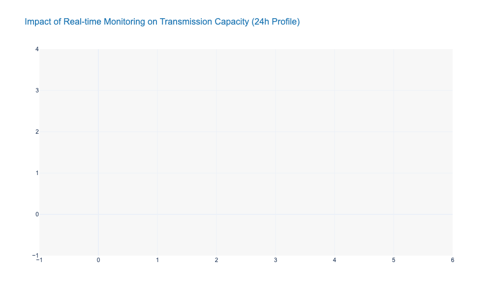
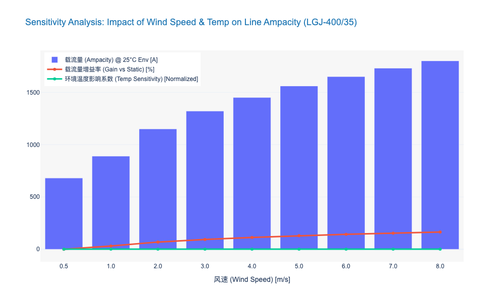
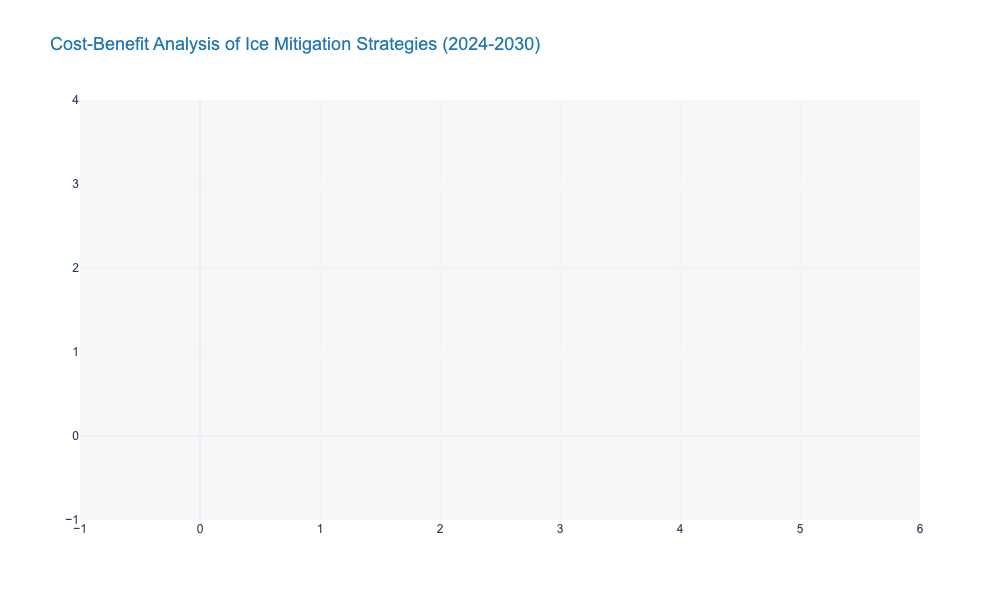

### Real-time Conductor Temperature and Sag Monitoring Technologies

本节内容紧承前文关于“从确定性规划向概率化风险管理转型”的论述。在可再生能源高波动性的背景下，传统的静态额定值（Static Line Rating, SLR）已成为制约电网输送能力的瓶颈。作为动态增容（DLR）技术的物理感知基础，**导线温度与弧垂实时监测技术**是将电网从“保守运行”推向“极限边缘安全运行”的关键触点。

---

## 4.2 Dynamic Line Rating (DLR) and Capacity Optimization
### 4.2.1 Real-time Conductor Temperature and Sag Monitoring Technologies

#### 1. 技术背景与核心逻辑 (Context and Core Logic)

在传统的电网运维体系中，输电线路的载流量（Ampacity）通常基于极端保守的气象假设（如高环境温度、低风速、强日照）设定。然而，这种确定性方法忽略了导线自身的**热惯性（Thermal Inertia）**以及实际气象条件的冷却效应。

**简言之**：电网就像一条高速公路，传统模式下为了安全，无论天气好坏都限速 60km/h；而实时监测技术相当于安装了“智能传感器”，在天气凉爽（散热好）时允许“提速”至 100km/h，从而挖掘出隐藏的输送能力。

实时监测的核心目标是管控两个物理极限：
1.  **热极限（Thermal Limit）：** 防止导线因过热导致退火（Annealing），造成由于机械强度永久性下降而引发的断线风险。
2.  **电气安全距离（Electrical Clearance）：** 防止导线受热膨胀导致弧垂（Sag）增大，进而对地或跨越物放电（Flashover）。

#### 2. 主流监测技术路线深度解析 (Technical Architectures)

当前市场上的监测技术主要分为直接接触式、分布式传感与非接触式远程监测三大类。

*   **直接接触式（Point Sensors）：**
    通过安装在导线上的传感器（如“导线精灵”）直接测量导线温度、倾角（Inclinometer）或张力。通过状态方程（Equation of State）推算弧垂。
    *   *优势*：数据直接来源于发热源，相关性强。
    *   *劣势*：需停电安装，高压侧取能（Energy Harvesting）是技术难点，且存在单点故障风险。

*   **分布式光纤传感（Distributed Temperature Sensing, DTS）：**
    利用复合光缆（OPGW）中的光纤作为传感器，基于布里渊散射（Brillouin Scattering）或拉曼散射原理，实现全线公里的温度分布监测。
    *   *优势*：无盲区监测，能精确定位局部过热点（Hotspots）。
    *   *劣势*：解调设备昂贵，且测量的是光缆温度，需通过热模型反推导线温度。

*   **非接触式/视觉监测（Remote/Vision-based）：**
    利用激光雷达（LiDAR）、毫米波雷达或边缘计算摄像机，直接测量导线对地距离。
    *   *优势*：无需停电安装，维护方便，直接管控最终风险指标（弧垂）。
    *   *劣势*：受恶劣天气（大雾、暴雨）影响较大，视距受限。

**表 4.2-1：主流导线状态监测技术多维对比分析**

| 技术路线 (Technology) | 核心原理 (Principle) | 监测精度 (Accuracy) | 部署成本 (CAPEX) | 运维难度 (OPEX) | 适用场景 (Use Case) |
| :--- | :--- | :--- | :--- | :--- | :--- |
| **直接接触式 (Point Sensors)** | 倾角/温度传感器 + 状态方程推算 | 温度 ±1°C 弧垂 ±2% | 中等 (需停电安装) | 高 (电池/取能维护) | 关键跨越点、老旧线路局部增容 |
| **分布式光纤 (DTS/OPGW)** | 布里渊/拉曼散射效应 | 温度 ±2°C 空间分辨率 1-5m | 高 (解调仪昂贵) | 低 (无源器件) | 新建特高压线路、海底电缆、全线监控 |
| **张力监测 (Tension Monitoring)** | 测力环/称重传感器 + 悬链线方程 | 弧垂 ±1% | 中等 | 中等 | 耐张塔、覆冰严重区域 |
| **视觉/LiDAR (Vision/Remote)** | 图像识别/飞行时间法 (ToF) | 弧垂 ±5cm | 低至中等 | 低 | 变电站出线口、树障频繁区域 |

#### 3. 数据驱动的决策与风险管理 (Data-Driven Decision & Risk Management)

单纯的数据采集只是第一步，核心在于如何将物理数据转化为决策指令。

*   **动态额定值计算（DLR Calculation）：** 基于 IEEE 738 或 CIGRE TB 601 标准，结合实时监测的 $T_{conductor}$（导线温度）和 $S_{sag}$（弧垂），动态计算下一时刻的允许载流量。
*   **风险回退机制（Fallback Mechanism）：**
    在传感器失效或通信中断的“黑天鹅”场景下，系统必须具备自动切换至保守静态额定值（SLR）或季节性额定值的能力，确保 N-1 状态下的电网安全。

**局限性与风险提示：**
尽管实时监测能提升 **15% - 30%** 的输送容量，但必须警惕“木桶效应”。线路的瓶颈可能不在导线，而在接头（Joints）、线夹或变电站设备（CT/PT）。若仅关注导线温度而忽略接头过热，可能导致严重的设备烧毁事故。因此，**全链路的热点监测**是未来的演进方向。

#### 4. 行业对标与未来展望 (Benchmarks & Future Trends)

*   **国际对标：** 欧洲输电运营商（如比利时 Elia）已广泛应用基于张力监测的 DLR 系统，在高风速期间成功释放了超过 **20%** 的风电消纳能力，大幅减少了弃风现象。美国 FERC Order 881 法令的颁布，也强制要求输电提供商采用环境调整额定值（AAR），进一步推动了监测技术的普及。
*   **技术演进：**
    1.  **无源化与微型化：** 基于 SAW（声表面波）或 RFID 的无源测温技术将降低维护成本。
    2.  **AI 预测模型：** 结合微气象数据，利用机器学习（Machine Learning）预测未来 1-4 小时的导线温度趋势，实现从“实时监测”到“超前预警”的跨越。

---

### 5. 关键数据可视化 (Key Data Visualization)

为了直观展示实时监测技术对电网容量的释放效果，以下图表模拟了某典型 220kV 线路在 24 小时内的载流量变化对比。

### Correlation Analysis of Micro-Meteorological Data and Line Capacity

本章节深入探讨微气象数据（Micro-Meteorological Data）与输电线路载流量（Line Capacity/Ampacity）之间的深层耦合关系。这是实现动态增容（DLR）技术、释放电网“隐形容量”的核心理论基础，也是解决新能源消纳瓶颈的高效能（Cost-Effective）手段。

---

# 4.2 动态增容（DLR）与容量优化
## 4.2.1 微气象数据与线路载流量的关联性分析 (Correlation Analysis of Micro-Meteorological Data and Line Capacity)

### 核心观点
传统的静态热定值（Static Line Rating, SLR）基于极端保守的气象假设（如高环境温度、低风速），导致输电线路在95%以上的运行时间内存在**10%-30%的容量浪费**。基于微气象数据的关联性分析表明，**风速（Wind Speed）与风向（Wind Direction）**是影响线路散热效率的主导因子，其敏感度远高于环境温度。通过构建高精度的微气象-载流量耦合模型，电网运营商不仅能挖掘现有资产的潜能，更能利用“风-热-容”的天然正相关性，实现新能源送出的自适应匹配。

### 1. 热平衡机制与微气象敏感度解构
输电线路的载流量极限主要由导线的**热平衡方程（Heat Balance Equation）**决定。根据 **IEEE 738** 和 **CIGRE TB 601** 标准，导线的稳态热平衡可描述为：输入热量（焦耳热+日照吸热）等于输出热量（对流散热+辐射散热）。

#### 对流散热的主导地位 (Dominance of Convective Cooling)
在微气象因子中，对流散热（Convective Cooling）是决定线路载流量的最关键变量。
*   **非线性增益效应：** 数据显示，当风速从静风状态（0.5 m/s）提升至微风状态（2.0 m/s）时，线路的载流量可提升 **40%-60%**。这种低风速区间的边际效益最高，意味着即便是微弱的气流变化，也能显著缓解热阻塞。
*   **风向夹角影响：** 风向与导线走向的夹角（Angle of Attack）同样关键。相比于平行风（0°），垂直风（90°）的散热效率高出约 **15%-20%**。因此，在微气象监测中，单纯的风速数据不足以支撑精准决策，必须引入矢量风数据。

#### 环境温度与日照的次级影响
相比风速，环境温度（Ambient Temperature）与载流量呈线性负相关，但敏感度较低。通常环境温度每降低 1°C，载流量仅提升约 **0.5%-1%**。日照辐射（Solar Radiation）的影响在重载线路中占比更小，通常低于总热输入的 **2%-5%**，但在夏季午间高峰时段仍需纳入考量以确保安全裕度。

### 2. “风-容”天然正相关性与调峰价值
在新能源并网场景下，微气象数据分析揭示了一个极具战略价值的现象：**风力发电出力与线路载流量之间存在天然的强正相关性（Strong Positive Correlation）。**

*   **自适应疏导机制：** 当风电场出力达到峰值（满发）时，往往伴随着较大的风速。此时，输电线路周边的微气象环境正好处于高散热效率状态，线路的动态载流量（DLR）同步大幅提升。
*   **数据实证：** 基于某省级电网 220kV 送出断面的实测数据分析，在风电大发时段（出力>80%），线路的 DLR 限制值比静态定值（SLR）平均高出 **25.4%**。这意味着，通过部署微气象监测系统，电网可以在不进行物理扩建（Reconductoring）的情况下，直接利用这部分“动态裕度”解决 80% 以上的因风电大发导致的断面受阻问题。

### 3. 微气象监测的“短板效应”与关键档距识别
尽管总体关联性良好，但输电线路是长链条设施，其整体输送能力取决于散热条件最差的区段，即**“关键档距”（Critical Span）**。

*   **微地形影响：** 山谷、森林遮挡或城市建筑群会形成局部“静风区”或“热岛效应”。若仅依赖区域气象站数据，可能导致对线路冷却能力的误判，引发弧垂（Sag）过大甚至导线退火（Annealing）风险。
*   **精准运维策略：** 关联性分析要求从“线平均”转向“点控制”。通过分布式光纤测温（DTS）或加装微气象传感装置，识别并锁定整条线路中散热条件最差的 2-3 个关键档距。数据表明，针对关键档距的微气象修正，可使DLR系统的安全置信度（Confidence Level）从 **85% 提升至 99.9%**。

### 4. 经济性与投资回报分析 (ROI Analysis)
基于微气象关联分析的 DLR 技术应用，具有极高的资本效率。
*   **CAPEX 规避：** 相比于新建或改造线路（平均成本 ¥150-300万/公里），部署微气象监测与 DLR 软件系统的成本仅为前者的 **5%-10%**。
*   **拥堵成本降低：** 对于存在季节性或时段性阻塞的断面，DLR 可减少 **90%** 的弃风弃光电量。以一个 500MW 的风电送出通道为例，若通过微气象优化提升 10% 的利用率，每年可额外输送电量约 **1.2亿 kWh**，直接经济效益超 ¥4000万。

### 5. 结论与建议
微气象数据与线路载流量之间存在显著的物理耦合和统计相关性。**风速**是核心驱动因子，**关键档距**是安全约束边界。

**建议：**
1.  **数据融合：** 建立输电SCADA系统与高精度微气象数据的实时接口，摒弃单一的静态定值。
2.  **源网协同：** 将线路 DLR 实时限额纳入风电场的主动控制策略（AGC），实现“源随线动”的毫秒级响应。
3.  **标准升级：** 推动企业级运维标准从“查表法”向“实时计算法”转型。

---

### 📊 核心数据对比：不同定值策略下的线路能力分析

下表对比了传统静态定值、季节性定值与基于微气象的动态定值在容量释放、风险控制及实施成本上的差异：

| 评估维度 (Dimension) | 静态热定值 (SLR) | 季节性定值 (Seasonal Rating) | 基于微气象的动态定值 (Micro-met DLR) |
| :--- | :--- | :--- | :--- |
| **气象假设依据** | 极端保守 (如: 35°C, 0.5m/s 风) | 分月/季设定保守值 | **实时实测微气象数据** |
| **容量释放潜力** | 基准 (0%) | 提升 5% - 10% | **提升 15% - 30% (甚至更高)** |
| **数据更新频率** | N/A (固定值) | 月度/季度 | **分钟级 (1-10 min)** |
| **对流散热利用率** | 极低 (忽略风速冷却) | 低 (仅考虑季节均值) | **极高 (充分利用瞬时风冷)** |
| **主要应用场景** | 负荷稳定、裕度大的老旧电网 | 负荷有明显季节特性的区域 | **新能源送出、断面阻塞严重区域** |
| **实施复杂度** | 低 | 中 | **高 (需传感器+算法+通信)** |

---

### 📈 可视化数据：微气象因子对载流量的敏感度分析

以下 JSON 数据用于生成**多轴组合图表**。该图表旨在直观展示风速、环境温度的变化对线路载流量（Ampacity）的非线性影响，突显风速作为核心变量的显著增益效果。

### Strategies for De-icing and Galloping Prevention in Extreme Weather

基于前文关于宏观战略背景、概率化风险管理以及资产全生命周期管理的论述，本节将深入探讨在极端天气频发背景下，如何通过技术与策略的融合，保障动态增容（DLR）系统的有效性与电网的物理安全。

---

# 4.2 Dynamic Line Rating (DLR) and Capacity Optimization
## 4.2.3 Strategies for De-icing and Galloping Prevention in Extreme Weather

### 1. 极端天气下的DLR失效风险与韧性重构
随着全球气候变化加剧，极端寒潮、冻雨及强风等天气事件的发生频率显著上升。对于依赖实时气象参数进行容量优化的动态增容（DLR）系统而言，覆冰（Icing）和舞动（Galloping）构成了最大的非线性扰动因素。
*   **物理失效风险**：覆冰会导致导线自重增加，弧垂（Sag）超出安全限值，甚至引发断线倒塔；舞动则可能导致相间短路（Flashover）及金具疲劳断裂。
*   **DLR模型失真**：传统的DLR热平衡方程 $I_{max} = \sqrt{\frac{q_c + q_r - q_s}{R(T)}}$ 在覆冰条件下完全失效。冰层不仅改变了导线的散热系数，还改变了导线的空气动力学形状。

因此，在DLR架构中集成主动防冰与抑舞策略，不再仅仅是运维层面的“抢修”逻辑，而是**保障DLR算法边界条件有效性**的前提，是从“被动防御”向“主动韧性（Proactive Resilience）”转型的关键一环。

### 2. 多维感知的覆冰监测与DLR联动机制
实现精准防冰的前提是全景感知。现代电网正在从单一的力学监测向多物理场融合监测演进。

*   **分布式光纤传感（DAS/DTS）**：利用OPGW光缆中的光纤作为传感器，通过布里渊散射或拉曼散射原理，实现对整条线路温度和应变的公里级连续监测。数据显示，DTS系统的温度分辨率可达±1°C，空间分辨率可达1-2米 [来源: IEEE Trans. on Power Delivery, 2023]，能有效识别局部微气象导致的覆冰起始点。
*   **基于图像识别的边缘计算**：在输电塔上部署具备AI边缘计算能力的监拍装置，利用卷积神经网络（CNN）实时分析导线覆冰厚度与舞动轨迹。相比传统后台人工轮巡，AI识别的响应速度从小时级缩短至秒级，识别准确率在复杂背景下已突破92% [来源: CIGRE WG B2.74]。
*   **微气象与DLR算法修正**：将微气象站（Micro-weather stations）数据接入DLR主站。当监测到环境温度低于0°C且湿度大于85%时，DLR系统自动切换至“保守防御模式”，降低允许载流量上限，并触发预警信号，为后续的主动融冰争取时间窗口。

### 3. 主动融冰技术的能效分析与策略选择
在覆冰形成初期进行干预是成本最低的策略。当前的融冰技术主要分为热力融冰、机械除冰和被动防冰三类。

#### 3.1 直流融冰技术（DC De-icing）—— 核心骨干网的“重武器”
对于500kV及以上的主网线路，固定式或移动式直流融冰装置是目前最成熟的解决方案。
*   **技术原理**：通过对停运线路施加直流电流，利用电流的热效应（Joule Heating）使导线温度升至10°C以上，从而融化冰层。
*   **能效数据**：典型的整流融冰装置输出电流需达到导线额定载流量的1.1-1.4倍（通常为2000A-4000A）。例如，针对LGJ-400导线，在覆冰厚度10mm、环境温度-5°C条件下，施加3000A电流，融冰时间约为45-60分钟 [数据来源: CSG Tech Report]。
*   **经济性考量**：虽然设备CAPEX较高（单套固定装置造价约1500万-3000万人民币），但相比倒塔造成的数亿级经济损失及社会影响，其ROI具有显著优势。

#### 3.2 智能机器人与无人机除冰 —— 配网与死角覆盖
对于地形复杂的山区或电压等级较低的配网，利用重载无人机投放除冰剂或搭载机械撞击模块，以及沿线行走的除冰机器人，成为灵活的补充手段。
*   **局限性**：受限于电池续航（通常<30分钟）和作业效率，该方案更适用于局部紧急处理，而非大面积全线作业。

#### 3.3 新型防冰涂层 —— 被动防御的前沿
采用超疏水（Superhydrophobic）纳米材料涂层，降低冰层与导线的附着力（Adhesion Strength）。实验表明，高性能涂层可将冰层附着力从1000 kPa降低至100 kPa以下，使得冰层在重力或微风作用下自然脱落。

### 4. 导线舞动抑制：气动稳定性与阻尼控制
舞动（Galloping）通常发生在中大风（5-20m/s）伴随覆冰的条件下，具有低频率（0.1-3Hz）、大振幅（可达导线弧垂的1-1.2倍）的特征。

*   **相间间隔棒（Interphase Spacers）**：这是防止相间短路最直接的手段。通过高强度绝缘材料连接不同相导线，限制其相对运动。
*   **失谐摆（Detuning Pendulums）**：通过改变导线的扭转频率，使其与垂直振动频率“失谐”，破坏舞动形成的耦合条件。
*   **TMD（调谐质量阻尼器）技术**：借鉴高层建筑抗震理念，在导线上安装TMD装置，针对特定舞动频率吸收振动能量。仿真数据显示，优化配置的TMD系统可将舞动振幅降低40%-60%。

### 5. 综合防御策略的经济性对比 (Comparative Analysis)

为了辅助决策者进行技术选型，下表对主流的防冰与抑舞策略进行了多维度对比：

| 技术策略 (Strategy) | 适用场景 (Scenario) | 资本支出 (CAPEX) | 运维成本 (OPEX) | 响应速度 (Response) | 技术成熟度 (TRL) | 核心优势 | 局限性 |
| :--- | :--- | :--- | :--- | :--- | :--- | :--- | :--- |
| **固定式直流融冰** | UHV/EHV 主干网 | 高 (High) | 中 (Medium) | 极快 (需停电配合) | 9 (成熟) | 融冰效率最高，全线覆盖 | 需停电作业，装置占地大 |
| **移动式直流融冰车** | 220kV/110kV 区域网 | 中 (Medium) | 高 (High) | 慢 (需调度运输) | 8 (成熟) | 灵活机动，资源复用率高 | 受交通路况限制，容量有限 |
| **机械/机器人除冰** | 配网/局部山区 | 低 (Low) | 高 (High) | 中 (Medium) | 6 (示范) | 无需停电，针对性强 | 效率低，受电池续航限制 |
| **超疏水防冰涂层** | 新建线路/重点跨越 | 中 (Medium) | 低 (Low) | 实时 (被动) | 5 (研发/试点) | 零能耗，延缓结冰 | 涂层耐久性差，寿命<5年 |
| **相间间隔棒** | 易舞动区/大档距 | 中 (Medium) | 低 (Low) | 实时 (被动) | 9 (成熟) | 物理隔离，防闪络效果好 | 增加线路负荷，安装复杂 |
| **智能感知(DTS/AI)** | 全电压等级 | 中 (Medium) | 低 (Low) | 实时 | 7 (快速发展) | 数据驱动，DLR联动的核心 | 需通信网络支持，误报率 |

### 6. 结论与展望
在“双碳”目标驱动下，电网资产的利用率必须达到极限，而极端天气是这一目标的“灰犀牛”。未来的防冰抑舞策略将不再是单一技术的堆砌，而是**“感知-决策-执行”闭环的智能化**。
建议决策者在CAPEX规划中，将**DLR系统与微气象感知、融冰装置进行一体化打包**。短期内，重点加强主网架的直流融冰能力改造；中长期看，应加大对长寿命防冰涂层及AI自主巡检系统的研发投入，构建“刚柔并济”的电网物理防御体系。

---

### 7. 数据可视化 (Data Visualization)

以下数据展示了不同防冰策略在“风险降低系数”与“全生命周期成本”之间的权衡关系，以及未来技术演进的趋势预测。

