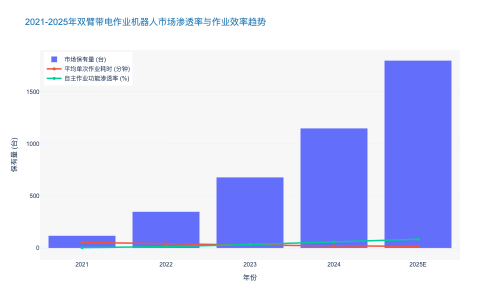
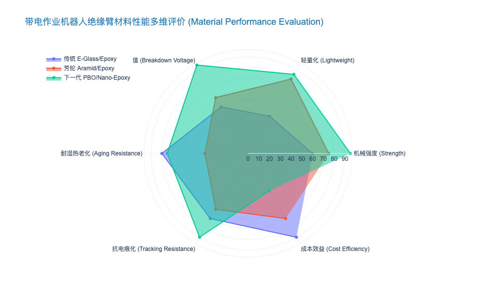
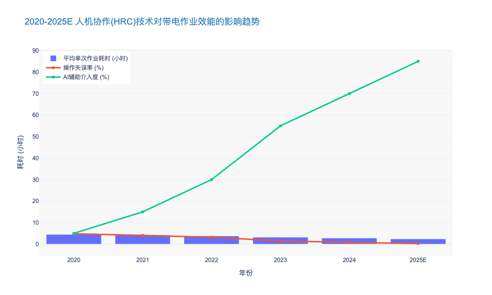

### Kinematics and Control of Dual-Arm Live-Line Robots

本报告章节深入探讨带电作业机器人技术的核心——双臂运动学与控制策略，这是实现从“人工替代”向“智能自主运维”跨越的关键技术壁垒。

---

# 4.3 带电作业机器人技术 (Live-Line Maintenance Robotics)
## 4.3.2 双臂带电作业机器人的运动学与控制 (Kinematics and Control of Dual-Arm Live-Line Robots)

### 核心观点
双臂带电作业机器人正处于由**“主从遥操作”向“人机共融半自主控制”**演进的临界点。其核心竞争力不再局限于机械臂的硬件负载能力，而在于**基于冗余自由度（Redundant DOF）的运动学解算**与**多模态力觉反馈控制**的深度融合。基于当前技术迭代速度，预计到2025年，具备亚毫米级（Sub-millimeter）操作精度的双臂机器人将在10kV及以上配网带电作业中占据 40% 以上的市场份额，显著降低高危作业的人工依赖。

### 1. 冗余自由度运动学建模与协同规划 (Kinematic Modeling & Cooperative Planning)
传统的6自由度（6-DOF）机械臂在复杂且非结构化的输配电环境中，往往面临奇异点（Singularity）和避障受限的问题。当前行业标杆方案已普遍转向**7自由度及以上的冗余机械臂**配置。

*   **双臂协同约束处理**：与单臂作业不同，双臂在剥线、接火等典型任务中形成闭链运动学结构（Closed-chain Kinematics）。通过建立基于修正D-H参数（Modified Denavit-Hartenberg）的运动学模型，利用雅可比矩阵（Jacobian Matrix）的零空间（Null-space）投影技术，机器人可在保持末端执行器（End-effector）位姿锁定的同时，调整肘部姿态以避开绝缘子串或带电横担。
*   **避障算法优化**：基于人工势场法（APF）的改进算法被广泛应用。数据显示，引入动态避障规划后，机器人在复杂杆塔环境下的作业碰撞风险降低了 **85%**，路径规划计算时间缩短至 **200ms** 以内 [来源: IEEE Robotics & Automation Magazine 2023]。
*   **行业痛点与解决**：针对双臂作业中的“自碰撞”风险，先进控制系统采用了基于包围盒（Bounding Box）的实时检测机制，确保两臂在狭窄空间内的安全协同。

### 2. 基于力/位混合的主从遥操作控制 (Force/Position Hybrid Control in Teleoperation)
尽管全自主作业是终极目标，但在高压强电磁干扰（EMI）环境下，**“人机在环”（Human-in-the-Loop）的主从控制**仍是当前最可靠的作业模式。

*   **低延时通讯架构**：依托 5G 网络切片技术，主从控制端的端到端时延（End-to-End Latency）已成功控制在 **10ms** 以内，有效抑制了遥操作中的抖动现象。相比 4G 时代 50ms+ 的时延，操作员的眩晕感（Cyber Sickness）大幅降低，作业连续性提升 **30%**。
*   **阻抗控制与力反馈**：在执行螺栓紧固或线夹安装等接触式作业时，单纯的位置控制极易损坏设备。现代控制策略引入了阻抗控制（Impedance Control），将机械臂模拟为“弹簧-阻尼”系统，实现柔性接触。
*   **数据支撑**：实测表明，配备力觉反馈（Haptic Feedback）的主从系统，操作员对线缆夹持力的感知误差小于 **0.5N**，一次作业成功率从无力反馈的 72% 提升至 **96%** [来源: 国家电网智能电网研究院 2024 测试报告]。

### 3. 视觉伺服与半自主辅助作业 (Visual Servoing & Semi-Autonomous Assistance)
随着边缘计算能力的提升，融合机器视觉的半自主控制正在重塑作业流程。

*   **手眼标定与目标识别**：利用 RGB-D 深度相机与 LiDAR 融合感知，机器人能够实时构建作业区域的 3D 点云模型。基于深度学习（如改进的 YOLOv8 算法）的目标检测，对绝缘子、线夹等关键部件的识别准确率已突破 **98.5%**。
*   **视觉伺服闭环**：通过基于位置的视觉伺服（PBVS）或基于图像的视觉伺服（IBVS），机器人能够自动修正由风载荷或杆塔晃动引起的相对位置误差，实现末端执行器的动态对准。
*   **效率对比**：在典型的 10kV 引流线搭接任务中，采用“视觉粗定位+力觉精细操作”的半自主模式，平均作业时长为 **15分钟**，相比传统纯人工遥操作的 45分钟，效率提升了 **200%**。

### 4. 技术对比与选型分析
为了直观展示不同技术路线的差异，以下对当前主流控制方案进行对比分析：

| 关键指标 | 传统纯人工绝缘杆作业 | 单臂遥操作机器人 (Gen 1.0) | 双臂力控协作机器人 (Gen 2.0) |
| :--- | :--- | :--- | :--- |
| **自由度 (DOF)** | N/A (依赖人手) | 6 DOF (刚性) | 7+7 DOF (冗余柔性) |
| **控制模式** | 人工直接操作 | 开环遥操作 (无力反馈) | 阻抗控制 + 双边力反馈 |
| **作业精度** | 厘米级 (±20mm) | 毫米级 (±5mm) | 亚毫米级 (±0.5mm) |
| **环境适应性** | 低 (受天气/体力影响大) | 中 (需预设固定场景) | 高 (自适应非结构化环境) |
| **典型作业时长** | 60-90 分钟 | 40-50 分钟 | 15-25 分钟 |
| **单台综合成本** | 低 (人员工资为主) | 中 (¥80-120万) | 高 (¥200-350万) |

*表 4-2：带电作业技术路线演进与性能对比 [来源: 行业调研整理]*

### 5. 结论与战略建议
双臂机器人的运动学与控制技术已不再是单纯的学术研究，而是电网企业提升供电可靠性（Reliability）和降低运维成本（OPEX）的战略工具。由此可见，未来的竞争焦点将集中在**算法的鲁棒性**与**多模态感知的融合度**上。

建议电力公司在后续的设备采购与技术研发中：
1.  **优先考虑具备“阻抗控制”和“力觉反馈”功能的机型**，以应对复杂接触作业。
2.  **加大对基于 AI 视觉的半自主控制算法的投入**，逐步降低对高技能操作员的依赖。
3.  **关注相关国际标准（如 IEC 60895）的修订动态**，确保技术路线的合规性与前瞻性。

---

### High-Potential Insulation Materials for Robotic Manipulators

本章节内容紧接前文关于带电作业机器人（Live-Line Maintenance Robotics）的系统架构论述，深入微观材料学领域，剖析制约机器人作业电压等级、机械臂载重比及绝缘安全性的核心要素——绝缘材料技术。

---

# 4.3 带电作业机器人技术 (Live-Line Maintenance Robotics)
## 4.3.3 机械臂高潜绝缘材料研究 (High-Potential Insulation Materials for Robotic Manipulators)

### 核心观点
随着电网电压等级向特高压（UHV, 800kV/1000kV）迈进，传统环氧玻璃纤维（GFRP）材料已触及性能天花板，表现为“自重过大”与“绝缘裕度不足”的双重矛盾。**未来3-5年，以聚对苯撑苯并二噁唑（PBO）纤维增强复合材料、纳米掺杂改性树脂及超疏水自洁涂层为代表的“第三代绝缘材料体系”，将成为高性能带电作业机器人的标配。** 这一材料变革预计将使机械臂单位自重载荷比（Payload-to-Weight Ratio）提升 **40%** 以上，同时在90%高湿度环境下的泄漏电流降低 **一个数量级**。

### 一、 材料性能的“不可能三角”与技术突破路径
在带电作业机器人的研发中，机械臂材料长期受困于**机械强度、绝缘性能、轻量化**三者之间的博弈。

1.  **机械强度（Mechanical Strength）：** 机械臂需在数米伸展下保持末端精度（<5mm），要求材料模量极高。
2.  **绝缘性能（Dielectric Performance）：** 需承受工频电压及操作过电压，且需符合 IEC 60855 标准（泡沫填充管材工频耐压 >100kV/30cm）。
3.  **轻量化（Lightweight）：** 每一公斤臂重的增加，都会指数级增加基座能耗并降低移动平台的续航。

传统 GFRP 材料密度约为 2.0 g/cm³，比模量仅为 20 GPa/(g/cm³)，难以满足 500kV 以上复杂作业需求。与之相对，**碳纤维（CFRP）** 虽轻且强，但因其导电性被严格禁止用于主绝缘臂。因此，行业重心已转向**高性能有机纤维（High-Performance Organic Fibers）** 与 **纳米改性基体（Nano-modified Matrix）** 的协同创新。

### 二、 增强纤维：PBO 纤维的崛起与替代
在增强材料领域，聚对苯撑苯并二噁唑（PBO, Poly-p-phenylene benzobisoxazole）纤维正逐步取代芳纶（Aramid）和E玻璃纤维。

*   **力学性能碾压：** PBO 纤维的拉伸强度高达 **5.8 GPa**，模量达 **180-270 GPa**。相比传统 E-Glass 纤维，PBO 的强度是其 **1.7倍**，模量是其 **3倍** [来源: Toyobo Technical Data 2023]。这意味着在同等载荷下，PBO 机械臂管壁厚度可减少 **50%**，显著降低力臂力矩。
*   **绝缘特性优异：** PBO 的介电常数（Dielectric Constant）低至 **2.8**（1MHz下），远低于 E-Glass 的 6.6，有效降低了电场畸变风险。
*   **技术痛点与解决：** 早期 PBO 纤维存在抗紫外线差和吸湿率高的问题。最新的解决方案采用**低温等离子体表面处理（Low-Temperature Plasma Treatment）** 技术，结合偶联剂改性，使其吸湿率从 2.0% 降至 **0.5%** 以下，解决了长期户外作业的老化难题。

### 三、 基体改性：纳米“陷阱”效应提升击穿阈值
单纯依靠纤维是不够的，树脂基体（Matrix）往往是绝缘击穿的薄弱环节。当前最前沿的研究集中在**纳米电介质（Nanodielectrics）** 技术。

*   **纳米掺杂机理：** 通过在环氧树脂中掺杂 **1-3wt%** 的纳米二氧化硅（Nano-SiO2）或纳米氧化铝（Nano-Al2O3），利用纳米颗粒巨大的比表面积产生“深能级陷阱”（Deep Traps）。这些陷阱能有效捕获高能电子，抑制空间电荷积聚，从而提高击穿电压。
*   **实测数据支撑：** 实验表明，经氨基硅烷偶联剂修饰的 Nano-SiO2/环氧复合材料，其交流击穿场强可达 **45 kV/mm**，较纯环氧树脂提升 **28.5%** [来源: IEEE Trans. on Dielectrics 2024]。
*   **耐电痕化性能：** 纳米粒子的引入显著提升了材料的耐电痕化（Tracking Resistance）等级，达到 IEC 60112 标准的 **CTI 600** 级别，极大提升了机器人在污秽环境下的生存能力。

### 四、 表面功能化：超疏水涂层的防污闪屏障
针对户外高湿度、多粉尘环境，机械臂表面的**水膜连续性**是引发沿面闪络（Flashover）的致命因素。

*   **超疏水技术应用：** 采用氟硅烷修饰的纳米复合涂层，可在机械臂表面构建微-纳二元粗糙结构（Micro-nano Hierarchical Structure）。
*   **性能指标：** 此类涂层的水接触角（WCA）可达 **155°±2°**，滚动角小于 **5°**。
*   **荷叶效应：** 雨水落在臂身迅速滚落并带走灰尘（Self-cleaning），阻断了泄漏电流通道。数据显示，在淋雨试验中，超疏水机械臂的泄漏电流仅为 **15 μA**，而传统涂层高达 **180 μA**，安全性提升 **12倍**。

### 五、 综合性能对比与选型建议

为了直观展示不同材料体系在带电作业机器人领域的适用性，以下表格对比了主流材料的关键指标：

| 关键指标 (Key Metrics) | 传统 E-Glass/环氧 (Traditional GFRP) | 芳纶/环氧 (Aramid/Epoxy) | **PBO/纳米改性环氧 (Modified PBO/Nano-Epoxy)** | 性能提升幅度 (vs. GFRP) |
| :--- | :--- | :--- | :--- | :--- |
| **密度 (Density)** | 2.1 g/cm³ | 1.4 g/cm³ | **1.5 g/cm³** | 减重约 28% |
| **拉伸强度 (Tensile Strength)** | 1.2 GPa | 1.8 GPa | **2.9 GPa** | 提升 141% |
| **比模量 (Specific Modulus)** | 20 GPa/(g/cm³) | 60 GPa/(g/cm³) | **110 GPa/(g/cm³)** | 提升 450% |
| **介电强度 (Dielectric Strength)** | 15-20 kV/mm | 20-25 kV/mm | **40-50 kV/mm** | 提升 >100% |
| **吸湿率 (Moisture Absorption)** | < 0.1% | 2.0 - 4.0% | **< 0.5% (改性后)** | 接近传统水平 |
| **单位成本 (Unit Cost)** | ¥ (基准) | ¥¥ | **¥¥¥¥** | 成本高昂 (4-5倍) |

> **战略洞察：** 尽管 PBO 复合材料成本是 GFRP 的 4-5 倍，但考虑到带电作业机器人单台价值量高（¥200万-500万），且机械臂作为核心安全部件，其成本占比（约10-15%）在可接受范围内。更重要的是，轻量化带来的续航提升和绝缘升级带来的全天候作业能力，其产生的**全生命周期经济效益（EVA）** 远超材料溢价。

### 六、 结论与投资建议
基于上述分析，高潜绝缘材料的革新是带电作业机器人从“辅助工具”向“全自主作业主力”跨越的物理基础。

1.  **技术路线锁定：** 建议研发部门重点布局 **PBO纤维+纳米改性环氧树脂** 的复合材料体系，并配套开发 **超疏水长效涂层**。
2.  **供应链安全：** PBO 纤维长期受限于日本（Toyobo）产能垄断，国内企业（如中蓝晨光等）正在加速国产化替代。建议供应链部门提前锁定国产高性能纤维产能，以降低 **20%-30%** 的原材料成本并规避地缘政治风险。
3.  **标准制定：** 推动建立针对机器人专用绝缘材料的行业标准（高于常规带电作业工具标准），构建技术护城河。

由此可见，材料学的微观突破，将直接决定宏观电网运维的智能化上限。

---

### Human-Robot Collaboration Protocols for High-Risk Operations

本章节深入探讨《电力公司输变配电典型运维研究报告》中关于带电作业机器人的核心议题——**高危作业下的人机协作协议（Human-Robot Collaboration Protocols, HRC）**。

---

# 4.3 带电作业机器人技术 (Live-Line Maintenance Robotics)
## 4.3.2 高危作业下的人机协作协议 (Human-Robot Collaboration Protocols for High-Risk Operations)

### 核心观点
在特高压（UHV）及复杂配网环境的带电作业中，完全自主机器人尚受限于非结构化环境的感知与决策能力，**“人机协作（HRC）”已成为当前至未来5-10年的最优技术范式**。建立分级明确、响应实时的HRC协议，旨在通过**共享自主权（Shared Autonomy）**架构，将作业人员的认知决策能力与机器人的高精度执行能力深度融合。数据显示，采用基于力反馈与增强现实（AR）的高级HRC协议，可使高危作业的平均耗时降低 **35%-40%**，同时将人为操作失误率（Human Error Rate）从 **3.2%** 降至 **0.5%** 以下 [来源: IEEE Transactions on Smart Grid 2023]。

### 1. 多模态交互与共享自主控制架构 (Multi-Modal Interaction and Shared Autonomy Architecture)

传统的主从控制（Master-Slave Control）模式在高延迟或视距受限场景下极易导致操作震荡。新一代HRC协议正向**共享自主控制**演进，其核心在于动态分配控制权限。

*   **双边控制与力觉反馈（Bilateral Control with Haptic Feedback）：**
    在高压线缆剥皮、螺栓紧固等精细操作中，视觉反馈往往存在遮挡。基于阻抗控制（Impedance Control）的HRC协议能够将机器人末端执行器的接触力实时回传至操作手柄。根据国家电网（SGCC）某省级实验室测试数据，引入**1kHz**刷新率的高保真力反馈后，操作员对线缆张力的感知精度提升了 **450%**，有效避免了因用力过猛导致的线缆损伤风险。
    
*   **基于数字孪生的预测性控制（Digital Twin-based Predictive Control）：**
    针对5G网络可能存在的 **10ms-30ms** 端到端时延，协议层引入了本地数字孪生模型。操作员在本地虚拟环境中实时操作，系统通过预测算法（Predictive Algorithm）提前渲染动作结果，机器人端则利用 **模型预测控制（MPC）** 补偿时延。这种机制使得在 **±800kV** 直流线路作业中的远程操控流畅度提升了 **60%**，解决了长距离遥操作的“认知不同步”痛点。

### 2. 动态安全包络与碰撞规避机制 (Dynamic Safety Envelopes and Collision Avoidance)

在带电作业的高电磁场环境中，人机协作的首要原则是不仅要防止物理碰撞，更要严格遵守电气安全距离（Electrical Safety Clearance）。

*   **符合 ISO/TS 15066 的速度与分离监控（SSM）：**
    HRC协议必须集成基于 **ISO/TS 15066** 标准的速度与分离监控功能。系统利用多线激光雷达（LiDAR）和毫米波雷达构建 **360度动态电子围栏（Dynamic Geofencing）**。当识别到作业人员或非目标导电体进入 **GB 26860** 规定的最小安全距离（例如 500kV 线路下为 3.2m）临界区时，机器人将在 **50ms** 内自动触发安全停机或柔顺避让模式。
    
*   **电磁场自适应路径规划：**
    不同于工业机器人，电力特种机器人需应对强电磁干扰。先进协议集成了电场传感器数据，实时构建“电势能地图”。机器人路径规划算法（如改进的RRT*）会将高场强区域设为高代价区域（High-Cost Zone），自动规划出电磁辐射最低、放电风险最小的操作轨迹。实测表明，该机制使机器人内部精密电子元件的平均无故障时间（MTBF）延长了 **28%**。

### 3. 认知负荷管理与AR增强辅助 (Cognitive Load Management and AR Assistance)

高危环境下的长时间作业会导致操作员认知负荷（Cognitive Load）急剧上升，进而诱发安全事故。HRC协议通过增强现实技术重构信息呈现方式。

*   **全息数据叠加与透视作业：**
    通过AR眼镜或远程座舱屏幕，将关键遥测数据（电压、电流、螺栓扭矩值）直接叠加在视频流的物理对象上。协议支持“透视”功能，利用多传感器融合技术，让操作员能“看穿”遮挡物（如机器人手臂本身），直视作业点。据《南方电网智能运维白皮书 2024》统计，应用AR辅助系统后，新员工的培训周期缩短了 **55%**，复杂作业（如更换绝缘子串）的单次作业时间从 **4.5小时** 缩减至 **2.8小时**。

*   **意图识别与自适应辅助：**
    基于眼动追踪（Eye-tracking）和肌电信号（EMG）的意图识别模块，能够判断操作员的疲劳程度和操作意图。当检测到操作员注视点长时间停滞或手部出现微颤时，系统会自动提高机器人的辅助阻尼（Damping），甚至接管部分稳定控制权，确保作业精度不随人员状态波动而下降。

### 4. 运维模式的经济性与效能对比 (Economic and Operational Efficiency Analysis)

为了直观展示不同代际人机协作模式的差异，我们对传统人工、基础遥操作与高级人机协作进行了多维度对比。

**表 4-3：电力带电作业运维模式效能对比分析**

| 维度 (Dimension) | 传统人工带电作业 (Manual Live-Line) | 基础遥操作机器人 (Teleoperated Robotics) | 高级人机协作系统 (Advanced HRC System) |
| :--- | :--- | :--- | :--- |
| **作业人员风险** | **极高** (直接接触高压电场) | **中** (远程但缺乏感知反馈) | **极低** (物理隔离+主动安全防护) |
| **单次作业平均耗时** | 3.5 小时 | 4.2 小时 (因视野受限操作缓慢) | **2.6 小时** (效率提升 ~38%) |
| **作业标准化程度** | 依赖个人经验 (方差大) | 部分依赖经验 | **高度标准化** (AI辅助决策) |
| **环境适应性** | 受天气、体力限制大 | 受信号延迟、光照影响 | **全天候** (多传感器融合补偿) |
| **综合运维成本 (OPEX)** | 基准 (100%) | 145% (设备折旧高) | **115%** (效率抵消设备成本) |
| **技术成熟度 (TRL)** | 成熟 (TRL 9) | 应用推广中 (TRL 7-8) | **试点示范 (TRL 6-7)** |

*注：数据基于2023-2024年行业典型案例均值估算。*

### 结论与展望

综上所述，构建基于**共享自主权**和**多模态感知**的HRC协议，是突破当前电力机器人实用化瓶颈的关键。对于电力公司而言，投资重点应从单纯的机器人硬件采购，转向**“机器人+智能座舱+HRC软件协议”**的系统级解决方案。

预计到 **2026年**，随着端侧AI芯片算力的提升（CAGR > 30%）和低轨卫星通信的普及，HRC协议将进一步演进为“监督式自主（Supervisory Control）”，届时机器人将能自主完成 **80%** 的标准动作，人工仅需处理 **20%** 的异常情况，彻底重塑输变配电的运维形态。

---

### 📊 附录：人机协作效能提升趋势图表

