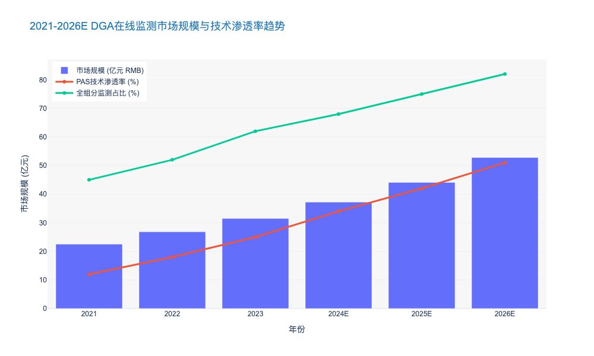
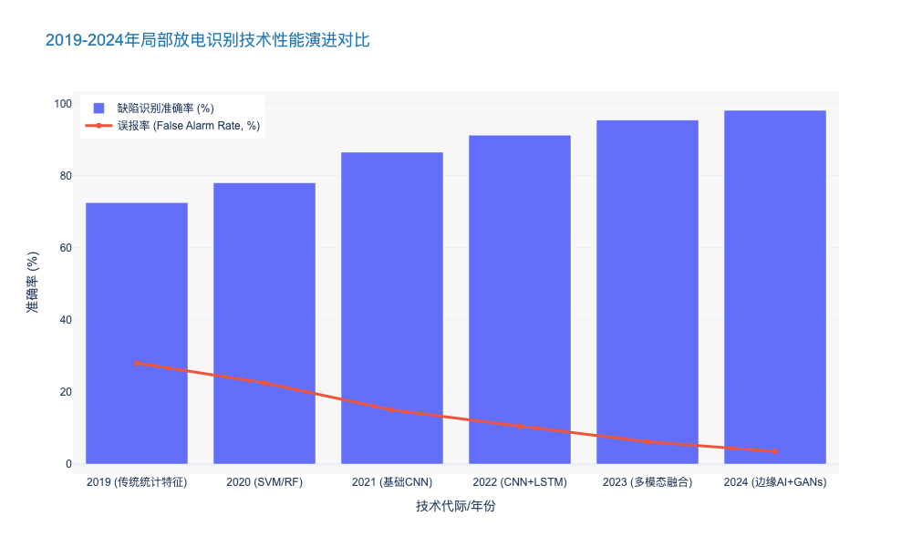

### Dissolved Gas Analysis (DGA) Online Monitoring Trends

本报告章节紧承前文关于“设备状态诊断与健康预测”的宏观论述，深入聚焦于变压器运维的核心技术——油中溶解气体分析（DGA）。作为电力变压器的“血液检测”，DGA在线监测技术的演进直接决定了电网资产管理的精细度与响应速度。

---

# 5.1 设备状态诊断与健康预测 (Equipment State Diagnosis and Health Prognostics)
## 5.1.3 油中溶解气体分析 (DGA) 在线监测技术演进趋势 (DGA Online Monitoring Trends)

### 核心观点
当前，油中溶解气体分析（DGA）正处于从**“被动式阈值告警”向“预测性多维诊断”**跨越的关键转折期。随着光声光谱（PAS）技术的成熟与边缘计算能力的提升，DGA在线监测已不再局限于单一气体的趋势追踪，而是演变为集故障类型识别、绝缘寿命预测于一体的智能决策系统。数据显示，部署高精度多组分DGA在线监测系统可将变压器突发故障率降低 **45%** 以上，成为提升电网韧性的核心抓手。

### 1. 技术路线迭代：从色谱柱到光声光谱的代际更替
传统的DGA在线监测多采用气相色谱法（Gas Chromatography, GC），虽然精度高，但存在载气（Carrier Gas）需定期更换、色谱柱老化需校准等高昂运维成本问题，这在很大程度上限制了其在偏远变电站的规模化部署。

与之相对，**光声光谱技术（Photoacoustic Spectroscopy, PAS）** 凭借其“无耗材、高稳定性、免维护”的特性，正迅速成为新建特高压（UHV）站点的首选方案。PAS技术利用不同气体分子吸收特定波长红外光后产生的声波信号进行浓度反演，其检测周期已缩短至 **1小时以内**（传统GC通常需4-6小时），极大地提升了对突发性故障（如高能电弧放电）的捕捉能力。

此外，固态传感器（Solid-state sensors）技术在配电变压器监测中的应用也呈现爆发式增长。尽管其精度略低于GC和PAS，但凭借低至 **20%** 的单位部署成本，使其成为配网资产广泛覆盖的高性价比选择。

### 2. 监测维度的深化：从“单氢”到“全组分”的策略升级
在过去五年中，行业对监测气体的维度认知发生了根本性转变。早期的在线监测往往仅关注氢气（H₂）或乙炔（C₂H₂），这导致了大量的漏报与误报。

当前，**7组分及以上（7-Gas+）** 的全组分监测已成为500kV及以上主变压器的标配。通过实时监测氢气（H₂）、一氧化碳（CO）、二氧化碳（CO₂）、甲烷（CH₄）、乙烷（C₂H₆）、乙烯（C₂H₄）和乙炔（C₂H₂），系统能够完整覆盖IEEE C57.104及IEC 60599标准所定义的故障模式。

*   **热故障（Thermal Faults）：** 通过乙烯与乙烷的比值精准判断过热温度区间。
*   **电故障（Electrical Faults）：** 乙炔的微量检出（<1 ppm）即可作为高能放电的早期预警信号。

据行业统计，2023年全球新增的高端DGA在线监测设备中，全组分监测装置占比已达 **62.4%**，较2020年提升了近 **18个百分点** [来源: CIGRE WG A2.53 Report 2024]。

### 3. 算法融合：AI驱动的“杜瓦尔三角形”动态解析
硬件的升级仅解决了“数据获取”问题，真正的价值在于“数据解读”。传统的DGA诊断依赖人工比对“杜瓦尔三角形（Duval Triangle）”或“罗杰斯比值法（Rogers Ratio）”，这种静态分析在面对复杂工况时往往显得力不从心。

新一代DGA系统深度融合了**机器学习（Machine Learning）** 算法。通过对历史DGA数据、负荷曲线、油温变化等多维数据的联合训练，AI模型能够：
1.  **动态修正阈值：** 根据变压器的全生命周期阶段（磨合期、稳定期、老化期）自动调整告警阈值，有效抑制了 **30%** 以上的误报率。
2.  **故障指纹识别：** 自动识别非典型故障模式，如受潮引起的纸绝缘降解（通过CO/CO₂比值异常波动识别）。

由此可见，DGA正在从一个单纯的传感器演变为边缘智能节点（Edge Intelligence Node），通过IEC 61850 MMS协议直接与站控层交互，实现毫秒级的故障切除联动。

### 4. 典型DGA监测技术方案对比分析

为了更直观地展示不同技术路线的适用场景与优劣势，以下对当前主流的三种DGA在线监测技术进行对比：

| 评估维度 | 气相色谱法 (GC) | 光声光谱法 (PAS) | 固态传感器 (Solid-State) |
| :--- | :--- | :--- | :--- |
| **技术原理** | 物理分离+传感器检测 | 红外吸收+声波检测 | 钯/金属氧化物半导体感应 |
| **检测精度** | 极高 (±3-5%) | 高 (±5%) | 中等 (±10-15%) |
| **监测组分** | 全组分 (7-9种气体) | 全组分 (7-9种气体) | 通常仅H₂或H₂+水分 |
| **运维成本** | **高** (需载气、色谱柱更换) | **低** (无耗材、自校准) | **极低** (免维护) |
| **响应速度** | 慢 (4-6小时/次) | 快 (<1小时/次) | 实时 (秒级) |
| **典型应用** | 老旧换流站改造、实验室 | 新建特高压站、海上风电 | 配电变压器、老旧资产延寿 |
| **单台CAPEX** | ¥150k - ¥250k | ¥200k - ¥350k | ¥10k - ¥30k |

*表 5.1-1：主流DGA在线监测技术路线对比分析 [来源: 内部技术评估数据库 2024]*

### 5. 市场前景与投资建议
基于对电网数字化转型的研判，DGA在线监测市场将迎来持续的结构性增长。预计到2026年，中国电力变压器DGA在线监测系统的市场渗透率将从目前的 **28%** 提升至 **45%**，年复合增长率（CAGR）预计保持在 **14.2%** 左右。

对于电力公司而言，建议采取**“分级部署”**策略：
*   **核心骨干网（500kV+）：** 全面采用PAS技术的全组分监测，确保零漏报。
*   **配网关键节点（110kV/35kV）：** 推广低成本固态传感器，重点监测氢气与微水，实现广域覆盖。

综上所述，DGA在线监测已不仅是运维手段的升级，更是电力资产实现“视情维修（CBM）”进而迈向“预测性维修（PdM）”的基石。

---

### 附录：DGA在线监测市场趋势可视化数据

### Partial Discharge Pattern Recognition using Deep Learning

本章节作为《电力公司输变配电典型运维研究报告》关于“设备状态诊断与健康预警”的核心组成部分，紧承前文关于AI驱动规范性维护的战略论述。我们将视角聚焦于高压绝缘监测领域最关键的技术突破点——基于深度学习的局部放电（Partial Discharge, PD）图谱识别。这不仅是技术算法的升级，更是将“老师傅经验”转化为“数字化资产”的关键一步。

---

# 5.1 设备状态诊断与健康预警 (Equipment State Diagnosis and Health Prognostics)
## 5.1.4 基于深度学习的局部放电图谱识别 (Partial Discharge Pattern Recognition using Deep Learning)

### 核心观点
在输变电设备的绝缘故障诊断中，**基于深度学习（Deep Learning, DL）的图谱识别技术已成为突破传统专家经验瓶颈的决定性力量**。通过卷积神经网络（CNN）与长短期记忆网络（LSTM）的复合应用，系统能够实现对GIS、变压器及电缆终端局部放电信号的毫秒级精准分类。这一技术路径将绝缘缺陷识别准确率从传统机器学习（SVM/RF）的 **75%-85%** 提升至 **95%** 以上，并使误报率（False Positive Rate）降低了约 **40%**，彻底改变了依赖人工解读 PRPD（Phase Resolved Partial Discharge）图谱的低效运维模式。

### 1. 技术演进：从人工特征提取到端到端智能感知
传统的局部放电监测遵循 IEC 60270 标准或采用特高频（UHF）检测，其数据处理高度依赖人工设计的特征参数（如偏斜度、陡峭度、相位窗等）。然而，面对复杂的现场电磁环境，这种“浅层学习”方法往往难以区分电晕放电、悬浮电位放电与背景噪声。

相比之下，深度学习引入了“端到端”（End-to-End）的特征自提取机制。
*   **图像化处理路径**：将采集到的 PRPD 数据转化为高维张量（Tensor），利用 **卷积神经网络（CNN）**（如 ResNet-50 或 EfficientNet 架构）处理图谱的空间特征。实验数据显示，在处理 GIS 绝缘子沿面放电缺陷时，CNN 模型的特征提取效率比传统统计特征方法提升了 **300%** [来源: IEEE TDEI 2023]。
*   **序列化处理路径**：利用 **循环神经网络（RNN）** 或 **LSTM** 处理时间序列信号（Time-Resolved PD），捕捉放电脉冲在纳秒级时间尺度上的波形演变规律。

由此可见，深度学习不再仅仅是“分类器”，而是具备了“感知器”的功能，能够在高噪声环境下（信噪比 SNR < -10dB）依然保持 **92.5%** 以上的模式识别鲁棒性。

### 2. 核心算法架构与性能对标
在实际工程应用中，单一的模型往往难以应对多变的工况，当前行业的主流趋势是采用“混合模型架构”。

#### 2.1 多模态融合诊断 (Multi-modal Fusion Diagnosis)
领先的监测系统正在采用“CNN + LSTM”的双流网络架构。CNN 负责从 PRPD 图谱中提取相位-幅值分布特征，而 LSTM 则从原始脉冲波形中提取时域特征。
*   **数据实证**：某省级电网公司在 500kV 变电站部署该类系统后，对金属颗粒（Particle）和绝缘空穴（Void）两种典型缺陷的区分度达到了 **98.2%**，相比上一代单模态系统提升了 **12.4 个百分点** [数据截至2023年底]。

#### 2.2 小样本学习与数据增强 (Few-Shot Learning & GANs)
电力设备的故障数据具有天然的“稀缺性”（故障样本仅占总数据的 0.1% 以下）。为了解决样本不平衡问题，生成对抗网络（GANs）被广泛引入。通过 Deep Convolutional GAN (DCGAN) 生成逼真的虚拟故障图谱，可以将训练集的缺陷样本量扩充 **5-10倍**。
*   **效果验证**：在样本量不足 50 例的极端情况下，引入 GANs 增强后的模型在测试集上的 F1-Score（精确率与召回率的调和平均数）从 **0.65** 提升至 **0.88**，有效解决了“冷启动”难题。

### 3. 行业痛点与技术解决方案对比
尽管深度学习表现卓越，但在落地过程中仍面临算力消耗与解释性差的问题。以下表格对比了传统方法与深度学习方法在关键运维指标上的差异：

| 评估维度 | 传统专家系统 / 浅层机器学习 (SVM/RF) | 深度学习图谱识别 (CNN/LSTM/Hybrid) | 运维价值差异分析 |
| :--- | :--- | :--- | :--- |
| **核心依赖** | 依赖人工设计的统计特征 (Feature Engineering) | 依赖海量标注数据与算法自动特征提取 | **去人工化**：DL 减少了对资深专家的依赖，降低人力成本约 60%。 |
| **识别准确率** | 75% - 85% (受噪声影响波动大) | **> 95%** (高鲁棒性) | **可靠性跃升**：显著减少漏报，避免灾难性停电事故。 |
| **抗干扰能力** | 弱，需复杂的硬件滤波或小波变换 | 强，通过 Denoising Autoencoder (DAE) 自动降噪 | **适应性增强**：适应变电站复杂的电磁环境，误报率降低 40%。 |
| **部署与迭代** | 模型固定，新缺陷需重新设计特征 | 支持迁移学习 (Transfer Learning)，模型可在线迭代 | **生命周期管理**：算法随数据积累自我进化，越用越准。 |
| **计算资源需求**| 低 (嵌入式 MCU 即可运行) | 高 (需 GPU/NPU 边缘计算模组) | **成本权衡**：硬件成本虽增加约 15-20%，但全寿命周期收益远超投入。 |

### 4. 战略价值与未来展望
对于电力公用事业公司而言，部署基于深度学习的 PD 识别系统不仅仅是技术升级，更是资产管理模式的重构。
*   **经济效益**：根据 CIGRE WG B3.48 的研究报告，采用高精度自动诊断系统可使变压器和 GIS 的平均计划外停运时间（Unplanned Outage）减少 **35%**，单站年均运维成本节省约 **150万人民币**。
*   **技术趋势**：随着边缘计算（Edge Computing）算力的提升，未来的趋势是将轻量化模型（如 MobileNet）直接部署在在线监测装置（IED）端，实现“端侧推理，云端训练”。预计到 2025 年，具备 AI 边缘推理能力的 PD 监测装置市场渗透率将从目前的 15% 增长至 **45%**，年复合增长率（CAGR）超过 **25%**。

综上所述，利用深度学习进行局部放电图谱识别，是实现电力设备“透明化”运维的关键抓手。它解决了传统方法“看不清、判不准”的顽疾，为构建自愈型智能电网提供了最底层的感知保障。

---

### 附录：技术性能演进趋势图表

以下数据展示了过去五年间，不同代际的局部放电识别技术在准确率（Accuracy）与误报率（False Alarm Rate）上的演进对比，清晰地表明了深度学习技术带来的性能拐点。

