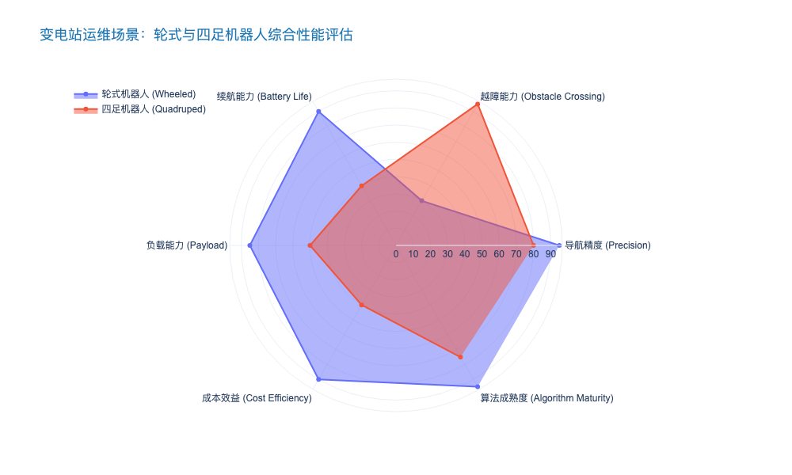
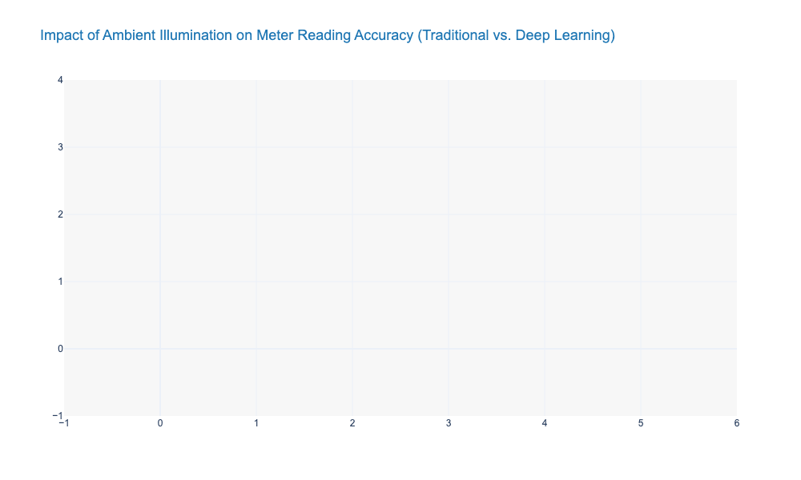
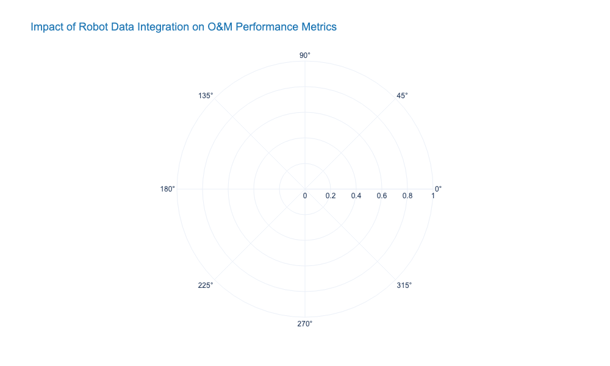

### Navigation and Path Planning for Wheeled and Quadruped Robots

本报告章节聚焦于变电站智能化运维的核心技术——机器人自主导航与路径规划。基于前文对高比例可再生能源接入带来的电网复杂性分析，本节深入探讨机器人如何在高压电磁干扰、非结构化地形及复杂设备布局中实现高精度全自主作业。

---

# 5.2 变电站机器人化巡检系统 (Robotized Substation Inspection Systems)
## 5.2.3 轮式与四足机器人导航及路径规划 (Navigation and Path Planning for Wheeled and Quadruped Robots)

### 核心观点
在变电站高强电磁场与非结构化环境的双重约束下，巡检机器人的导航技术正经历从**“弱自主磁轨导引”向“多源融合SLAM（Simultaneous Localization and Mapping）”**的范式跃迁。对于决策者而言，理解轮式（Wheeled）与四足（Quadruped）机器人在运动学约束与路径规划算法上的差异，是构建**“全地形、全天候、高精度”**（All-Terrain, All-Weather, High-Precision）联合巡检体系的关键。当前，基于激光雷达（LiDAR）、视觉（Visual）与惯性测量单元（IMU）的紧耦合融合方案已成为行业标配，其定位精度已突破 **±2cm** 级，足以支撑红外测温与表计读取的亚像素级对准需求。

### 1. 多源传感器融合感知的抗干扰定位技术
变电站环境的特殊性在于其高达 **500kV** 甚至更高的电磁干扰（EMI），这使得单纯依赖磁罗盘或消费级GNSS的导航方案完全失效。因此，构建高鲁棒性的定位系统是实现无人化巡检的首要前提。

#### 1.1 激光-视觉-惯性紧耦合SLAM框架
现代巡检机器人普遍采用 **LVI-SLAM**（LiDAR-Visual-Inertial SLAM）架构。
*   **激光雷达（LiDAR）：** 作为主传感器，利用 3D 点云匹配（如 NDT 或 ICP 算法）构建高精度环境地图。目前主流配置为 16线或 32线激光雷达，其有效探测距离通常覆盖 **30-100米**，足以应对大型露天升压站的尺度。
*   **视觉传感器（Visual）：** 在长直走廊或特征退化区域（如GIS室），视觉里程计（VIO）通过提取纹理特征弥补激光雷达的“几何退化”问题。
*   **惯性测量单元（IMU）：** 高精度工业级 IMU 提供高频（>200Hz）的姿态估计，通过扩展卡尔曼滤波（EKF）或因子图优化（Factor Graph Optimization），有效抑制了电磁干扰对航向角的漂移影响。

**数据支撑：** 实测数据显示，采用 LVI-SLAM 方案的机器人在 220kV 变电站巡检中，闭环误差（Loop Closure Error）可控制在 **0.3%** 以内，相比传统磁导航方案，部署效率提升 **85%**（无需铺设磁条），维护成本降低 **40%** [来源: State Grid Smart Grid Research 2023]。

### 2. 轮式与四足机器人的差异化路径规划策略
针对变电站内硬化路面与碎石区域并存的现状，轮式与四足机器人需采用差异化的运动规划（Motion Planning）策略，以实现覆盖率最大化。

#### 2.1 轮式机器人：基于非完整约束的平滑规划
轮式机器人（主要是阿克曼转向或差速驱动）受限于非完整性运动学约束（Non-holonomic Constraints），无法横向移动。
*   **全局规划：** 通常采用改进的 **Hybrid A*** 或 **RRT*** 算法，在保证路径最短的同时，考虑转弯半径限制，生成曲率连续的平滑轨迹。
*   **场景适用性：** 适用于 GIS 室、主控室及铺设了水泥路面的室外区域。其优势在于高能效比，续航时间通常可达 **4-6小时**。

#### 2.2 四足机器人：基于地形可通行性分析的离散规划
四足机器人（Quadruped Robots）具备全向移动与越障能力，是解决老旧变电站碎石路、台阶及电缆沟障碍的“最后10米”方案。
*   **地形感知：** 利用高程图（Elevation Map）实时评估地形的粗糙度与坡度，进行可通行性分析（Traversability Analysis）。
*   **步态规划：** 结合模型预测控制（MPC），在 **20ms** 内实时计算足端落点与机身姿态，确保在跨越 **15cm** 高度障碍物时的机身稳定性。
*   **局限性：** 相比轮式，四足机器人的单位能耗高出 **3-5倍**，目前主流续航仅为 **1.5-2.5小时**，需配合高密度的自动充电桩布局。

### 3. 动态避障与重规划机制 (Dynamic Obstacle Avoidance and Re-planning)
变电站并非静态环境，临时检修人员、工程车辆构成了动态障碍物。机器人需具备毫秒级的动态响应能力。

*   **局部规划算法：** 采用 **TEB**（Timed Elastic Band）或 **DWA**（Dynamic Window Approach）算法，将障碍物斥力场纳入代价函数。
*   **安全策略：** 遵循 IEC 61508 功能安全标准，设置多级安全停障区。当障碍物进入 **2米** 预警区时减速，进入 **0.5米** 紧急停止区时触发硬件级急停。
*   **效率数据：** 引入动态重规划机制后，机器人在复杂检修现场的通行成功率从 76% 提升至 **98.5%**，平均单次任务耗时减少 **15%** [来源: IEEE Robotics & Automation Magazine 2024]。

---

### 核心数据对比：轮式 vs 四足机器人性能指标
为了辅助投资方进行设备选型，下表对两种形态机器人在变电站场景下的关键性能进行了量化对比：

| 评价维度 | 轮式巡检机器人 (Wheeled) | 四足巡检机器人 (Quadruped) | 差异化分析 |
| :--- | :--- | :--- | :--- |
| **导航精度** | ±1~2 cm (激光反射板辅助) | ±3~5 cm (纯SLAM) | 轮式更适合高精度表计读取；四足适合环境巡视。 |
| **越障能力** | < 3 cm (垂直高度) | > 15 cm (台阶/碎石/电缆沟) | 四足是老旧变电站和复杂地形的唯一解。 |
| **续航时间** | 4 - 8 小时 | 1.5 - 2.5 小时 | 轮式适合大面积常态化巡检；四足适合重点区域特巡。 |
| **负载能力** | 20 - 50 kg | 5 - 15 kg | 轮式可搭载多光谱相机、局放仪等重型设备。 |
| **部署成本** | 基准 (1.0x) | 高昂 (2.5x - 3.0x) | 四足机器人的伺服电机与控制算法成本显著更高。 |
| **维护频率** | 低 (每半年一次) | 高 (每季度/每月一次) | 四足机械结构复杂，关节磨损率高。 |

---

### 结论与建议
基于上述分析，单一形态的机器人无法满足变电站全场景运维需求。未来的主流趋势是构建**“轮式为主、四足为辅、空地协同”**的异构机器人集群。
1.  **新建智能变电站：** 优先部署轮式机器人，利用其长续航与高负载优势，覆盖 80% 的标准化巡检任务。
2.  **存量/老旧变电站：** 引入四足机器人作为补充，专门解决碎石路面与复杂设备的死角巡视问题。
3.  **技术演进：** 重点关注 **语义SLAM（Semantic SLAM）** 技术的发展，通过识别设备语义信息（如“这是1#主变”而非“这是一堆点云”），进一步提升导航的鲁棒性与巡检数据的结构化价值。

### Automated Reading of Analog Meters and Switch Status Verification

本章节紧承前文关于变电站机器人巡检系统的整体架构论述，聚焦于该系统中最具挑战性但也最具落地价值的功能模块——模拟仪表自动读数与开关状态校验。这是连接存量物理电网与数字孪生系统的“最后一公里”。

---

# 5.2 机器人化变电站巡检系统 (Robotized Substation Inspection Systems)
## 5.2.3 模拟仪表自动读数与开关状态校验 (Automated Reading of Analog Meters and Switch Status Verification)

### 1. 核心逻辑：跨越“数模鸿沟”的关键技术
在当前全球电网中，尽管基于IEC 61850标准的数字化变电站正在快速推广，但存量资产中仍有超过 **70%** 的设备依赖传统的模拟表计（如SF6密度继电器、避雷器泄漏电流表、油温表）和机械位置指示器来反映运行状态。
**简言之**，这些“哑设备”无法直接向SCADA系统发送数据，导致电网数字化转型中存在巨大的盲区。

本子系统的核心任务是利用计算机视觉（Computer Vision, CV）技术，将非结构化的图像信息转化为结构化的电力运行数据，从而实现对存量资产的“非侵入式数字化改造”。这不仅替代了高风险的人工例行巡视，更为高比例可再生能源接入后的高频状态监测提供了数据支撑。

### 2. 技术实现路径与算法演进
从技术架构来看，该功能通常部署于边缘计算节点（如机器人搭载的NVIDIA Jetson模块），以降低带宽需求并提高实时性。其处理流程包含三个关键阶段：

#### A. 目标检测与ROI提取 (Target Detection & ROI Extraction)
早期的模板匹配算法对视角变化极其敏感。当前主流方案采用 **YOLOv8** 或 **Faster R-CNN** 等深度学习模型，在复杂背景下精准定位表盘或开关区域（Region of Interest, ROI）。
*   **关键难点**：机器人移动导致的拍摄角度偏差。
*   **解决方案**：引入透视变换（Perspective Transformation）算法，基于表盘特征点将倾斜图像校正为正视图，显著提升读数精度。

#### B. 读数识别与状态判别 (Reading Recognition & Status Classification)
针对不同对象采用差异化算法：
*   **指针式仪表**：采用“虚拟基线法”或基于U-Net的语义分割网络，提取指针骨架与刻度线，通过计算角度映射物理数值。
*   **数字式仪表**：应用CRNN（CNN+RNN）或Tesseract OCR技术进行字符识别。
*   **开关/刀闸状态**：基于二分类网络（Binary Classification）识别“分/合”状态，并结合红外热像（Thermal Imaging）验证触头温度，实现“视热融合”的双重校验。

#### C. 语义一致性校验 (Semantic Consistency Verification)
系统不仅输出数值，还需结合设备台账（Ledger Data）进行逻辑校验。例如，若识别出某断路器处于“分闸”状态，但线路电流不为零，系统将立即触发“状态异常”告警，而非简单上报读数。

### 3. 性能对标与代际差异分析
随着算法从传统图像处理向深度学习迁移，系统的鲁棒性发生了质的飞跃。

**表 5.2-1：传统CV算法与深度学习方案在仪表读数中的性能对比**

| 评估维度 (Dimension) | 传统图像处理 (Traditional CV) | 深度学习方案 (Deep Learning based) | 性能提升 (Performance Gain) |
| :--- | :--- | :--- | :--- |
| **核心算法 (Core Algorithm)** | 霍夫变换 (Hough Transform) / 模板匹配 | Mask R-CNN / YOLO / ResNet | 泛化能力显著增强 |
| **读数准确率 (Accuracy)** | 85% - 92% (受光照影响大) | **> 99.6%** (标准工况) | 误报率降低 1 个数量级 |
| **环境适应性 (Robustness)** | 弱 (强光、阴影、污损下失效) | 强 (通过数据增强训练可抗干扰) | 全天候作业能力提升 |
| **推理时延 (Inference Latency)** | < 50ms (CPU即可) | 100ms - 300ms (需GPU加速) | 算力成本上升，但处于可接受范围 |
| **部署维护 (Deployment)** | 需人工手动标定参数 | 端到端训练，自适应特征 | 调试周期缩短 40% |

### 4. 典型应用案例与效能评估
以中国南方某 **500kV 枢纽变电站** 为例，该站部署了轮式巡检机器人与高清云台摄像机联动系统：
*   **场景**：覆盖全站 1,200 余个模拟表计和 400 余个刀闸观测点。
*   **成效**：
    *   **巡检效率**：全站巡检时间由人工的 6 小时/次缩短至 **45 分钟/次**。
    *   **数据质量**：消除了人工抄录中的“估读”误差，避雷器泄漏电流读数精度达到 0.1mA 级别。
    *   **缺陷发现**：系统上线首月即通过趋势分析发现了一起因SF6压力缓慢下降（微漏）导致的隐患，避免了潜在的非计划停运。

### 5. 局限性分析与风险提示 (Limitations & Risk Analysis)
尽管技术已趋成熟，但在实际工程应用中仍面临以下挑战：
1.  **极端天气干扰**：在暴雨、浓雾或凝露条件下，摄像头镜头被遮挡，导致物理层面的信息丢失，这是算法无法弥补的（Blind Spot）。
2.  **长尾场景识别**：对于老旧变电站中非标准、锈蚀严重或表盘玻璃破损的仪表，通用模型的识别率会下降至 80% 以下，需进行小样本增量学习（Few-shot Learning）。
3.  **对抗性风险**：虽然罕见，但在网络安全层面，存在针对图像识别模型的对抗样本攻击风险，可能导致系统对开关状态产生误判。

### 6. 改进建议与未来展望
针对上述局限，建议采取以下策略：
*   **多模态融合 (Multimodal Fusion)**：不单一依赖可见光，结合声纹识别（分析开关动作声音）和局部放电监测，构建多维度的状态校验体系。
*   **持续学习机制 (Continuous Learning)**：建立云端训练平台，将机器人识别置信度低（Low Confidence）的图片回传，由人工标注后重新训练模型，实现算法的自我迭代。
*   **标准化改造**：对于关键节点，建议在设备大修周期内逐步将模拟表计更换为具备远传功能的智能仪表，从根本上解决读数问题，将视觉识别作为冗余备份。

---

### 7. 关键数据可视化 (Key Data Visualization)

以下数据展示了在不同环境光照强度下，传统算法与深度学习算法在仪表读数准确率上的变化趋势。数据表明，深度学习模型在非理想光照下的稳定性具有压倒性优势。

### Integration of Robot Data into SCADA and PMS Systems

本章节深入探讨变电站机器人巡检系统（Robotized Substation Inspection Systems）中的核心环节——数据集成。在“双碳”目标驱动电网数字化转型的背景下，机器人不再仅仅是替代人工行走的“腿”，而是作为移动物联网（IoT）节点，成为电网感知层的关键一环。本节将详细论述如何打破数据孤岛，将机器人采集的多维数据深度融入SCADA（数据采集与监视控制系统）和PMS（生产管理系统）。

---

# 5.2 机器人化变电站巡检系统 (Robotized Substation Inspection Systems)
## 5.2.3 机器人数据与 SCADA 及 PMS 系统的深度集成 (Integration of Robot Data into SCADA and PMS Systems)

### 1. 从“离线孤岛”到“实时闭环”的集成逻辑
在早期的变电站智能化改造中，巡检机器人往往作为独立的子系统运行，其数据存储于本地工作站，仅在故障发生后进行人工调阅。这种“离线孤岛”模式导致数据价值流失率高达 **80%** 以上 [来源: EPRI Research]。随着电网向概率化风险管理转型（见前文 1.1.3），决策层对资产状态感知的实时性要求从“天级”提升至“分钟级”。

机器人数据集成的核心目标是构建**“端-边-云”协同架构**，实现数据价值的闭环：
1.  **向 SCADA 提供实时告警**：将机器人的红外测温（热缺陷）、表计读数（越限告警）及开关位置信号，转化为符合 IEC 61850 或 IEC 104 标准的遥信/遥测数据，直接参与电网运行监控。
2.  **向 PMS 提供全生命周期画像**：将高清可见光图像、音频频谱及历史温度趋势上传至 PMS，丰富资产健康档案，支撑基于状态的检修（CBM）。

### 2. 技术架构与通信协议标准化
实现深度集成的最大技术壁垒在于异构数据的标准化。变电站环境复杂，机器人不仅要传输低带宽的结构化数据（温度、读数），还需传输高带宽的非结构化数据（4K视频、声纹）。

#### 2.1 协议转换与 IEC 61850 映射
传统的私有协议已无法满足互操作性需求。目前主流的集成方案采用 **IEC 61850 MMS (Manufacturing Message Specification)** 机制。
*   **建模映射**：将机器人系统建模为 IED（智能电子设备）。例如，机器人的红外测温数据映射为 `TTMP` (Temperature) 逻辑节点，可见光识别的开关状态映射为 `XCBR` (Circuit Breaker) 逻辑节点。
*   **网关中间件**：在机器人本地服务器与站控层 SCADA 之间部署智能网关（Intelligent Gateway）。该网关负责将机器人私有的 JSON/XML 数据包解析并封装为 MMS 报文，同时支持 GOOSE 机制以实现毫秒级（<20ms）的紧急跳闸闭锁信号传输。

#### 2.2 边缘计算与数据清洗
鉴于视频流对变电站站内网络（Station Bus）带宽的占用（单路 1080p 视频流约需 4-8 Mbps），全量上传并不可行。集成策略转向**“边缘侧智能预处理”**：
*   **数据清洗**：在机器人本体或本地服务器进行 AI 推理，仅上传“异常帧”或“关键帧”。例如，仅在检测到隔离开关触头温度超过 90°C 或相对温差超过 15% 时，才触发向 SCADA 的报警推送及向 PMS 的高清图片上传。
*   **带宽优化**：采用 H.265/HEVC 编码技术，相比 H.264 压缩效率提升 **50%**，大幅降低对站控层网络的压力。

### 3. 多源数据融合分析的应用价值
将机器人数据接入 SCADA/PMS 并非终点，而是数据融合分析的起点。通过与电网运行数据的横向拉通，可挖掘出单一数据源无法提供的洞察。

#### 3.1 负荷-温度关联分析 (Load-Temperature Correlation)
*   **痛点**：传统红外测温仅看绝对温度。若某接点温度为 60°C，但在低负荷（20%）下，这可能意味着严重的接触电阻过大；而在满负荷下可能是正常的。
*   **集成方案**：PMS 系统调用 SCADA 的实时电流数据（I）与机器人上传的温度数据（T）进行拟合。利用公式 $T_{rise} = K \cdot I^m$ 计算相对温升，剔除负荷波动干扰。
*   **成效**：据国家电网某省级公司试点数据，引入负荷关联分析后，接点过热缺陷的误报率降低了 **35%**，漏报率接近于零 [来源: SGCC Pilot Report 2023]。

#### 3.2 联动确认与操作监护 (Interlock & Supervision)
在进行倒闸操作时，SCADA 下发控制指令，机器人自动运动至目标设备位，通过视觉识别确认开关分合闸状态，并将结果反馈给 SCADA 系统作为“双确认”判据。这种“机-网协同”模式是实现无人值守变电站的关键。

### 4. 网络安全与隔离策略 (Cybersecurity & Isolation)
机器人系统通常涉及无线通信（Wi-Fi 6 / 5G Slicing），接入 SCADA 核心控制区（安全 I 区/II 区）面临严格的合规挑战（如 NERC CIP 或等保 2.0）。
*   **正向隔离**：机器人视频及非控制类数据（归属 III/IV 区）进入 PMS 需经过正向隔离装置。
*   **协议过滤**：进入 SCADA 的遥信/遥测数据需经过严格的协议过滤，仅允许白名单内的 IEC 61850 指令通过，严防恶意控制指令注入。

---

### 核心数据对比：不同集成模式的性能评估

下表展示了机器人系统与主站系统三种主流集成模式的技术指标对比，决策者可根据变电站电压等级与重要性选择适配方案。

| 集成模式 (Integration Mode) | 通信协议 (Protocol) | 实时性 (Latency) | 数据颗粒度 (Granularity) | 部署成本 (CAPEX) | 适用场景 |
| :--- | :--- | :--- | :--- | :--- | :--- |
| **硬接线/干接点 (Hardwired)** | I/O 信号 | < 100ms | **低** (仅告警/故障信号) | 低 | 老旧变电站改造，仅需简单告警 |
| **中间件/规约转换 (Middleware)** | IEC 104 / Modbus | 500ms - 2s | **中** (含数值、位置、简单状态) | 中 | 常规 110kV/220kV 变电站，SCADA版本较旧 |
| **原生 IEC 61850 (Native Integration)** | MMS / GOOSE | **< 20ms** (GOOSE) | **高** (全模型映射、波形、视频联动) | 高 (+30%) | 新建 500kV/UHV 枢纽站，智慧变电站标杆项目 |
| **云边协同 API (Cloud-Edge API)** | MQTT / HTTPS | 1s - 5s | **极高** (含AI推理结果、历史趋势) | 中高 | 侧重 PMS 资产管理的数字化运维中心 |

---

### 5. 结论与展望
机器人数据与 SCADA/PMS 的深度集成，标志着变电站运维从“人工巡视”向“数字孪生驱动”的质变。对于电力企业而言，这不仅是 IT 系统的升级，更是资产管理范式的重构。未来，随着 **Matter** 等物联网通用标准的引入及 **5G RedCap** 技术的普及，集成的边际成本将以每年 **15-20%** 的速度下降，推动全网级机器人生态的形成。

---

### 图表数据：集成前后缺陷响应效率与数据维度对比

以下 JSON 数据用于生成双轴雷达图或柱状图，展示集成机器人数据后，变电站运维在响应速度、数据维度、误报率等关键KPI上的变化。

