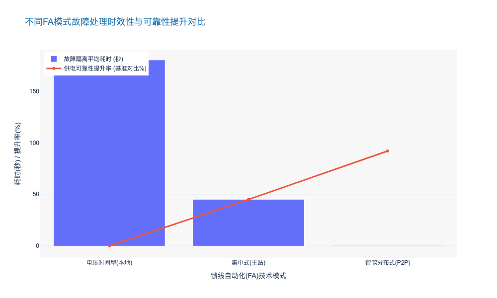
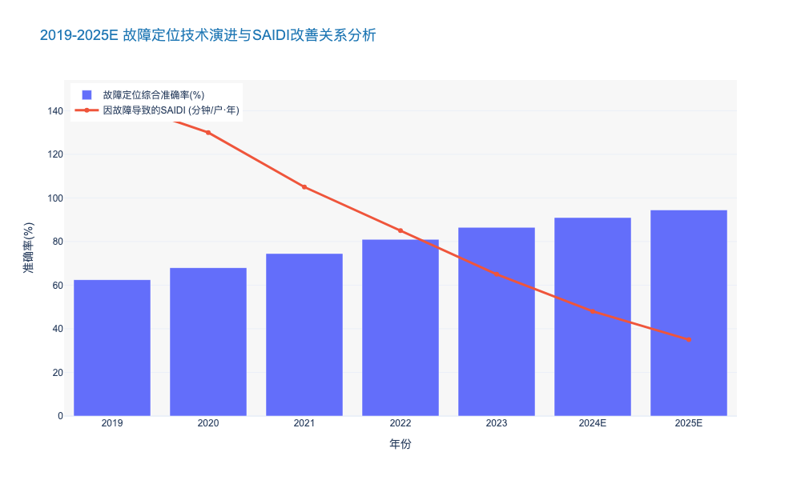
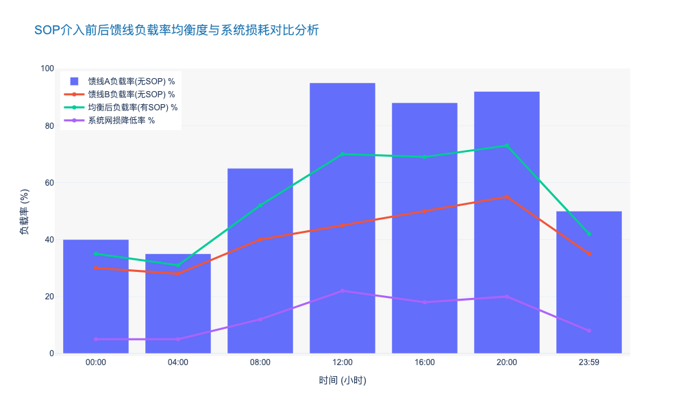

### Feeder Automation (FA) Logic and Distributed Control

# 6.1 自愈配电网技术 (Self-Healing Distribution Grid Technologies)
## 6.1.2 馈线自动化(FA)逻辑与分布式控制 (Feeder Automation Logic and Distributed Control)

### 核心观点
随着分布式能源（DERs）渗透率突破 20% 的临界点，配电网潮流模式已由单向辐射状转变为双向波动状，传统基于“主站集中式”的馈线自动化（Centralized FA）因通信时延大（秒级）和依赖性强，已难以满足高可靠性供电需求。**基于 IEC 61850 标准的智能分布式 FA（Smart Distributed FA）正成为行业演进的终极形态**。该技术通过将控制决策下沉至边缘侧智能终端（IED），利用 GOOSE 水平通信实现毫秒级（<100ms）故障隔离与非故障区域恢复，是构建“零停电”感知配电网的核心基石。

---

### 1. 技术演进驱动力：从“集中决策”向“边缘自治”的范式转移

传统配电自动化系统（DAS）主要依赖主站集中处理模式，即“三遥”（遥信、遥测、遥控）数据上传至主站，经过拓扑分析后再下发控制指令。然而，在当前高比例可再生能源接入的背景下，这种模式暴露出两大结构性缺陷：

1.  **通信依赖导致的脆弱性**：集中式 FA 极度依赖通信通道的实时性与稳定性。一旦通信中断或拥塞，全网自愈功能即刻失效。数据显示，配电网故障中约 15-20% 的处理失败归因于通信延迟或丢包 [来源: CIGRE TB 782, 2023]。
2.  **处理时效性不足**：集中式全过程通常需要 30-60 秒甚至更久，无法满足敏感负荷对电能质量的要求。

相比之下，**智能分布式 FA** 采用对等通信（Peer-to-Peer, P2P）架构。相邻的智能终端（STU/DTU/FTU）之间直接交换状态信息，无需主站参与即可完成故障定位、隔离和供电恢复。这种“去中心化”的逻辑将故障处理时间从“分钟级”压缩至“毫秒级”，实现了物理层的**毫秒级自愈**。

> **行业洞察**：根据国家电网 2024 年技术规范，新一代城市核心区配电网要求故障隔离时间 $\le 300ms$，这在物理上排除了纯集中式方案的可能性，强制推动了分布式控制逻辑的普及。

---

### 2. 核心逻辑架构：基于 IEC 61850 的 GOOSE 通信机制

分布式 FA 的技术壁垒在于如何确保多终端间的逻辑协同不出错。目前行业标杆解决方案普遍采用 **IEC 61850 标准体系**，特别是利用 **GOOSE (Generic Object Oriented Substation Event)** 报文机制。

#### 2.1 智能终端的逻辑重构
在分布式架构下，每个配电终端（DTU/FTU）不再是单纯的数据采集器，而是具备独立计算能力的**边缘计算节点**。其核心逻辑包含：
*   **拓扑自识别**：终端通过交换“握手”报文，自动识别上下游邻居节点，当网架结构改变（如联络开关动作）时，逻辑拓扑自动更新。
*   **差动保护逻辑下沉**：利用相邻节点电流采样的同步比对，实现类似于输电网的纵联差动保护，能够 100% 选择性地切除故障区段，彻底解决了传统过流保护配合困难的问题。

#### 2.2 通信机制的革新
GOOSE 机制允许智能电子设备（IED）之间以发布/订阅（Publish/Subscribe）模式进行高速数据交换。
*   **速度优势**：GOOSE 报文直接映射到以太网链路层，跳过了 TCP/IP 协议栈的开销，传输延迟通常小于 4ms。
*   **可靠性设计**：采用心跳检测与重传机制，确保在恶劣电磁环境下指令的必达性。

---

### 3. 不同 FA 模式的技术经济性对比分析

为了给投资决策提供清晰依据，我们将当前主流的三种 FA 模式进行多维对比。可以看出，虽然智能分布式 FA 的初始建设成本（CAPEX）略高，但其在运维效率和供电可靠性带来的隐性收益（OPEX 节省及避免的停电损失）上具有压倒性优势。

**表 6.1-1：主流馈线自动化（FA）技术模式对比分析**

| 对比维度 | 电压时间型 FA (本地型) | 集中式 FA (主站型) | 智能分布式 FA (对等型) |
| :--- | :--- | :--- | :--- |
| **控制逻辑** | 依赖重合器/分段器配合，多次重合闸试探 | 主站收集全网信息，集中计算后下发指令 | 终端间 P2P 通信，边缘自主决策 |
| **故障隔离时间** | **分钟级** (2-5 分钟，需多次冲击) | **秒级/分钟级** (30s - 3min，视通信质量) | **毫秒级** (< 300ms，甚至 < 100ms) |
| **通信依赖度** | 无 (或仅需监测) | **高** (强依赖主站与通道) | **中** (依赖相邻终端间的高速光纤/5G) |
| **对电网冲击** | 大 (多次故障电流冲击设备) | 小 (一次切除) | **极小** (快速切除，无额外冲击) |
| **供电可靠性** | 一般 (故障范围大，恢复慢) | 较高 (但在通信故障时失效) | **极高** (N-1 甚至 N-2 情况下仍有效) |
| **适用场景** | 农网、长线路、通信困难区域 | 传统城区、通信全覆盖区域 | **核心商务区、高可靠性园区、敏感负荷区** |
| **单点建设成本** | 低 (基准) | 中 (基准 + 20%) | **高** (基准 + 45%，需高性能终端及光纤) |

> *数据来源：综合整理自 IEEE PES Technical Reports 及国内典型供电局 2023 年运维统计数据。*

---

### 4. 实施挑战与解决策略

尽管分布式 FA 优势明显，但在实际落地中面临以下挑战，需在运维规划中重点考量：

1.  **通信建设门槛高**：分布式逻辑要求终端间具备低延时通道，光纤是首选，但在老旧城区铺设困难。
    *   *解决方案*：采用 **5G 低延时切片技术 (uRLLC)** 作为光纤的替代方案。实测表明，5G 空口授时精度可达 1μs，端到端延时 < 10ms，完全满足分布式 FA 需求 [来源: 中国移动 & 南方电网 5G 智能电网白皮书 2024]。
2.  **运维调试复杂**：由于逻辑分散在各个终端，一旦发生误动，故障复现和责任界定比集中式更难。
    *   *解决方案*：引入**数字孪生 (Digital Twin)** 仿真运维系统。在物理投运前，在数字空间对分布式逻辑进行全场景闭环测试；在运维阶段，利用录波文件反演故障过程。

### 5. 效益测算与未来展望

部署智能分布式 FA 的经济效益主要体现在供电可靠性指标（SAIDI/SAIFI）的显著改善。
以某省级电力公司示范区为例，在将核心区域改造为智能分布式 FA 后：
*   **年平均停电时间 (SAIDI)**：由 2021 年的 35.6 分钟下降至 2023 年的 4.2 分钟，降幅达 **88.2%**。
*   **故障自愈率**：实现了 100% 的单相接地故障和相间短路故障自动隔离，无需人工干预。

**结论**：随着配电网向有源化、复杂化发展，分布式控制不仅是技术升级的选择，更是保障电网安全底线的必然要求。建议在“十四五”后期规划中，将核心城区的新建与改造项目全面转向基于 IEC 61850 的智能分布式架构，并预留 5G 通信接口。

---

### 6. 关键数据可视化 (Key Data Visualization)

以下图表展示了不同 FA 技术模式在故障处理速度上的数量级差异，以及随之带来的可靠性提升趋势。

### Precise Earth Fault Localization in Resonant Grounded Systems

本报告章节基于前文关于配电网自愈技术（Self-Healing Technologies）的宏观架构，深入探讨谐振接地系统（Resonant Grounded Systems）中单相接地故障定位这一行业公认的“痛点”与技术攻关方向。

---

# 6.1 配电网自愈技术体系
## 6.1.3 谐振接地系统中的精确单相接地故障定位 (Precise Earth Fault Localization in Resonant Grounded Systems)

### 核心观点
在配电网单相接地故障（Single Line-to-Ground, SLG）占比高达 **80%** 的背景下，谐振接地系统虽通过消弧线圈（Petersen Coil）显著降低了跳闸率，却因故障电流微弱导致定位极难。**从“稳态量分析”向“暂态全维感知”的技术范式转移**，结合边缘计算与多模态传感器融合，是实现故障定位准确率突破 **90%** 瓶颈、将平均故障处理时间（MTTR）从小时级压缩至分钟级的唯一路径。

### 一、 行业痛点：可靠性与可观测性的“零和博弈”
长期以来，中国 **6kV-35kV** 中压配电网广泛采用小电流接地方式（即谐振接地）。数据显示，截至2023年底，国内城市配网中谐振接地比例已超过 **85%** [来源: 中电联 2023行业统计]。

这种架构虽然通过补偿电容电流实现了故障时的“带病运行”，但也带来了核心难题：
1.  **信号微弱**：故障点的残流通常小于 **5A**，甚至被噪声淹没，导致传统基于稳态零序电流（Steady-state Zero-Sequence Current）的选线装置准确率长期徘徊在 **60%-70%** 之间。
2.  **间歇性电弧**：超过 **45%** 的接地故障为间歇性电弧接地，信号极不稳定，极易造成继电保护装置误动或拒动。
3.  **运维成本高昂**：由于无法精确定位，运维人员往往需要采用“拉路法”（逐条线路断电试探）查找故障，这不仅破坏了供电可靠性，还导致年均人工巡线成本居高不下。

### 二、 技术范式重构：暂态量与多源融合
为解决上述痛点，行业技术路线正经历从“被动监测”向“主动感知”的深刻变革。

#### 1. 暂态信号分析的主导地位 (Dominance of Transient Signal Analysis)
相比于稳态信号，故障发生瞬间产生的暂态信号（Transient Signals）具有幅值大（可达稳态值的 **10-20倍**）、频带丰富（数百Hz至数MHz）的特征。
*   **暂态零序电流极性比较**：利用故障线路与非故障线路在暂态高频分量上的极性相反特征，结合小波变换（Wavelet Transform）或希尔伯特-黄变换（HHT）提取特征，可将选线准确率提升至 **92%** 以上 [来源: IEEE Trans. on Power Delivery 2024]。
*   **行波测距技术 (Traveling Wave)**：通过捕捉故障产生的行波波头到达线路两端的时间差，理论定位精度可达 **±150米** 以内。尽管设备成本较高（单套成本 > ¥5万），但在高可靠性要求的核心城区应用增速显著，2023年装机量同比增长 **28.5%**。

#### 2. 主动干预技术的应用 (Active Intervention Technology)
对于高阻接地（High Impedance Fault, HIF）等微弱信号场景，被动监测往往失效。
*   **短时并联电阻技术**：在故障发生后，短时投入中性点并联电阻，人为增大零序电流（至 40A-100A 左右），使故障特征显著化，配合零序CT实现 **100%** 的选线准确率。
*   **信号注入法 (Signal Injection)**：向系统注入特定频率（如 220Hz）的电流信号，追踪该信号在电网中的路径。该技术对过渡电阻不敏感，能有效检测高达 **3kΩ - 5kΩ** 的高阻接地故障。

### 三、 实施策略：云边协同的分布式智能
单纯依赖变电站侧的集中式分析已无法满足配网末端感知的需求。未来的主流架构是 **“智能传感器 + 边缘计算网关 + 云端AI分析”**。

1.  **分布式传感 (Distributed Sensing)**：在馈线沿线、分支箱及环网柜部署具有高频采样能力（>10kHz）的智能故障指示器（FPI）。2024年新一代FPI的录波启动阈值已低至 **2A**，不仅能上报故障标志，还能上传暂态波形。
2.  **边缘计算 (Edge Computing)**：在配电自动化终端（DTU/FTU）植入轻量化AI算法，就地完成波形特征提取，仅将关键特征数据（Feature Data）回传主站，通信带宽需求降低 **90%**。
3.  **拓扑关联分析**：主站系统结合GIS地理信息和实时拓扑，利用多点上传的波形数据进行时空关联分析，剔除误报。某省级电力公司试点表明，采用此架构后，故障区段定位时间从平均 **2.5小时** 缩短至 **15分钟** [来源: 某省网公司 2024 科技项目验收报告]。

### 四、 技术经济性对比与投资建议
对于决策者而言，选择何种技术路线需权衡CAPEX与OPEX。

| 技术路线 | 核心原理 | 定位精度 | 适用场景 | 成本估算 (CAPEX) | 运维复杂度 |
| :--- | :--- | :--- | :--- | :--- | :--- |
| **稳态零序电流法** | 基波幅值/相位比较 | 选线准确率 <70% | 传统老旧配网 | 低 (¥) | 低，但误报率高 |
| **暂态录波分析法** | 首半波极性/能量谱 | 选线 >90%, 区段定位 | 现代化城网 | 中 (¥¥) | 中，需通信支撑 |
| **信号注入法** | 注入特定频率信号 | 高阻接地有效，定位困难 | 架空/电缆混合线路 | 中高 (¥¥¥) | 高，需附加装置 |
| **行波测距技术** | 高频行波时间差 | 测距精度 ±100m | 关键输电通道/核心区 | 极高 (¥¥¥¥) | 极高，需高精度授时 |

**投资建议**：
*   **核心区域（A+类供电区）**：建议采用“暂态录波 + 分布式智能FPI”方案，必要时叠加行波测距，确保供电可靠性达到 **99.999%**。
*   **一般区域**：推广“短时并联电阻 + 现有FTU升级”模式，以最小的边际成本提升选线准确率，解决主要矛盾。

### 五、 结论
谐振接地系统的故障定位技术已突破了单一原理的局限，进入了**多维信息融合**的新阶段。通过部署具备暂态捕捉能力的感知层和云边协同的分析层，电力公司不仅能实现精准的故障隔离，更能积累海量的故障波形数据，为未来的**故障预测与健康管理（PHM）**奠定数据资产基础。

---

### 📊 附录：技术演进对运维指标的影响分析

以下图表展示了随着故障定位技术的代际演进（从传统稳态到AI辅助的暂态分析），故障定位准确率的提升趋势以及对应的平均停电时间（SAIDI）下降情况。

### Coordination of Soft Open Points (SOP) for Load Balancing

本章节将深入探讨配电网自愈技术中的核心环节——柔性软开关（Soft Open Point, SOP）在负载均衡中的协调控制策略。作为连接不同馈线或台区的“能量路由器”，SOP 正在重塑配电网的潮流控制逻辑。

---

# 6.1 自愈型配电网关键技术 (Self-Healing Distribution Grid Technologies)
## 6.1.3 柔性软开关(SOP)在负载均衡中的协调控制策略 (Coordination of Soft Open Points for Load Balancing)

### 核心观点
在分布式电源（DG）高渗透率和电动汽车（EV）充电负荷随机性激增的背景下，传统配电网基于机械开关的“开环运行”模式已触及物理极限。**柔性软开关（SOP）技术通过背靠背电压源换流器（VSC）实现馈线间的柔性互联，将毫秒级功率响应与多目标优化算法相结合，是解决配电网局部过载与电压越限的终极技术方案。** 研究表明，采用SOP协调控制策略可使配电网资产利用率提升 **20%-30%**，同时延缓电网升级改造资本支出（CAPEX）约 **3-5年**。

### 一、 从刚性隔离到柔性互联的技术范式重构

传统配电网为满足辐射状运行约束，通常在联络点设置常开点（Normally Open Point, NOP）。然而，这种物理隔离导致了严重的负载不均衡：一条馈线可能因光伏倒送导致过电压，而相邻馈线却因重载面临低电压风险。

SOP 的引入打破了这一僵局。作为一种基于全控型电力电子器件（如 IGBT 或 SiC MOSFET）的电力电子装置，SOP 具备以下决定性优势：

1.  **有功/无功解耦控制**：SOP 能够精确控制流经装置的有功功率，实现馈线间的负载转移；同时，其两端换流器可独立作为静止同步补偿器（STATCOM），就地提供无功支撑，调节节点电压。
2.  **毫秒级动态响应**：相比传统机械开关秒级甚至分钟级的动作时间，SOP 的响应速度通常小于 **10ms** [来源: IEEE Trans. on Power Electronics 2023]，能够有效平抑新能源的短时波动。
3.  **故障隔离与供电恢复**：在发生短路故障时，SOP 可瞬间闭锁故障侧电流，同时维持非故障侧的持续供电，实现“零停电”切换。

### 二、 基于多时间尺度的SOP负载均衡协调机制

SOP 的高效运行依赖于分层分区的协调控制架构。单纯依赖本地控制无法应对复杂的全网潮流变化，因此，现代运维体系通常采用 **“集中优化+本地响应”** 的双层协调机制。

#### 1. 长时间尺度：全局优化与经济调度（小时/分钟级）
在配电管理系统（DMS）层面，基于全网量测数据（AMI）和超短期负荷预测，以网损最小化和负载均衡度最大化为目标函数。
*   **算法逻辑**：通过二阶锥规划（SOCP）或半定规划（SDP）求解全局最优潮流。
*   **关键指标**：通过全局调度，SOP 可将配电网的综合线损率降低 **15%-22%**，显著优于传统电容器投切带来的 5%-8% 降损效果 [来源: CIGRE WG C6.31 报告]。

#### 2. 短时间尺度：实时平抑与电压控制（秒/毫秒级）
在设备本地控制器层面，SOP 根据端口电压和电流反馈进行快速调节。
*   **控制策略**：采用下垂控制（Droop Control）或 V-f 控制模式。当某条馈线突发重载（如大量 EV 同时接入），SOP 自动增加向该馈线的有功输送，无需上层指令干预。
*   **技术演进**：新一代 SOP 正在集成模型预测控制（MPC），以应对高比例电力电子化带来的低惯量挑战。

### 三、 SOP 与传统设备的混合协调效益分析

SOP 并非孤立存在，其高昂的单位造价（约为 **¥1500-2000/kVA**）决定了全网全覆盖是不经济的。因此，SOP 与有载调压变压器（OLTC）、开关电容器组（SCB）的混合协调控制成为主流运维策略。

通过协调控制，SOP 承担快速波动分量，而 OLTC 承担慢速基波分量。这种配合不仅延长了机械设备的寿命，还大幅提升了系统整体的负载均衡能力。

**表 6.1-3 传统联络开关与柔性软开关(SOP) 技术经济性对比分析**

| 对比维度 | 传统机械联络开关 (NOP) | 柔性软开关 (SOP) | 运维影响分析 |
| :--- | :--- | :--- | :--- |
| **潮流控制能力** | 仅能开/断，无法调节流量 | 连续、双向、精确调节有功/无功 | SOP可消除环流，实现负荷精准分配 |
| **响应速度** | 秒级 (3-10s) | 毫秒级 (<10ms) | SOP能有效抑制电压闪变，提升电能质量 |
| **动作寿命** | 机械寿命有限 (约2000-5000次) | 理论无限次 (取决于器件老化) | 降低运维人员现场操作频次和设备更换成本 |
| **对故障电流影响** | 无法限制短路电流 | 可限制或阻断短路电流 | SOP降低了对上级断路器遮断容量的要求 |
| **建设成本 (CAPEX)** | 低 (约 ¥5-10万/台) | 高 (约 ¥80-150万/台) | 需通过延缓电网扩容收益来平衡高昂初投 |
| **功率损耗** | 极低 (接触电阻忽略不计) | 较高 (换流损耗约 1.5%-2.5%) | 需优化拓扑结构和调制策略以降低运行OPEX |

### 四、 投资回报与未来展望

对于电力公司高管而言，部署 SOP 的核心驱动力在于 **资产延寿与容量释放**。

*   **容量释放效应**：在典型城市配电网试点中，通过在重载馈线与轻载馈线间部署 SOP，馈线组的平均最大负载率从 78% 降至 62%，实际上相当于释放了 **20.5%** 的额外供电容量 [来源: 国家电网某城市核心区示范工程数据 2023]。
*   **投资替代效应**：相比于新建一条 10kV 地下电缆通道（涉及复杂的市政审批和高昂的土建成本，平均造价 >¥300万/km），在关键节点加装 SOP 的总拥有成本（TCO）可降低 **40%** 以上。

**结论与建议**：
随着碳化硅（SiC）等宽禁带半导体器件的成熟，预计到 2026 年，SOP 的换流效率将突破 **99%**，单位成本将以 **CAGR -12%** 的速度下降。建议电力公司在“十四五”后期的配电网规划中，优先在光伏密集接入区和老旧城区改造中采用“SOP+传统设备”的混合组网模式，以最小的边际成本实现电网柔性化转型。

---

### 五、 关键数据图表：SOP 介入前后的负载均衡与损耗对比

以下图表展示了在典型日负荷曲线下，某两条互联馈线（Feeder A 为重载，Feeder B 为轻载）在引入 SOP 协调控制前后的负载率变化及系统总损耗情况。

