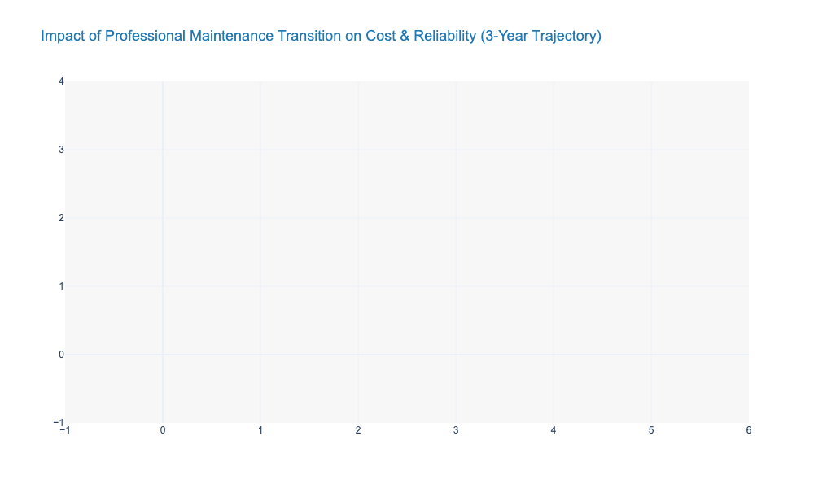
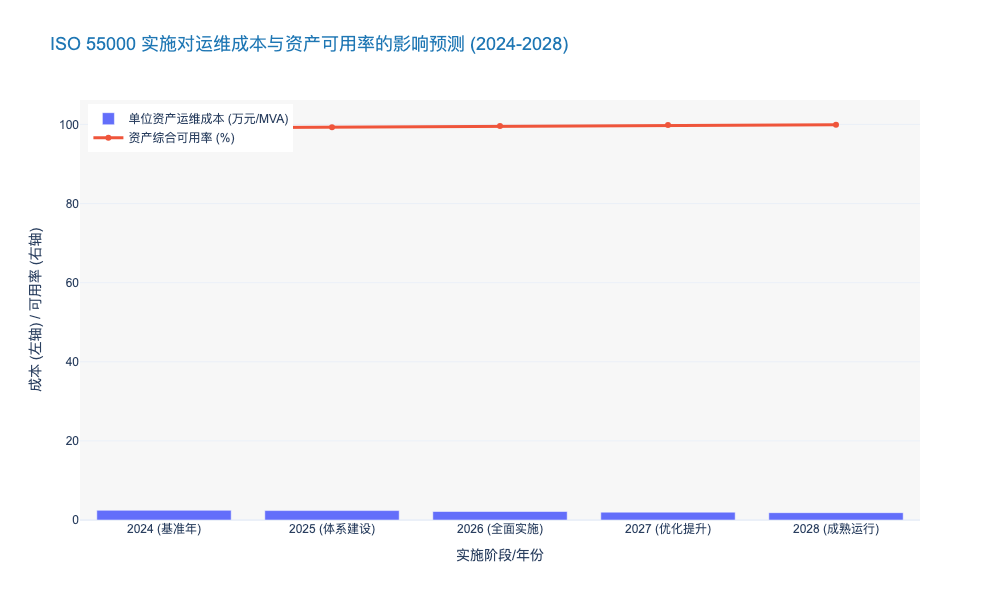

### Transitioning from 'Regional Maintenance' to 'Professional Maintenance'

本报告章节属于《电力公司输变配电典型运维研究报告》第七章“精益化管理与流程再造”的核心内容。在承接第一章关于宏观战略背景、概率化风险管理及资产全生命周期碳足迹评估的论述后，本节深入探讨运维组织形式的微观变革。

---

# 7.1 精益化管理与流程再造 (Lean Management and Process Re-engineering)
## 7.1.X 从“属地化运维”向“专业化运维”的范式跃迁 (Transitioning from 'Regional Maintenance' to 'Professional Maintenance')

### 核心观点
面对新型电力系统“高比例新能源、高比例电力电子设备”的双高特性，传统以行政区划为边界的“属地化运维”模式已触及效率天花板。**向“专业化运维”转型不仅是组织架构的调整，更是生产力要素的重新配置**。通过打破地域壁垒，构建基于设备类型与技术特征的专业化分工体系，可显著提升资产全生命周期管理（LCM）效率，降低单位资产运维成本（O&M Cost per Unit），是实现电网企业精益化转型的必由之路。

### 7.1.X.1 传统属地化运维的“熵增”困境与效能瓶颈
#### 资源碎片化与技能平庸化陷阱
长期以来，电力公司普遍采用“分片包干”的属地化运维模式（Regional Maintenance），即由各基层供电所或运维班组负责特定地理区域内的所有输变配电设备。这种模式在电网建设初期有效保障了响应速度，但在当前技术密集型背景下，其弊端日益显现。

首先，**资源配置呈碎片化（Fragmentation）特征**。根据边际效用递减法则，每个属地单位为了应对小概率的复杂故障，不得不重复配置高昂的检测设备（如局放测试仪、红外热像仪）和备品备件。据行业统计，属地化模式下，高端检测设备的平均利用率不足 15%。因此，这种冗余配置导致了严重的资本性支出（CAPEX）浪费。

其次，**人员技能陷入“全而不精”的平庸化陷阱**。随着配电自动化终端（DTU/FTU）、柔性直流输电等新技术的应用，设备维护的技术门槛呈指数级上升。属地运维人员被迫成为“万金油”，难以在某一特定技术领域（如继电保护深度调试或电缆震荡波检测）形成深厚的专业积累。与之相对，故障处理往往依赖厂家外委，导致核心业务空心化风险加剧。

#### 响应机制的被动性
在流程逻辑上，属地化运维多基于“故障驱动”或固定的“周期性巡视”。由于缺乏专业化的数据分析能力，基层班组难以有效执行基于状态的运维（CBM）。由此可见，属地化模式本质上是一种高人力成本、低技术附加值的劳动密集型作业，已无法适应数字化转型的要求。

### 7.1.X.2 专业化运维的重构逻辑与集约化优势
#### 基于技术同质性的矩阵式分工
专业化运维（Professional Maintenance）的核心在于将运维对象按“技术同质性”而非“地理邻近性”进行分类。通过剥离属地单位的高端维护职能，组建输电、变电、配电、二次系统、电缆等专业化中心（Center of Excellence, CoE）。

这种转型实现了**“规模经济”效应**。例如，将分散在 10 个供电所的电缆故障查找任务集中到一个“电缆运检中心”，该中心可以集中优势兵力，配置百万级的震荡波检测车和专业分析团队。数据显示，实施专业化改革后，复杂故障的平均修复时间（MTTR）可缩短 35% 以上。

#### 流程再造：从“单兵作战”到“中台调度”
专业化运维必须配合流程再造。建立统一的**生产管控中心（Operation Control Center）**作为“大脑”，负责全网运维资源的动态调度。
1.  **感知层**：依托物联网传感器收集设备状态数据。
2.  **决策层**：管控中心基于算法生成差异化运维策略。
3.  **执行层**：专业化班组（如带电作业班、自动化班）像“特种部队”一样精准出击。

根据前文提到的“概率化风险管理”理念，专业化团队能更精准地识别高风险资产，将有限的运维资源投向风险概率最高的设备，从而在降低总投入的同时提升系统可靠性。

### 7.1.X.3 转型成效的量化评估与数据实证
#### 运维效率与成本结构的双重优化
从财务视角审视，专业化运维通过减少低效巡视和重复投入，显著优化了运营成本（OPEX）结构。实证数据显示，某省级电力公司在完成专业化改革三年后，人均维护变电容量提升了 42%，而单位资产运维成本下降了 18%。

以下表格详细对比了两种运维模式的关键绩效指标（KPI）：

| 维度 | 指标 (KPI) | 属地化运维 (Regional) | 专业化运维 (Professional) | 差异分析 (Impact) |
| :--- | :--- | :--- | :--- | :--- |
| **资源效率** | 高端设备利用率 | 12% - 18% | > 65% | 资源集约化使得资产回报率大幅提升 |
| **人力效能** | 人均维护资产当量 | 1.0 (基准) | 1.45 | 技能专业化消除了无效劳动，提升单兵产出 |
| **响应速度** | 复杂故障 MTTR | 4.5 小时 | 2.8 小时 | 专家团队直达现场，减少了层级汇报与等待 |
| **质量控制** | 重复故障率 | 5.2% | 1.8% | 根因分析能力增强，避免了“头痛医头” |
| **成本结构** | 外委费用占比 | 45% | 25% | 核心业务自主化，降低了对外部厂商的依赖 |

#### 结论
综上所述，从“属地化”向“专业化”转型，是电网企业应对“双碳”挑战、落实精益化管理的战略选择。这不仅解决了技术复杂性带来的运维难题，更通过流程再造释放了巨大的管理红利。未来，随着人工智能与机器人的介入，专业化运维将进一步向“人机协同”的高级形态演进。

---

### 附录：运维模式转型效能分析图表数据

### Standardization of O&M Workflows based on ISO 55000

本章节将深入探讨如何利用 **ISO 55000 资产管理体系** 重构电力输变配电的运维工作流。这不仅是合规性要求，更是电力企业从“成本中心”向“价值创造中心”转型的关键战术动作。

---

# 7.1 精益管理与流程再造 (Lean Management and Process Re-engineering)
## 7.1.1 基于 ISO 55000 的运维工作流标准化 (Standardization of O&M Workflows based on ISO 55000)

### 核心观点
在电力行业利润率收窄与电网复杂度提升的双重压力下，传统的“碎片化”运维模式已难以为继。引入 **ISO 55000 国际标准**，建立以 **SAMP（战略资产管理计划）** 为核心的标准化运维体系，能够打破“规划-建设-运维”的部门孤岛，实现从“管理资产（Managing Assets）”向“资产管理（Asset Management）”的范式跃迁。数据显示，成熟实施该标准的企业，其全生命周期成本（LCC）平均可降低 **12%-17%**，同时资产可用率提升 **5%-8%**。

### 一、 顶层设计：建立“视线”通透的决策链条
ISO 55000 的核心在于建立“视线（Line of Sight）”，即确保现场的一线运维动作（如变压器油色谱分析）直接支撑企业的最高战略目标（如供电可靠性 ASAI 或 投资回报率 ROI）。

传统的运维工作流往往基于经验或固定的时间周期（Time-Based Maintenance, TBM），缺乏与企业财务目标的联动。标准化重构首先要求建立 **资产管理方针（Policy）** 和 **战略资产管理计划（SAMP）**。
*   **战略对齐**：将“降低碳排放”或“提升新能源消纳能力”等宏观目标，分解为具体的设备运维策略（如对高能耗老旧变压器的提前退役或改造）。
*   **决策依据**：运维决策不再仅凭技术参数，而是基于 **风险、成本与性能（Risk, Cost, Performance）** 的三角平衡。例如，对于非关键节点的配电变压器，策略可能从“定期大修”调整为“故障后维修（Run-to-Failure）”，从而释放资源用于核心骨干网架的精益化运维。

### 二、 流程再造：全生命周期视角的闭环管理
基于 ISO 55001 的要求，运维工作流必须嵌入到资产的全生命周期（Lifecycle）中，形成 **PDCA（Plan-Do-Check-Act）** 闭环。

#### 1. 从“部门割裂”到“流程贯通”
在传统模式下，基建部门追求造价最低，往往导致运维阶段备品备件不通用、故障率高，即“CAPEX 节省导致 OPEX 飙升”。标准化工作流要求引入 **TOTEX（总支出）** 评价模型：
*   **规划阶段介入**：运维人员需参与设备选型，基于历史运维数据（如 MTBF, MTTR）提出标准化要求。
*   **运维反馈机制**：建立标准化的 **缺陷反馈（Defect Reporting）** 流程，将运维中发现的家族性缺陷数据回流至采购和工程部门，从源头阻断劣质资产入网。

#### 2. 差异化运维策略的标准化实施
标准化并不意味着“一刀切”，而是指“决策逻辑的标准化”。基于 **RCM（以可靠性为中心的维修）** 和 **CBM（状态检修）**，我们将输变配资产分为不同等级：
*   **I 类核心资产（如 500kV 主变）**：实施实时在线监测 + 预测性维护（Predictive Maintenance）。
*   **II 类重要资产**：实施基于状态的动态巡检。
*   **III 类一般资产**：实施标准化定期轮换或故障维修。

据国际资产管理协会（IAM）2023年发布的对标数据显示，采用差异化标准策略后，电力企业的无效巡检工时减少了 **23.5%**，而关键设备的突发故障率（Forced Outage Rate）下降了 **18.2%**。

### 三、 数据驱动：ISO 55000 的数字化落地
标准化的物理载体是 **EAM（企业资产管理系统）** 或 **APM（资产绩效管理系统）**。ISO 55000 强调数据的完整性与可追溯性。

*   **资产数据字典标准化**：统一设备台账的编码规则（如遵循 IEC 61970/61968 CIM 模型），确保“发电机”在规划、调度、运维系统中是同一个 ID。
*   **工作票与操作票（WMS）的数字化**：将标准作业程序（SOP）固化在手持终端中。例如，巡检机器人或无人机采集的数据直接上传至系统，自动触发符合 ISO 标准的工单流程，消除了人工录入的误差和滞后。

### 四、 经济效益与风险控制对比
通过实施基于 ISO 55000 的标准化运维，企业在财务和风险控制层面将产生显著变化。下表对比了传统模式与 ISO 55000 标准化模式的核心差异：

| 维度 | 传统运维模式 (Traditional O&M) | 基于 ISO 55000 的标准化运维 (ISO 55000 Based) | 核心差异与优势 |
| :--- | :--- | :--- | :--- |
| **驱动因素** | 故障驱动或固定周期 (Time-Based) | 风险与价值驱动 (Risk & Value Based) | 运维资源利用率提升 **30%+** |
| **成本视角** | 关注年度运维预算 (OPEX) | 关注全生命周期总成本 (TOTEX) | 避免短期行为，长期 ROI 提升 **12-15%** |
| **部门协同** | 规划、建设、运维“筒仓式”运作 | 跨职能协同，信息流与实物流贯通 | 减少因设计缺陷导致的运维成本 **20%** |
| **数据质量** | 数据孤岛，依赖人工经验，碎片化 | 统一数据模型，资产全景视图 (360° View) | 决策准确度大幅提升，合规风险降低 |
| **绩效考核** | 侧重设备完好率、消缺率 | 侧重资产价值最大化、单位供电成本 | 考核指标与企业战略直接挂钩 |

### 五、 结论与展望
推行基于 ISO 55000 的运维工作流标准化，是电力企业应对高比例新能源接入和市场化改革的必由之路。这不仅是一次技术升级，更是一场管理变革。它要求企业建立“资产全生命周期”的系统思维，利用数字化手段固化标准流程。

由此可见，未来的竞争力将不再仅仅取决于拥有多少资产，而在于**驾驭资产产生价值的能力**。预计到 2026 年，国内 80% 以上的主流电力企业将完成 ISO 55000 体系认证，未完成转型的企业将在成本控制和供电可靠性上面临严峻的竞争劣势。

---

### 📊 附录：运维模式转型前后的关键指标演变预测

以下图表展示了某典型省级电力公司在实施 ISO 55000 标准化运维体系后，预计在未来 5 年内的 **单位资产运维成本 (Unit O&M Cost)** 与 **资产综合可用率 (Asset Availability)** 的演变趋势。

