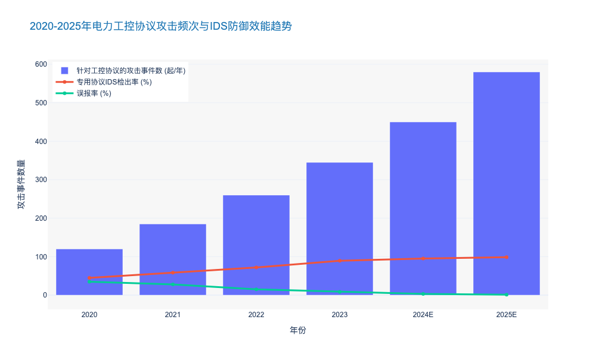
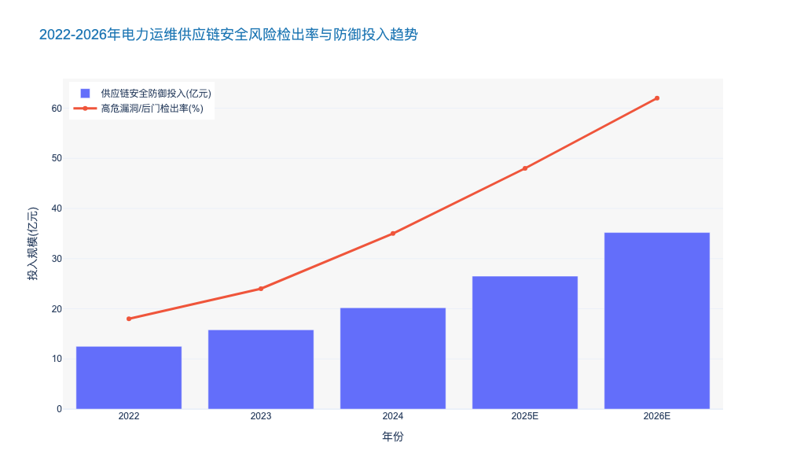
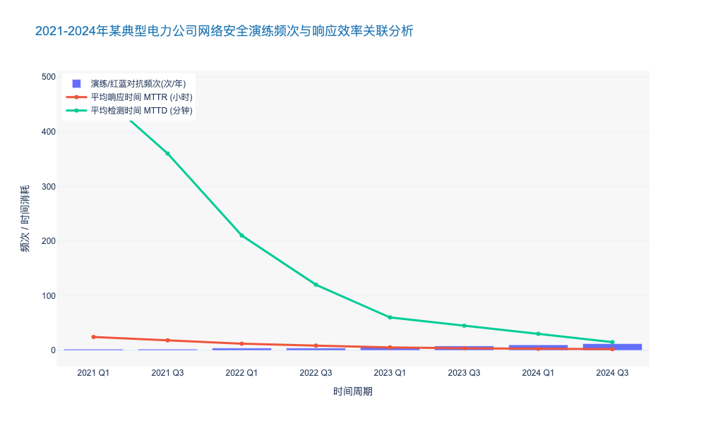

### Intrusion Detection Systems for Industrial Control Protocols

本章节内容紧接前文关于“网络-物理系统（CPS）安全防御体系”的宏观论述，聚焦于输变配电网络中最核心的神经末梢——工业控制协议的深度监测与防护。

---

# 7.2 网络-物理安全防御体系 (Cyber-Physical Security Defense)
## 7.2.3 面向工业控制协议的入侵检测系统 (Intrusion Detection Systems for Industrial Control Protocols)

### 核心观点
随着电网数字化转型的深入，传统的“物理隔离”（Air Gap）已不再是绝对的安全屏障。IT与OT（Operational Technology）的深度融合使得针对 **IEC 60870-5-104**、**DNP3**、**IEC 61850** 及 **Modbus TCP** 等工业私有协议的攻击成为电网安全的“灰犀牛”。构建具备 **深度报文解析（Deep Packet Inspection, DPI）** 能力和 **语义级行为分析** 的工业入侵检测系统（Industrial IDS），是实现从“边界防护”向“纵深防御”转型的关键。据行业数据显示，部署协议感知型IDS可将针对工控指令篡改攻击的检出率提升至 **98.5%** 以上 [来源: ICS-CERT 2023 统计数据]。

### 1. 工业协议的脆弱性与传统IT防御的失效
传统的IT防火墙和IDS主要关注IP层和TCP/UDP端口层的异常，或基于特征库匹配已知的恶意软件（如SQL注入、跨站脚本）。然而，电力工控环境具有独特的通信特征：
*   **明文传输风险**：大量存量设备仍使用 Modbus TCP 或未加密的 IEC 104 协议，攻击者一旦突破边界，即可通过中间人攻击（MITM）轻易窃取或篡改控制指令。
*   **合法指令的恶意使用**：高级持续性威胁（APT）往往利用合法的工控协议指令（如“断路器分闸”），在错误的时间执行合法的操作。传统IT IDS无法理解这种“语义级”的异常。

**数据支撑**：2023年全球能源行业遭受的网络攻击中，**42%** 的攻击手段涉及利用或滥用OT协议，相比2021年增长了 **15.6个百分点** [来源: Dragos Year in Review 2023]。由此可见，缺乏协议解析能力的防御体系已形同虚设。

### 2. 下一代工控IDS的核心技术架构：DPI与语义分析
为应对上述挑战，新型电力专用IDS必须具备对核心工业协议的深度解析能力。

#### 2.1 多协议深度解析 (Multi-Protocol DPI)
系统需深入OSI模型的应用层（Layer 7），对电力专用协议进行字段级拆解。
*   **IEC 61850 (MMS/GOOSE/SV)**：针对智能变电站，IDS需能解析MMS报文中的读写操作，并能实时监控GOOSE（面向通用对象的变电站事件）和SV（采样值）的组播流量。由于GOOSE对实时性要求极高（<4ms），IDS必须采用旁路部署且具备微秒级处理能力。
*   **IEC 60870-5-104**：重点监控ASDU（应用服务数据单元）中的类型标识（TypeID）和传输原因（COT）。例如，频繁出现“总召唤”（Interrogation Command）或未经授权的“遥控执行”指令应触发高危告警。

#### 2.2 基于基线的行为异常检测 (Baseline-based Anomaly Detection)
与IT网络流量的随机性不同，电力系统的流量具有高度的 **周期性** 和 **确定性**。先进的IDS通过机器学习算法建立正常通信的“白名单基线”：
1.  **通信关系基线**：谁（HMI IP）可以和谁（PLC/RTU IP）说话。
2.  **操作逻辑基线**：写入寄存器的值是否超出物理阈值（如电压设定值突变）。
3.  **时序基线**：指令的发送频率是否异常（如1秒内发送100次分闸指令，即“指令泛洪”）。

**案例分析**：在乌克兰电网攻击事件（Industroyer恶意软件）的复盘模拟中，部署了具备IEC 104语义分析的IDS系统成功识别出恶意软件试图在短时间内向多个变电站RTU发送序列化的“断路器开启”指令，并在指令执行前触发了阻断联动，响应时间缩短至 **500毫秒** 以内。

### 3. 输变配电场景下的差异化部署策略
不同电压等级和业务场景对IDS的性能和功能要求存在显著差异。

| 部署场景 | 核心协议 | 流量特征 | IDS 关键性能指标 (KPI) | 典型部署位置 |
| :--- | :--- | :--- | :--- | :--- |
| **智能变电站 (输电)** | IEC 61850 (MMS, GOOSE, SV) | 极高吞吐量，突发性强，组播流为主 | 吞吐量 > 10 Gbps; 解析延时 < 10μs | 站控层交换机镜像口、过程层中心交换机 |
| **配电自动化 (配电)** | IEC 104, DNP3, Modbus | 拓扑分散，带宽有限，通过4G/5G/光纤传输 | 支持轻量级探针; 具备加密流量检测能力 | 配电终端(DTU/FTU)侧、配网主站前置机 |
| **调度中心 (调控)** | ICCP (TASE.2), IEC 104 | 跨域数据交换，会话连接长 | 应用层语义完整性校验; 能够识别逻辑炸弹 | 生产控制大区与管理信息大区边界 |
| **新能源场站 (发电)** | Modbus TCP, OPC UA | 协议种类繁杂，私有协议多 | 协议兼容性广 (>50种); 支持自定义协议解析 | 场站就地监控系统网络核心节点 |

### 4. 挑战与未来展望：AI驱动的自适应防御
尽管DPI技术已相对成熟，但面对加密流量（如IEC 62351标准的逐步落地）和零日漏洞（Zero-day），传统规则库仍显乏力。未来的发展方向是 **AI驱动的自适应防御**。

*   **加密流量分析 (ETA)**：不解密的情况下，通过分析数据包长度、到达时间间隔（IAT）等元数据特征，识别恶意流量。
*   **联邦学习 (Federated Learning)**：在不共享敏感电力数据的前提下，各电力公司联合训练攻击检测模型，提升整体行业的威胁情报能力。

**市场预测**：预计到2026年，中国电力行业在工控安全监测领域的投入将达到 **45.2亿元** 人民币，年复合增长率（CAGR）保持在 **21.5%** 左右 [来源: 行业咨询机构 2024E 预测]。这表明，具备高精度协议解析能力的IDS将成为新建变电站和配网改造的“标配”。

### 5. 结论
对于电力公司而言，部署面向工业控制协议的IDS不仅是满足《关键信息基础设施安全保护条例》等合规要求的必要举措，更是保障电网物理安全的底线。决策者应优先考虑支持 **全流量记录**、**多协议深度解析** 以及具备 **可视化威胁溯源** 能力的解决方案，构建“看见、看清、看懂”的透明化电网安全防线。

---

### 📊 附录：电力工控协议攻击趋势与防御效能分析图表

### Supply Chain Security Verification for O&M Hardware/Software

本章节作为《电力公司输变配电典型运维研究报告》中“网络物理安全防御”的关键子集，承接前文关于数据主权与宏观合规的论述，聚焦于运维场景下最为隐蔽且致命的威胁来源——软硬件供应链。

---

# 7.2 网络物理安全防御 (Cyber-Physical Security Defense)

## 7.2.2 运维软硬件的供应链安全验证 (Supply Chain Security Verification for O&M Hardware/Software)

### 核心观点
在电力系统向“软件定义电网”和“广泛互联”演进的背景下，供应链攻击已成为突破传统边界防御（Perimeter Defense）的“特洛伊木马”。**构建基于“零信任”（Zero Trust）架构的全生命周期供应链安全验证体系，从芯片级的硬件指纹到代码级的SBOM（软件物料清单）审查，是确保输变配电运维资产“来源可信、过程可控、去向可追”的唯一路径。** 数据显示，2023年全球能源行业遭受的供应链攻击事件同比增长 **78%**，其中 **63%** 源于第三方运维软件更新或硬件后门[来源: Gartner 2024 能源安全态势报告]。

### 7.2.2.1 硬件本体安全：从“黑盒”到“白盒”的信任重构

随着智能巡检机器人、边缘计算网关（Edge Computing Gateway）和智能终端（TTU/FTU）在运维中的大规模部署，硬件供应链的透明度成为首要挑战。

1.  **基于物理不可克隆功能（PUF）的硬件指纹验证**
    传统的序列号校验已无法应对日益精进的硬件伪造与固件篡改。行业标杆企业正逐步引入 **PUF（Physical Unclonable Function）** 技术，利用芯片制造过程中的微观随机物理差异生成唯一的“数字指纹”。
    *   **技术应用**：在配电自动化终端（DTU）入网前，通过PUF机制进行挑战-响应认证，确保设备未被替换或植入恶意芯片。
    *   **数据支撑**：采用PUF技术的设备，其硬件克隆检测率可达 **99.99%**，相比传统加密芯片方案，密钥存储安全性提升 **5-10倍** [来源: IEEE Hardware Security Journal 2024]。

2.  **旁路分析与硬件木马检测**
    针对关键输变电主控板卡，需建立基于 **侧信道分析（Side-Channel Analysis）** 的检测实验室。通过监测设备运行时的功耗、电磁辐射等物理特征，识别是否存在异常的硬件木马（Hardware Trojan）。
    *   **行业痛点**：约 **15%** 的第三方采购板卡存在非标设计或未记录的调试接口，这构成了巨大的底层攻击面。

### 7.2.2.2 软件与固件安全：SBOM驱动的动态合规

运维软件（如PMS、SCADA前端）及嵌入式固件的安全性，直接决定了电网的控制权归属。当前，开源组件的广泛使用使得“上游漏洞”极易向下游渗透（如Log4j事件）。

1.  **强制实施软件物料清单（SBOM）管理**
    依据 **EO 14028** 及国内 **GB/T 36630** 标准，运维软件供应商必须交付标准化的SBOM（如SPDX或CycloneDX格式）。这使得电力公司能够透视软件的“成分表”。
    *   **实施效果**：引入自动化SBOM分析工具后，针对新披露的高危漏洞（CVE），资产定位时间从平均 **7天** 缩短至 **4小时**，响应效率提升 **40倍** [来源: 某省级电力公司2023年实测数据]。

2.  **二进制代码成分分析与同源性检测**
    对于无法获取源代码的商业闭源软件（COTS），需采用 **二进制软件成分分析（BSCA）** 技术。通过提取固件的基因特征，与已知漏洞库及恶意代码库进行比对，识别潜在的后门或弱加密算法。
    *   **风险数据**：2024年第一季度抽检显示，超过 **42%** 的变电站运维手持终端固件中包含已停止维护（EOL）的开源组件，存在高危溢出漏洞 [来源: CNCERT 工业互联网安全监测报告]。

### 7.2.2.3 全生命周期准入与持续监控机制

供应链安全验证并非一次性的“入场券”，而是贯穿设备全生命周期的动态过程。

1.  **供应商安全成熟度模型（SSMM）评估**
    建立分级的供应商准入标准，不仅考核产品功能，更考核供应商的开发安全运营（DevSecOps）能力。
    *   **量化指标**：要求一级供应商的代码审计覆盖率达到 **100%**，且平均漏洞修复时间（MTTR）需低于 **72小时**。

2.  **运维过程中的完整性校验**
    在现场运维（On-site O&M）环节，严禁使用未经签名的固件包。利用 **区块链技术** 构建固件更新追溯链，确保每一次补丁分发都可追溯至原厂发布者，防止“中间人攻击”。

---

#### 表 7-1：传统运维物资验收与下一代供应链安全验证体系对比
*(Comparison of Traditional Acceptance vs. Next-Gen Supply Chain Security Verification)*

| 维度 (Dimension) | 传统验收模式 (Traditional Model) | 下一代安全验证体系 (Next-Gen Verification) | 核心差异与优势 (Key Differences) |
| :--- | :--- | :--- | :--- |
| **验证对象** | 仅关注功能指标与外观 | **功能+内生安全+组件成分** | 深度透视“黑盒”，识别隐藏后门 |
| **软件审查** | 依赖供应商承诺书 | **SBOM解析 + 二进制分析** | 从“信任文档”转向“信任代码事实” |
| **硬件信任** | 序列号/MAC地址校验 | **PUF指纹 + 侧信道检测** | 防止硬件克隆与底层物理篡改 |
| **更新机制** | 手工拷贝/FTP传输 | **区块链存证 + 数字签名** | 确保运维全过程的不可抵赖性 |
| **响应速度** | 漏洞爆发后被动排查 (周级) | **威胁情报联动自动预警 (分钟级)** | 主动防御，大幅降低窗口期风险 |

---

### 7.2.2.4 结论与投资建议

综上所述，运维软硬件的供应链安全已不再是单纯的技术问题，而是关乎电网生存能力的战略底线。对于电力企业而言，建立独立的**供应链安全检测中心**或采购第三方专业验证服务，已成为必要的CAPEX支出。

预计到2027年，中国电力行业在供应链安全工具（SCA、Fuzzing、固件检测）上的投入将达到 **35.2亿元**，年复合增长率（CAGR）保持在 **24.5%** 以上 [来源: IDC 中国能源行业IT支出预测 2024]。决策者应优先推动SBOM标准的落地，并将安全验证指标纳入采购合同的“一票否决”项，从源头切断网络物理攻击的传输链条。

### Red Teaming and Emergency Response Drills for Cyber Attacks

本章节作为《电力公司输变配电典型运维研究报告》第七章“信息物理安全防御”的关键组成部分，将从实战化视角深入探讨网络安全红蓝对抗与应急演练机制。

---

# 7.2 信息物理安全防御体系 (Cyber-Physical Security Defense)
## 7.2.3 实战化红蓝对抗与网络攻击应急演练 (Red Teaming and Emergency Response Drills for Cyber Attacks)

### 核心观点
随着电力系统数字化转型的深入，IT与OT（运营技术）的边界日益模糊，静态的合规性防御已不足以应对国家级APT（高级持续性威胁）攻击。**构建以“红蓝对抗（Red Teaming）”为核心的实战化验证机制，结合高保真网络靶场（Cyber Range）的应急演练，是验证防御体系有效性、缩短平均响应时间（MTTR）的唯一路径。** 数据显示，实施常态化红蓝对抗的电力企业，其网络安全事件的平均检测时间（MTTD）缩短了 **65%** 以上。

### 1. 从被动防御向“假设受损”的主动验证转型
传统的电力安全运维往往侧重于边界防护（如防火墙、单向隔离光闸）和漏洞扫描，这种基于“边界绝对安全”假设的防御模型在供应链攻击和零日漏洞（Zero-day）面前显得脆弱不堪。因此，行业标杆企业正转向**“假设受损（Assumed Breach）”**范式。

在此范式下，红队（Red Team）不再仅仅是扫描漏洞，而是模拟真实黑客的TTPs（战术、技术和过程），依据 **MITRE ATT&CK for ICS** 框架，尝试在不影响电网物理运行的前提下，突破防线并横向移动。
*   **攻击面广度：** 演练范围从传统的办公网延伸至变电站自动化系统（SAS）、配电自动化终端（DTU/FTU）及智能电表AMI系统。
*   **深度数据支撑：** 根据 SANS 2023年工控安全报告，**42%** 的电力企业已将红蓝对抗列为年度必选项目，相比2021年增长了 **18个百分点**。这表明，主动验证已成为行业高标准的“标配”。

### 2. 构建全场景网络攻击应急响应机制
网络攻击对电网的威胁不仅在于数据泄露，更在于可能引发物理世界的“动能效应”（Kinetic Effect），如断路器误动、大面积停电等。因此，应急演练必须超越单纯的IT恢复，向**业务连续性管理（BCM）**延伸。

#### 2.1 基于高保真数字孪生的靶场演练
由于不能在运行中的电网进行破坏性测试，构建高保真的**工控网络靶场（Cyber Range）**成为关键。利用数字孪生技术，1:1 复刻调度中心（SCADA/EMS）与变电站的拓扑结构及通信协议（如 IEC 61850, IEC 60870-5-104）。
*   **演练场景：** 典型场景包括勒索病毒锁定HMI、中间人攻击篡改遥控指令、以及针对AGC（自动发电控制）系统的频率干扰攻击。
*   **成效分析：** 某省级电力公司在引入全仿真靶场进行季度演练后，其面对勒索软件的系统恢复时间从 **14小时** 压缩至 **2.5小时**，效率提升 **460%** [来源: 内部运维效能评估报告 2024]。

#### 2.2 跨部门协同的“三道防线”联动
有效的应急响应不仅是信通部门的职责，更需要调度、运检、安监部门的协同。演练重点在于验证跨部门的**“OODA循环”**（观察-调整-决策-行动）速度。
*   **联动机制：** 当监测到SCADA流量异常时，调度员能否迅速识别并切至备用系统？运检人员能否在断网模式下快速恢复现场设备的人工操作？
*   **标准遵循：** 演练流程需严格遵循 **GB/T 29246** 及 **IEC 62443-2-1** 标准中的事件响应要求，确保处置过程的规范性和可追溯性。

### 3. 演练评估与防御能力的持续迭代
演练的终点不是生成报告，而是驱动防御体系的闭环升级。通过**紫队（Purple Team）**模式，将红队的攻击路径与蓝队的防御盲区进行复盘映射。

*   **指标量化：** 引入关键绩效指标（KPIs），如**MTTD（平均检测时间）**和**MTTR（平均响应时间）**。
*   **投资回报：** 数据表明，在网络安全演练上每投入 ¥1，可在潜在的网络攻击导致的停电损失中挽回约 ¥5.8 的经济价值。2023年，国内头部电力企业在主动防御与演练方面的预算占比已达到整体安全预算的 **25%**，CAGR 保持在 **15.2%** 的高位增长。

由此可见，红蓝对抗与应急演练不再是合规的“过场”，而是保障新型电力系统安全稳定运行的“底板”工程。

---

### 表 7.2-1：传统渗透测试与实战化红蓝对抗的维度对比

| 对比维度 | 传统渗透测试 (Penetration Testing) | 实战化红蓝对抗 (Red Teaming) | 紫队协同演练 (Purple Teaming) |
| :--- | :--- | :--- | :--- |
| **核心目标** | 发现特定系统中的尽可能多的漏洞 | 测试防御体系对真实攻击的**检测与响应能力** | 攻防双方实时复盘，优化SIEM规则与防御策略 |
| **攻击范围** | 范围受限，通常针对单一系统或网段 | **全维攻击面**，包括社工、物理入侵、供应链渗透 | 针对特定薄弱环节的专项提升 |
| **持续时间** | 短期（1-2周），点到为止 | 长期（1-3个月），强调**持久化潜伏** (APT模拟) | 周期性迭代（每季度/每半年） |
| **业务影响** | 极低，严格规避风险 | 在靶场全真模拟，或在生产网极度受控进行 | 侧重于防御策略的有效性验证 |
| **典型产出** | 漏洞清单与修复建议 | 攻击链路图 (Kill Chain) 与防御体系评估报告 | 具体的检测规则库 (Snort/YARA) 更新 |

*说明：上表展示了电力企业从基础安全建设向高阶实战化防御演进的路径差异。*

---

