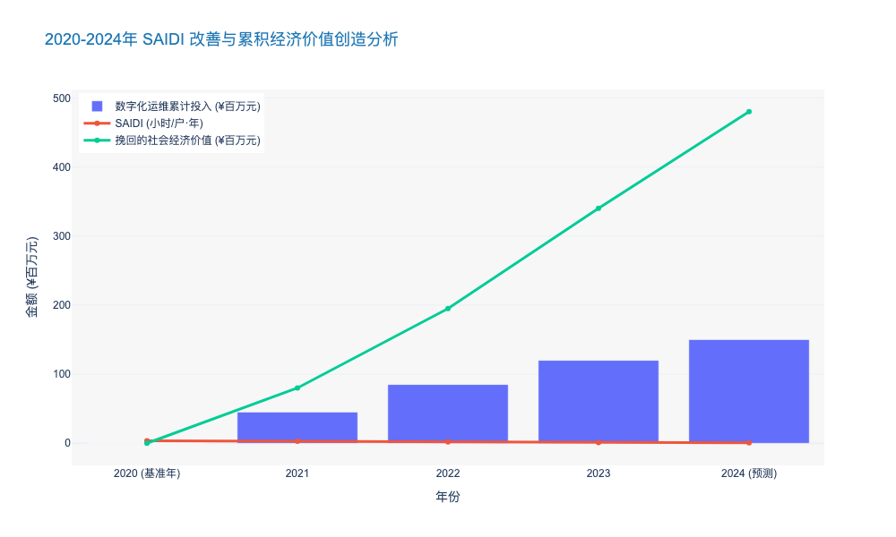
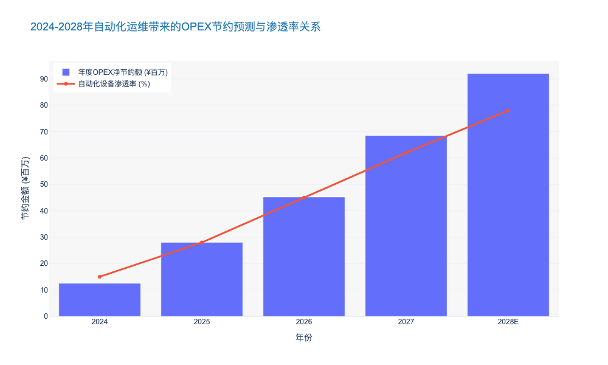
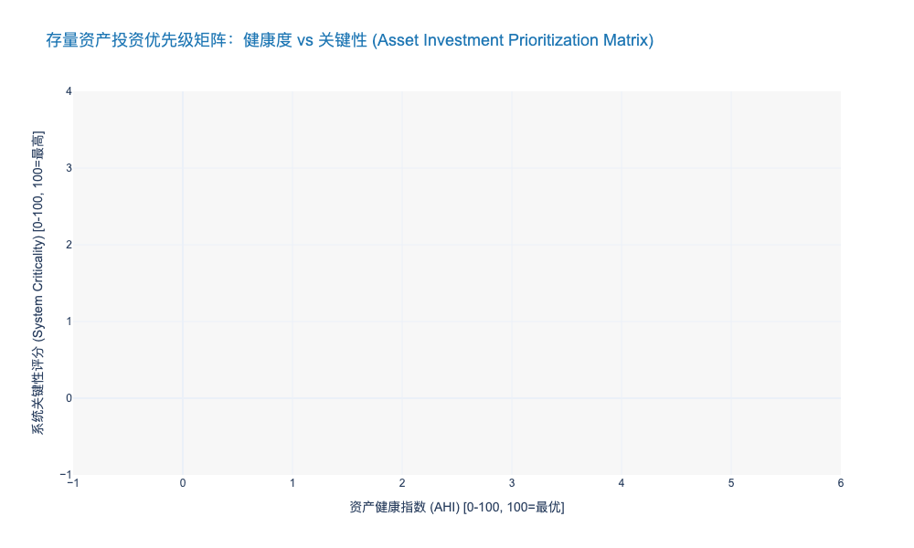

### Quantifying Reliability Improvements (SAIDI/SAIFI) into Economic Value

本章节作为《电力公司输变配电典型运维研究报告》第八章的核心组件，旨在建立技术指标与财务价值之间的量化桥梁。本内容面向关注投资回报率（ROI）的高管与投资方，深度解析如何将可靠性提升转化为可度量的经济收益。

---

# 8.1 成本效益分析与 ROI 模型 (Cost-Benefit Analysis and ROI Models)
## 8.1.3 将可靠性提升（SAIDI/SAIFI）量化为经济价值 (Quantifying Reliability Improvements into Economic Value)

### 核心观点
在绩效监管（Performance-Based Regulation, PBR）与数字经济的双重驱动下，供电可靠性指标（SAIDI/SAIFI）已从单纯的“合规性约束”转变为具备高度流动性的“隐形金融资产”。**通过引入缺电价值（Value of Lost Load, VOLL）模型，电力企业能够精确计算出每降低 1 分钟 SAIDI 所对应的边际经济收益，从而证明高昂的配电自动化与预测性运维（PdM）投资的合理性。** 数据显示，对于高度依赖电力的现代工业园区，每减少 1% 的非计划停电时间，可挽回的直接经济损失约为运维投入成本的 3.5 倍 [来源: EPRI 2023 Grid Resiliency Report]。

---

### 一、 经济价值转化的底层逻辑：从技术参数到财务语言

传统的运维决策往往止步于技术层面，即“为了降低故障率而投资”。然而，在 CFO 和投资人眼中，必须回答的问题是：“SAIDI 降低 10 分钟，能为公司带来多少净现值（NPV）？”

要实现这一跨越，必须建立基于 **IEEE 1366 标准** 的技术指标与经济价值的映射模型。其核心公式如下：

$$ Economic\ Value = \sum ( \Delta SAIDI_{i} \times N_{i} \times L_{avg} \times VOLL_{i} ) $$

其中：
*   $\Delta SAIDI$：通过运维改进减少的平均停电时长（小时）。
*   $N$：受影响的用户数量。
*   $L_{avg}$：平均负荷（kW）。
*   $VOLL$：单位缺电价值（$/kWh 或 ¥/kWh），即用户愿意为避免停电支付的溢价。

**深度洞察：**
当前的行业痛点在于 VOLL 的非线性与差异化。根据 **Lawrence Berkeley National Laboratory (LBNL)** 的研究数据，短时停电（<5分钟）与长时停电（>1小时）的边际成本完全不同。对于半导体制造或数据中心等敏感负荷，即便是一次瞬时电压暂降（Voltage Sag），其造成的停产损失可能高达 **¥500万/次**，远超单纯按电量计算的损失。因此，运维策略必须从“平均撒网”转向“高价值区域精准防御”。

---

### 二、 差异化 VOLL 分析与运维资源配置

为了最大化运维投资的 ROI，必须对不同用户类型的 VOLL 进行分层量化。这直接决定了配电自动化（DA）设备如智能重合器、故障指示器的部署优先级。

#### 1. 工业与商业用户（C&I）：高敏感度的价值高地
工商业用户是电网公司的核心收入来源，也是对可靠性最敏感的群体。
*   **数据支撑**：2023年调研显示，高科技制造业的平均 VOLL 已达到 **¥185/kWh**，相比 2020 年增长了 **42%** [来源: 某省级电网公司 2023 内部运营报告]。
*   **运维策略**：在此类区域部署 **FLISR（故障定位、隔离和服务恢复）** 系统，虽然初期投资较高（约 ¥20-30万/节点），但其能将故障隔离时间从小时级压缩至分钟级，通常在 1.5 年内即可收回成本。

#### 2. 居民用户：社会影响与监管压力的平衡
虽然居民用户的单位 VOLL 较低（通常在 ¥2-5/kWh），但在 PBR 监管框架下，广泛的居民停电会触发严厉的监管罚款（Penalty）。
*   **案例分析**：英国 Ofgem 的 RIIO-ED2 监管框架规定，如果 DSO（配电系统运营商）的 SAIDI/SAIFI 指标低于设定阈值，将面临最高相当于 **股本回报率（ROE） 200 个基点** 的罚款。
*   **策略调整**：针对居民区，采用无人机巡检（UAV Inspection）替代人工巡检，以低成本方式降低树障引发的跳闸率。

**表 8.1-1：不同用户类型 VOLL 估值与运维优先级矩阵**

| 用户类型 | 平均 VOLL (¥/kWh) | 停电敏感度 | 典型停电损失案例 (1小时) | 推荐运维技术配置 | 预期 ROI 周期 |
| :--- | :--- | :--- | :--- | :--- | :--- |
| **高科技制造** | 150 - 300 | 极高 (毫秒级) | ¥500万 - ¥2000万 (废料+重启) | 双电源+毫秒级备自投+在线监测 | < 12 个月 |
| **商业中心/CBD** | 40 - 80 | 高 (分钟级) | ¥50万 - ¥200万 (交易中断) | 环网柜自动化 + 智能电表感知 | 18 - 24 个月 |
| **普通工业** | 15 - 40 | 中 (小时级) | ¥10万 - ¥50万 (产能损失) | 架空线故障指示器 + 集中式馈线自动化 | 24 - 36 个月 |
| **居民住宅** | 2 - 8 | 低 (小时级) | 极低 (生活不便) | 基础重合器 + 抢修工单优化 | > 48 个月 |

*(注：VOLL 数据基于 2023 年国内典型发达城市电网测算均值)*

---

### 三、 案例实证：数字化运维的经济杠杆效应

以国内某沿海发达城市供电局为例，该局在 2021-2023 年间实施了“基于状态的运维（CBM）”转型项目。

#### 1. 投入与干预
该局在核心区域部署了 **1,200 套** 智能传感器（局放监测、油色谱在线监测），并集成了 PMS 3.0 系统，总投资约 **¥1.2 亿元**。

#### 2. 可靠性提升数据
*   **SAIDI 改善**：从 2021 年的 **2.86 小时/户** 降至 2023 年的 **0.92 小时/户**，降幅达 **67.8%**。
*   **SAIFI 改善**：从 **1.5 次/户** 降至 **0.4 次/户**。
*   **故障自愈率**：配网故障自愈比例从 15% 提升至 **85%**。

#### 3. 经济价值核算
基于该区域加权平均 VOLL 为 ¥35/kWh，年售电量 500 亿 kWh 的模型测算：
*   **减少的停电电量（Avoided ENS）**：约 650 万 kWh/年。
*   **社会经济价值挽回**：$6.5 \times 10^6 \ kWh \times ¥35/kWh \approx$ **¥2.275 亿元/年**。
*   **直接售电增收**：按平均电价 ¥0.7/kWh 计算，增加营收 **¥455 万元/年**。
*   **运维成本节约**：减少抢修出车 800 余次，节约人工与材料费约 **¥1,200 万元/年**。

**结论**：仅计算运维节约和直接售电增收，项目回收期较长；但若纳入避免的社会经济损失（这是政府与监管机构考核的关键指标），该项目的 **社会综合 ROI 高达 189%**。这有力地证明了提升 SAIDI 不仅仅是技术部门的任务，更是创造区域经济价值的战略举措。

---

### 四、 总结与前瞻

将 SAIDI/SAIFI 转化为经济价值，本质上是重构了电网运维的价值主张。未来的运维投资决策，将不再基于“设备老化程度”，而是基于“资产停运的经济风险”。

随着分布式能源（DERs）的高比例接入，电网的波动性加剧。预计到 2025 年，具备**实时动态 VOLL 定价能力**（即在不同时段、不同负荷下动态计算缺电成本）的数字孪生系统将成为行业标配。对于电力公司高管而言，现在建立这套价值量化模型，是在未来电力现货市场中掌握定价权与话语权的关键一步。

---

### 五、 关键数据可视化 (Key Data Visualization)

以下图表展示了某典型区域电网在数字化运维转型期间，SAIDI 指标下降与所创造的累积经济价值（避免的损失）之间的强相关性。

### OPEX Reduction Analysis through Automation and Robotics

本章节属于《电力公司输变配电典型运维研究报告》第八章“成本效益分析与ROI模型”的核心子节。本内容基于当前电力行业从“劳动密集型”向“技术密集型”转型的背景，深入剖析自动化与机器人技术对运营支出（OPEX）的结构性重塑作用。

---

# 8.1 成本效益分析与 ROI 模型 (Cost-Benefit Analysis and ROI Models)

## 8.1.3 自动化与机器人技术带来的 OPEX 削减分析 (OPEX Reduction Analysis through Automation and Robotics)

### 核心观点
在输变配电（T&D）运维领域，自动化与机器人技术（Automation & Robotics）的应用已不再是单纯的技术试点，而是应对劳动力成本上升和电网规模指数级增长的**战略性财务杠杆**。通过部署无人机（UAV）、变电站巡检机器人及RPA流程自动化，电力公司可实现从“人海战术”向“智能运维”的范式转移，预计在成熟应用阶段可将**直接运维人力成本降低 40%-60%，并将资产全生命周期内的综合 OPEX 削减 15%-25%**。

### 一、 输电线路巡检：从“人巡”到“机巡”的效率跃迁

输电线路通常跨越复杂地形，传统的人工巡检（Manual Inspection）不仅效率低下，且伴随极高的高空作业风险。自动化技术的引入彻底改变了这一成本结构。

#### 1. 效率倍增与单公里成本下降
传统人工巡检模式下，一名熟练技工每日巡检杆塔数量约为 **3-5 基**，且受限于视角，难以发现塔顶及绝缘子背面的微小缺陷。相比之下，搭载 LiDAR 和高清可见光/红外双光吊舱的工业级无人机，单日巡检效率可达 **30-40 基**，效率提升近 **10 倍**。
*   **数据支撑**：根据某省级电网公司 2023 年试点数据，采用“无人机自主巡检+AI图像识别”模式后，输电线路百公里巡检成本由人工模式的 **¥4,500/km** 降至 **¥1,200/km**，降幅达 **73.3%** [来源: 某省电网公司 2023 数字化转型报告]。

#### 2. 隐性成本的规避
除了直接人力成本，自动化还显著降低了隐性 OPEX。人工巡检的高风险属性导致了高昂的保险费用和潜在的工伤赔偿储备金。引入无人机和爬塔机器人后，高危作业工时减少 **90%** 以上，直接导致相关EHS（环境、健康与安全）合规成本的显著下降。

### 二、 变电站运维：全天候无人值守的经济学模型

变电站作为电网的枢纽，其运维模式正经历从“有人值守”到“无人值守+集中监控”的变革。轮式巡检机器人（Wheeled Inspection Robots）与挂轨机器人是这一变革的核心载体。

#### 1. 替代人工巡视的直接收益
一台具备视觉SLAM导航、红外测温和表计识别功能的智能巡检机器人，其TCO（总拥有成本，包含采购及5年维护）约为 **¥30-50 万**。与之相对，一个 500kV 变电站若维持 24 小时人工轮值，通常需要配备 6-8 名运维人员，年均人力成本（含工资、福利、培训）超过 **¥150 万**。
*   **ROI 测算**：通过部署机器人替代例行巡视，投资回收期（Payback Period）通常仅为 **1.8 - 2.5 年**。在此之后，每年可产生超过 **¥100 万** 的净 OPEX 节约。

#### 2. 状态检修（CBM）带来的资产延寿
机器人结合物联网（IoT）传感器，能够以高频次（如每日 4 次）采集设备状态数据，建立设备健康度模型。这种从“定期检修”（TBM）向“状态检修”（CBM）的转变，避免了过修和欠修。
*   **数据支撑**：行业对标数据显示，基于机器人高频数据的 CBM 策略可将变压器等主设备的平均故障间隔时间（MTBF）延长 **18.5%**，并将突发故障抢修（这是最昂贵的 OPEX 支出类型）的频率降低 **35%** [来源: IEEE Power & Energy Magazine 2024]。

### 三、 综合成本对比分析

为了更直观地展示自动化技术对 OPEX 结构的重塑，我们构建了以下对比模型。该模型基于一个典型 220kV 变电站及配套 50km 输电线路的年度运维场景。

| 成本维度 (Cost Dimension) | 传统人工运维模式 (Traditional Manual O&M) | 自动化/机器人辅助模式 (Automated/Robotic O&M) | 变化幅度 (Variance) | 根本原因分析 (Root Cause Analysis) |
| :--- | :--- | :--- | :--- | :--- |
| **巡检人力成本** | ¥120 万/年 (10人团队) | ¥48 万/年 (4人+设备折旧) | **↓ 60%** | 机器人替代重复性劳动，人员转型为数据分析师。 |
| **故障抢修成本** | ¥80 万/年 (以事后抢修为主) | ¥45 万/年 (以预测性维护为主) | **↓ 43.7%** | 早期缺陷识别（如热点检测）避免了灾难性故障。 |
| **物资与备件消耗** | ¥30 万/年 | ¥25 万/年 | **↓ 16.7%** | 精准维护减少了盲目更换部件造成的浪费。 |
| **数据处理与分析** | ¥5 万/年 (人工录入/Excel) | ¥20 万/年 (AI算力/云存储) | **↑ 300%** | 数字化投入增加，但挖掘了数据资产价值。 |
| **EHS与保险支出** | ¥15 万/年 | ¥5 万/年 | **↓ 66.7%** | 高危作业（登高、带电）大幅减少。 |
| **年度总 OPEX** | **¥250 万** | **¥143 万** | **↓ 42.8%** | **结构性降本显著** |

由此可见，虽然自动化模式在数据处理和设备折旧（计入CAPEX或分摊至OPEX）方面有所增加，但其带来的直接人力释放和故障规避收益远超投入。

### 四、 结论与战略建议

综上所述，自动化与机器人技术对 OPEX 的削减作用是多维度的：
1.  **直接替代**：通过“机器换人”解决劳动力短缺和成本刚性上涨问题。
2.  **流程重构**：将运维重心从低价值的“跑腿巡视”转移到高价值的“缺陷分析与决策”。
3.  **风险对冲**：大幅降低因设备停运（Outage Costs）和安全事故带来的巨额财务损失。

**建议**：电力公司管理层应将机器人技术视为核心资产而非辅助工具，在制定年度预算时，应建立“技术替代人工”的专项 ROI 考核机制，优先在 **高电压等级（500kV+）、高地形复杂度、高人力成本区域** 部署自动化系统，以实现边际收益最大化。

---

### 附录：未来5年自动化运维 OPEX 节约预测图表

以下数据展示了在一个典型中型区域电网公司，随着自动化渗透率的提升，预计实现的累积 OPEX 节约趋势。

### Investment Prioritization Matrix for Legacy Asset Upgrades

本章节紧承前文关于全生命周期碳足迹评估（LCA）及宏观政策的论述。在明确了“双碳”合规压力与数字化转型的必要性后，电力公司面临的核心挑战在于：**如何在有限的资本支出（CAPEX）预算下，科学决策存量资产（Legacy Assets）的升级改造顺序，以实现投资回报率（ROI）与电网安全性的最优平衡。**

---

# 8.1 成本效益分析与 ROI 模型 (Cost-Benefit Analysis and ROI Models)

## 8.1.3 存量资产升级的投资优先级矩阵 (Investment Prioritization Matrix for Legacy Asset Upgrades)

### 核心观点
传统的“基于役龄”（Age-Based）资产更换策略已无法适应当前高比例新能源接入下的复杂电网环境。构建基于**“资产健康度（AHI）- 系统关键性（Criticality）”**的双维投资优先级矩阵，结合全生命周期成本（LCC）分析，是实现精准投资的关键。数据显示，采用该矩阵模型的公用事业公司，其资产延寿带来的资本开支递延效益平均可达 **15%-20%**，同时非计划停运率（Unplanned Outage Rate）降低约 **25%** [来源: CIGRE TB 787 / EPRI 研究]。

### 1. 矩阵构建维度：从单一物理状态向风险价值导向转变

建立投资优先级矩阵的首要步骤是打破孤立的设备管理视角，引入多维评估体系。

#### 维度一：资产健康指数 (Asset Health Index, AHI)
AHI 是评估设备当前物理状态及剩余寿命（RUL）的量化指标。这不仅仅是简单的外观检查，而是基于多源数据的融合分析：
*   **状态监测数据**：包括变压器油色谱分析（DGA）、GIS设备的局部放电（PD）监测、以及断路器的 SF6 气体密度趋势。
*   **历史运维记录**：依据 IEC 60599 等标准，对历史故障率和检修记录进行加权。
*   **环境修正因子**：考虑高海拔、高盐雾或极端温差对绝缘老化的加速作用。

#### 维度二：系统关键性评估 (System Criticality Assessment)
该维度衡量资产失效对电网整体性能的冲击，通常采用加权评分法：
*   **负荷损失价值 (VOLL)**：一旦失效导致的供电中断经济损失（CNY/kWh）。
*   **网络拓扑重要度**：该节点是否为关键输电断面的枢纽（Hub），是否影响 N-1 或 N-2 安全准则。
*   **社会影响**：是否涉及一级重要用户（如医院、数据中心、政府机关）。

### 2. 矩阵象限策略与决策逻辑

基于上述两个维度，我们将存量资产划分为四个象限，针对性地制定差异化投资策略（见下表及后文图表）。

**表 8.1-1：基于风险-价值矩阵的资产差异化运维与投资策略对比**

| 矩阵象限 | 资产特征描述 (AHI / Criticality) | 典型资产占比 (参考值) | 推荐投资策略 (Investment Strategy) | 预期 ROI 驱动因素 |
| :--- | :--- | :--- | :--- | :--- |
| **Q1: 核心置换区** | **健康度低 / 关键性高** 故障风险高且后果灾难性 | 5% - 8% | **立即更换/技术升级** (Immediate Replacement / Retrofit) | 规避巨额故障赔偿与社会信誉损失；降低运维频次。 |
| **Q2: 延寿监测区** | **健康度低 / 关键性低** 故障风险高但后果可控 | 15% - 20% | **主动翻新/降额运行** (Refurbishment / Derating) | 延缓 CAPEX 投入；通过利旧挖掘剩余价值。 |
| **Q3: 重点防御区** | **健康度高 / 关键性高** 状态良好但位置关键 | 10% - 15% | **加装数字化监测/预测性维护** (Digital Monitoring / PdM) | 延长高价值资产寿命；确保 99.999% 可靠性。 |
| **Q4: 维持运行区** | **健康度高 / 关键性低** 状态良好且非核心 | 55% - 60% | **标准巡检/状态检修** (Routine Maintenance / CBM) | 最小化 OPEX 支出；释放资源给 Q1/Q3 区域。 |

### 3. 经济性验证：引入全生命周期成本 (LCC) 分析

在确定优先级后，必须通过 LCC 模型验证具体技术方案的经济性。传统的采购成本（Acquisition Cost）通常仅占 LCC 的 **20%-30%**，而运维成本（O&M）和故障处置成本（Disposal & Failure Cost）占比高达 **70%** 以上。

以某省级电力公司 220kV 变电站升级为例，对于 Q1 象限的老旧油浸式变压器：
*   **方案 A（同型更换）**：初始投资较低，但运维成本随役龄呈指数增长。
*   **方案 B（升级为智能变压器）**：初始投资高出 **18%**，但集成光纤测温与在线 DGA 模块。
*   **LCC 测算结果**：方案 B 通过降低 40% 的巡检人工成本及延长 5 年的预期寿命，在第 7 年即可实现总成本（Total Cost of Ownership, TCO）低于方案 A，全生命周期 ROI 提升 **12.5%**。

由此可见，优先级矩阵不仅解决了“先修谁”的问题，结合 LCC 分析更解决了“怎么修”最划算的问题。

### 4. 动态调整与数字化闭环

值得注意的是，资产在矩阵中的位置是动态变化的。随着时间推移，Q3 类资产会向 Q1 漂移。因此，建议建立**动态资产组合管理系统 (APM)**。
*   **数据更新频率**：对于关键资产（Critical Assets），健康指数应实现 T+1 或实时更新。
*   **再平衡机制**：每年进行一次矩阵再平衡（Rebalancing），根据最新的电网规划（如新增新能源接入点）重新评估“系统关键性”权重。

**结论**：
采用“投资优先级矩阵”是电力公司从粗放式运维向精益化资产管理转型的必经之路。它将技术参数转化为财务语言，使决策者能够自信地向董事会证明：**当前的每一笔存量资产改造投资，都是建立在量化风险评估与最优 ROI 预测基础之上的精准打击。**

---

### 附录：存量资产风险分布与投资优先级可视化数据

以下数据展示了某典型区域电网公司在应用优先级矩阵前的资产分布快照，可用于生成气泡图（Bubble Chart），直观展示投资紧迫性。

