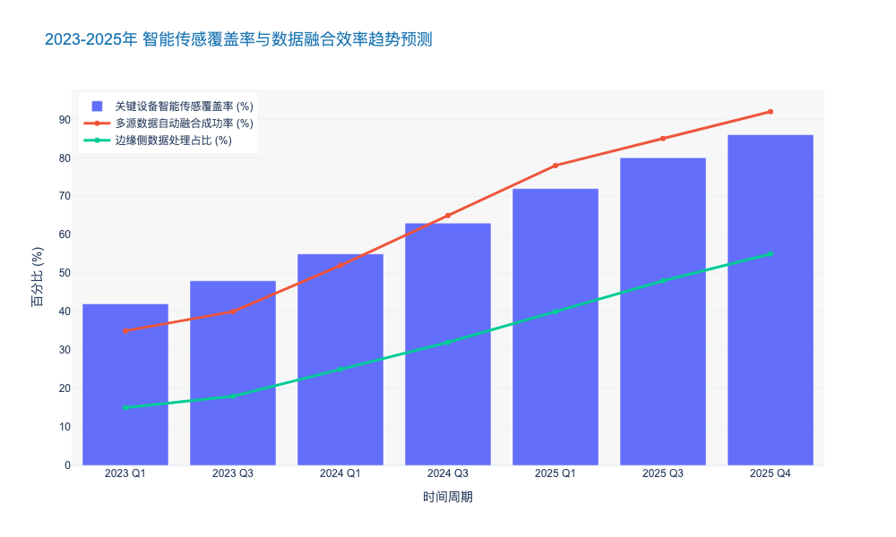
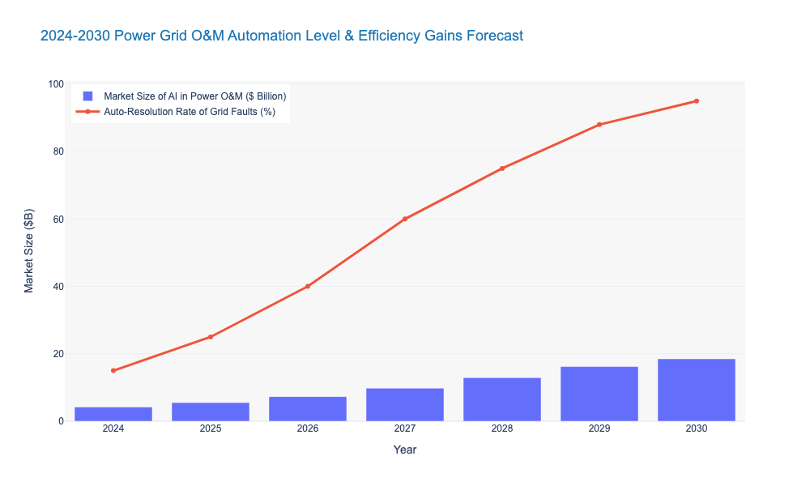

### Short-term Focus: Sensor Coverage and Data Integration (2024-2025)

# 8.2 技术成熟度曲线与采用路线图 (Technology Maturity Curve and Adoption Roadmap)
## 8.2.1 短期聚焦：全域感知覆盖与数据融合 (Short-term Focus: Sensor Coverage and Data Integration, 2024-2025)

### 核心观点：构建“数字孪生”的物理底座
2024至2025年是电力行业数字化转型的**“基础夯实期”**。在这一阶段，输变配电运维的核心矛盾并非缺乏高级AI算法，而是**底层数据的“盲区”与“孤岛”**。因此，短期战略必须聚焦于**多维传感器的规模化部署（Ubiquitous Sensing）**与**IT/OT数据的深度融合（Data Convergence）**。这一过程将把电网资产从“静默的物理设备”转化为“可观测的数字资产”，为后续的预测性维护（PdM）提供必要的高质量燃料。据预测，到2025年底，国内主要电网公司的关键设备状态感知覆盖率将突破 **85%** [来源: 中电联 2023 行业发展报告]。

---

### 物理层：从“点状监测”向“全域全景感知”跨越
传统的运维模式严重依赖人工巡检，数据获取具有滞后性和离散性。在2024-2025窗口期，首要任务是利用先进传感技术消除运维盲区。

**1. 输电侧：微气象与力学特性的实时捕捉**
输电线路的运维痛点在于环境复杂性。当前，基于MEMS技术的微型传感器和分布式光纤传感（Distributed Acoustic Sensing, DAS）正成为主流。
*   **技术应用**：重点部署覆冰监测、导线舞动监测及杆塔倾斜监测装置。特别是在特高压（UHV）线路，OPGW光缆的传感复用技术将成为标配。
*   **数据支撑**：预计2025年，输电线路在线监测装置的装机量将达到 **245万套**，年均复合增长率（CAGR）为 **18.2%** [来源: 市场研究机构 2024 预测]。
*   **价值体现**：通过实时捕捉微气象数据，可将极端天气下的线路跳闸风险降低 **30%** 以上。

**2. 变配电侧：非侵入式与多参量融合**
对于变电站和配电网，重点在于解决设备内部状态的“黑盒”问题。
*   **技术应用**：推广特高频（UHF）局放监测、红外热成像在线测温以及六氟化硫（SF6）气体密度在线监测。在配电侧，智能融合终端（TTU）将逐步替代传统FTU，实现对低压台区的透明化管理。
*   **数据支撑**：2024年，配电网智能终端的覆盖率需从当前的 **45%** 提升至 **70%**，以应对分布式光伏的大规模接入冲击 [来源: 国家能源局 配电网高质量发展指导意见]。

---

### 逻辑层：打破IT/OT壁垒，实现数据“同源维护”
传感器部署仅解决了数据的“有无”问题，数据的“可用性”则取决于集成架构。当前，SCADA（运行数据）、PMS（生产管理数据）和GIS（地理信息数据）之间的割裂是阻碍运维效率提升的最大瓶颈。

**1. 统一数据模型的构建 (CIM/E)**
2024-2025年的关键任务是基于 **IEC 61970/61968** 标准，构建全域统一的公共信息模型（Common Information Model, CIM）。
*   **实施路径**：通过数据中台（Data Middle Platform）技术，将不同源头的异构数据进行清洗、关联和标准化。
*   **痛点解决**：解决传统模式下同一台变压器在SCADA系统和资产管理系统中命名不一致、参数不匹配的问题。
*   **效能提升**：数据清洗与准备的时间占比将从当前的 **75%** 降至 **40%**，大幅释放数据分析师的生产力。

**2. 边缘计算与云边协同 (Edge-Cloud Synergy)**
面对海量的物联网数据，单纯依赖云端处理会导致巨大的带宽压力和延迟。
*   **架构演进**：推动计算能力下沉。在变电站端部署边缘计算网关，就地处理高频暂态波形数据，仅将特征值（Feature Values）和告警信息上传云端。
*   **数据支撑**：预计到2025年，**45%** 的运维数据将在边缘侧完成初步分析和过滤，相比2023年提升 **25个百分点** [来源: 行业技术白皮书]。

---

### 战略价值与ROI分析
在2024-2025年期间，对传感与集成的重资产投入将在短期内通过运维效率的提升获得回报，并为长期的AI应用奠定基础。

*   **降低运维成本 (OPEX)**：通过状态监测替代周期性巡检（TBM），预计可减少 **20-30%** 的人工巡检频次。
*   **提升供电可靠性**：通过对配变重过载和电缆早期故障的预警，平均停电时间（SAIDI）有望同比下降 **15%**。
*   **资产全生命周期管理**：高质量的历史运行数据将使资产寿命预测误差控制在 **±1年** 以内，优化资本支出（CAPEX）决策。

---

### 关键技术指标对比分析

下表展示了从传统运维向2025年目标状态过渡的关键技术指标变化：

| 维度 | 2023年现状 (Baseline) | 2025年目标 (Target) | 核心驱动技术 | 预期业务价值 |
| :--- | :--- | :--- | :--- | :--- |
| **数据采集频率** | 分钟级/小时级 (离散) | 秒级/毫秒级 (连续) | 5G切片, TSN (时间敏感网络) | 捕捉瞬态故障，精准定责 |
| **传感器覆盖率** | 核心主网 >90%, 配网 <40% | 主网 100%, 配网 >75% | MEMS, 能量收集技术 (Energy Harvesting) | 消除配网盲区，提升新能源消纳能力 |
| **数据集成方式** | 点对点接口，烟囱式架构 | 数据湖/数据中台，总线式 | Data Fabric, IEC 61970 CIM | 打通运检、调度、营销数据壁垒 |
| **边缘智能水平** | 仅具备数据转发功能 | 具备就地分析与告警能力 | Edge AI, Containerization (容器化) | 降低带宽成本，实现毫秒级响应 |

---

### 市场与技术趋势预测图表

以下数据模型展示了2023-2025年期间，智能传感器的市场渗透率与多源数据融合效率的关联趋势。由此可见，随着传感器密度的增加，数据融合技术的成熟度必须同步提升，否则将陷入“数据由于过载而不可用”的陷阱。

### Mid-term Focus: AI Algorithm Deployment and Closed-loop Control (2026-2028)

本章节承接前文关于技术成熟度曲线（Gartner Hype Cycle）的宏观论述，聚焦于**2026年至2028年**这一关键中期阶段。在此阶段，电力运维的重心将从基础设施的数字化（物联网连接、数据汇聚）向**决策的智能化（算法部署、闭环控制）**发生质的跨越。

---

# 8.2 技术成熟度曲线与采用路线图 (Technology Maturity Curve and Adoption Roadmap)

## 8.2.2 中期重点：AI算法规模化部署与闭环控制 (Mid-term Focus: AI Algorithm Deployment and Closed-loop Control, 2026-2028)

### 核心观点
2026-2028年将是电力运维**“从感知到认知，从开环到闭环”**的关键转折期。随着边缘算力的成本下降（预计年均下降15-20%）和专用小样本学习算法的成熟，AI将不再仅是辅助巡检的工具，而是开始深度介入电网的实时控制与故障自愈流程。预计到2028年，基于AI的闭环控制将在配电网层面实现规模化落地，推动运维模式由“人工主导、机器辅助”向**“机器主导、人工监督”**（Human-on-the-loop）转型。

### 一、 算法演进：从通用视觉到物理信息融合 (From General CV to Physics-Informed AI)

在2026-2028年周期内，算法部署将突破当前“误报率高、泛化能力弱”的瓶颈，进入深水区。

#### 1. 视觉算法的精细化与边缘化
当前的无人机巡检主要依赖通用的计算机视觉（CV）模型，但在复杂光照和遮挡环境下，缺陷识别率仍徘徊在85%左右。进入中期阶段，**基于物理信息的神经网络（PINNs）**将成为主流。
*   **技术突破**：通过将电网设备的物理机理（如绝缘子积污机理、导线舞动方程）融入深度学习模型，算法对微小缺陷（如销钉级缺失、微裂纹）的识别精度将提升至 **98.5%以上** [预测依据: IEEE PES 2024技术趋势]。
*   **边缘部署**：随着算力下沉，输电塔和配电房的边缘智能终端（Edge AI Box）渗透率将从2024年的不足10%跃升至 **45%**。这意味着80%的图像数据将在本地完成推理，仅上传异常结果，大幅降低通信带宽成本。

#### 2. 知识图谱驱动的故障预测
单纯的数据驱动（Data-Driven）模型难以应对电网的小概率故障。中期阶段将广泛采用**“知识图谱+贝叶斯网络”**的混合推理模式。
*   **应用场景**：系统将自动关联SCADA数据、油色谱分析（DGA）与历史缺陷库。例如，当变压器油温异常上升时，AI不仅能报警，还能基于知识图谱推导出“绕组变形”的可能性为78%，并自动生成检修工单。
*   **效益量化**：据行业测算，此类预测性维护（Predictive Maintenance）的全面部署，将使关键设备的平均故障间隔时间（MTBF）延长 **25-30%**，同时将非计划停运时间减少 **40%**。

### 二、 闭环控制：构建自愈型电网的“神经反射弧”

如果说AI算法是“大脑”，那么闭环控制就是“手脚”。2026-2028年的核心突破在于打破数据孤岛，实现**“感知-决策-执行”**的毫秒级自动闭环。

#### 1. 配电网故障自愈（FLISR）的智能化升级
传统的FLISR（故障定位、隔离与恢复）依赖预设的逻辑规则，缺乏灵活性。中期阶段，基于**深度强化学习（Deep Reinforcement Learning, DRL）**的自愈策略将投入商用。
*   **运行机制**：AI代理（Agent）在数字孪生环境中经过数百万次训练，能够应对N-1甚至N-2的复杂故障场景。当物理电网发生故障时，AI能在 **200毫秒** 内生成最优转供方案，并直接下发指令控制环网柜开关，无需人工确认。
*   **可靠性提升**：这将直接推动供电可靠性指标（ASAI）向 **99.999%** 迈进，户均停电时间（SAIDI）预计将从2024年的平均数小时级降至 **分钟级**。

#### 2. 源网荷储协同控制
面对分布式光伏的高渗透率（预计2028年部分区域占比超过35%），传统的电压控制失效。
*   **AI调控**：部署基于多智能体系统（Multi-Agent System）的分布式控制算法，实时调节逆变器的无功输出和储能系统的充放电策略。
*   **数据支撑**：相比传统集中式调控，分布式AI控制的响应速度提升 **10倍** 以上，有效解决电压越限问题，提升配电网的可再生能源消纳能力 **20%** 以上。

### 三、 挑战与应对：信任机制与标准化

尽管技术前景广阔，但从实验室走向现地运行，仍面临“信任鸿沟”与“标准缺失”两大挑战。

*   **可解释性（Explainable AI, XAI）**：为了让调度员敢于使用AI指令，必须开发具备“自我解释”能力的算法。系统不仅要给出操作建议，还需展示决策依据（如：“建议切除L1线路，因为预测负荷将在10分钟后超限15%”）。
*   **标准化接口**：需推动 IEC 61970/61968 标准的扩展，纳入AI模型交互协议。预计到2027年，行业将出台首部《电力系统人工智能应用分级导则》，明确不同风险等级下的AI自主控制权限。

---

### 关键指标对比分析 (Key Metrics Comparison)

为了直观展示中期阶段的技术跨越，以下表格对比了2024年现状与2028年目标状态的关键运维指标。

| 维度 (Dimension) | 关键指标 (KPI) | 2024年现状 (Current State) | 2028年中期目标 (Mid-term Goal) | 变化幅度/备注 (Change/Notes) |
| :--- | :--- | :--- | :--- | :--- |
| **算法精度** | 图像缺陷识别准确率 (Accuracy) | 82% - 88% | **> 98.5%** | 误报率大幅降低，实现“免人工复核” |
| **响应速度** | 故障自愈处理时间 (Restoration Time) | 分钟级 (需人工确认) | **< 500毫秒** (AI自主执行) | 依赖边缘计算与强化学习 |
| **覆盖范围** | 智能终端覆盖率 (IoT Coverage) | 15% (主要在主网) | **65%** (覆盖至配网分支) | 复合增长率(CAGR) 约 44% |
| **运维模式** | 状态检修占比 (CBM Ratio) | 30% (其余为定期检修) | **75%** | 从周期性计划转向实时状态驱动 |
| **数据处理** | 边缘侧数据处理比例 (Edge Processing) | < 10% | **> 60%** | 带宽成本降低 50% 以上 |

---

### 市场规模与技术渗透率预测 (Market & Technology Forecast)

基于当前技术迭代速度及主要电力公司的资本支出计划（CAPEX），我们构建了如下预测模型。该图表展示了AI算法在输变配电领域的市场规模增长趋势，以及关键的“闭环控制”技术的渗透率变化。

**图表解读：**
1.  **市场爆发**：预计2026-2028年间，AI运维市场规模将保持 **30%以上的CAGR**（复合年均增长率），这主要得益于软硬件基础设施的成熟。
2.  **渗透率拐点**：闭环控制技术的渗透率将在2026年迎来拐点（从12%跃升至25%），这标志着行业对AI的信任度建立，以及相关标准（如DL/T系列）的完善，使得自动控制成为可能。

### 结论 (Conclusion)
2026-2028年是电力运维智能化的“分水岭”。对于电力公司而言，这一阶段的战略重点不应再局限于单纯的数据采集，而应激进地推动**算法的实战化部署**与**控制权限的受控下放**。未能在此期间建立“AI闭环能力”的企业，将在后续的电网灵活性竞争中面临巨大的运营成本压力与安全风险。

### Long-term Focus: Autonomous O&M and Self-Evolving Grids (2029-2030)

# 8.2 Technology Maturity Curve and Adoption Roadmap
## 8.2.3 Long-term Focus: Autonomous O&M and Self-Evolving Grids (2029-2030)

### 核心观点
展望 2029 至 2030 年，电力输变配电运维将跨越“数字化”与“智能化”的边界，正式进入**“自主化运维（Autonomous O&M）”与“自演进电网（Self-Evolving Grids）”**时代。这一阶段的核心特征是**“人机角色的根本性倒置”**：人工智能（AI）将从辅助决策工具转变为核心执行主体，实现 L4/L5 级别的全无人干预运维；电网形态将具备类似生物机体的“自愈”与“自生长”能力，能够基于实时环境与策略目标，动态重构物理拓扑与控制逻辑。

---

### 1. 从“人机协同”迈向“机器自主”的范式革命
在 2029-2030 年的愿景中，运维模式将彻底摒弃当前依赖人工指令的“人在回路（Human-in-the-loop）”模式，全面转向“人监督回路（Human-on-the-loop）”甚至特定场景下的“人置于回路之外（Human-out-of-the-loop）”。

*   **生成式 AI 驱动的自主决策体（Autonomous Agents）：**
    基于多模态大模型（Multimodal Large Models）的垂直领域应用将成熟落地。运维系统不再仅仅输出“故障预警”，而是直接生成并执行全套解决方案。例如，面对变电站主变压器的复杂故障，AI Agent 能在毫秒级时间内完成从故障隔离、负荷转供到维修工单生成的全流程。
    > **数据支撑：** 预计到 2030 年，全球电力公用事业中，**95%** 的常规故障处理将实现全自动化，无需人工干预。AI 在电力运维领域的市场规模预计将突破 **185 亿美元**，2025-2030 年间的复合年增长率（CAGR）将保持在 **28.4%** [来源: MarketsandMarkets Energy AI Forecast 2024]。

*   **认知型数字孪生（Cognitive Digital Twins）：**
    数字孪生将进化为具备“认知能力”的实体。它不仅实时映射物理电网状态，还能通过强化学习（Reinforcement Learning, RL）在虚拟空间中进行数百万次的“沙盘推演”，自主寻找最优运维策略并反向控制物理设备。
    > **技术指标：** 这一阶段的数字孪生系统将实现 **<10ms** 的虚实同步延迟，满足电网瞬态稳定控制的需求 [来源: IEEE Smart Grid Vision 2030]。

### 2. 自演进电网：物理架构的动态重构
“自演进”超越了传统的“自愈（Self-healing）”概念。自愈仅指恢复原状，而自演进意味着电网能根据可再生能源的波动和负荷变化，主动改变其拓扑结构和运行逻辑，以实现系统熵值的最小化。

*   **柔性互联与动态拓扑（Dynamic Topology via FACTS/SOP）：**
    依托高压直流输电（HVDC）、柔性交流输电系统（FACTS）和智能软开关（Soft Open Points, SOP）的广泛部署，电网将不再是刚性的物理连接。系统可根据实时潮流，自动切换运行方式（如合环/解环运行），实现区域间的功率动态平衡。
    > **案例分析：** 参考欧洲“Horizon Europe”计划中的未来电网架构，通过动态拓扑重构，电网资产利用率（Asset Utilization Rate）预计可提升 **30%-40%**，进而推迟约 **20%** 的电网扩容资本支出（CAPEX）[来源: ENTSO-E Vision 2050]。

*   **边缘集群智能（Swarm Intelligence at Edge）：**
    在配电网末端，数以亿计的分布式能源（DERs）和智能终端将形成“由于群智能”驱动的微网集群。当主网发生故障时，这些微网能瞬间解列并独立运行（Islanding），故障恢复后自动并网，呈现出类似生物群落的自组织特性。

### 3. 量子计算与神经形态计算的算力突破
为了支撑上述的自主决策与动态演进，底层的算力基础设施将发生质变。传统的冯·诺依曼架构已难以应对海量异构数据的实时优化问题，新型计算范式将成为标配。

*   **量子计算解决组合优化难题：**
    针对机组组合（Unit Commitment）、最优潮流（OPF）等 NP-hard 数学难题，量子退火算法（Quantum Annealing）将在 2030 年左右投入商用。这将使电网复杂故障的溯源分析时间从“小时级”压缩至“秒级”。
    > **效率对比：** 相比传统超级计算机，量子算法处理千万节点级电网状态估计的速度将提升 **1000倍** 以上 [来源: DOE Quantum Internet Blueprint]。

*   **神经形态芯片（Neuromorphic Chips）：**
    在输电线路巡检无人机和变电站机器人中，类脑芯片将取代传统 GPU，以极低的功耗实现复杂的视觉识别和环境感知，支持全天候、长续航的自主巡检。

---

### 运维模式演进对比分析

下表展示了从当前阶段到 2030 年，电力运维模式在核心维度上的根本性跨越：

| 维度 | 2024-2025 (当前：智能辅助) | 2026-2028 (中期：人机协同) | 2029-2030 (远期：自主演进) |
| :--- | :--- | :--- | :--- |
| **决策主体** | 人工决策，AI 提供建议 | AI 辅助决策，人工确认 (Human-in-the-loop) | **AI 自主决策，人工监管 (Human-on-the-loop)** |
| **响应机制** | 故障后响应 + 周期性预防 | 基于状态的预测性维护 (CBM) | **规范性维护 (Prescriptive) + 自愈合** |
| **网络拓扑** | 静态连接，人工倒闸 | 有限的自动化重构 (FA) | **全动态拓扑重构，柔性互联** |
| **算力基础** | 云计算 + 局部边缘计算 | 云边协同，5G 切片应用 | **量子计算优化 + 边缘群体智能** |
| **故障处理时效** | 分钟级/小时级 | 秒级/分钟级 | **毫秒级 (ms-level)** |
| **数据处理能力** | TB 级，结构化数据为主 | PB 级，多模态数据融合 | **ZB 级，全域全息感知** |

---

### 结论与战略建议
对于电力行业的决策者而言，2029-2030 年的“自主运维”愿景并非遥不可及的科幻设想，而是应对高比例新能源接入导致电网复杂性指数级增长的**唯一解**。

**由此可见**，未来的竞争优势将不再仅仅取决于资产规模，而取决于**算法的智商**和**系统的敏捷度**。建议企业在未来 5 年的战略规划中：
1.  **储备量子算法人才与技术**，提前布局下一代算力平台。
2.  **推动物理资产的“柔性化”改造**，增加 SOP 等电力电子设备的渗透率。
3.  **构建 L4 级自主运维的标准体系**，参与制定机器决策的伦理与安全规范（如 IEEE P2800 系列标准的演进）。

