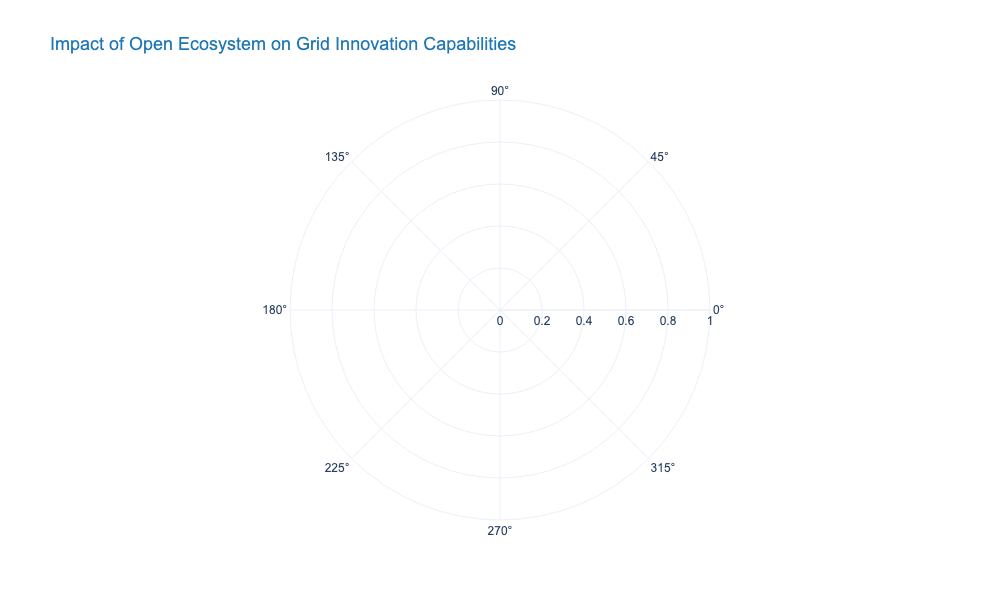
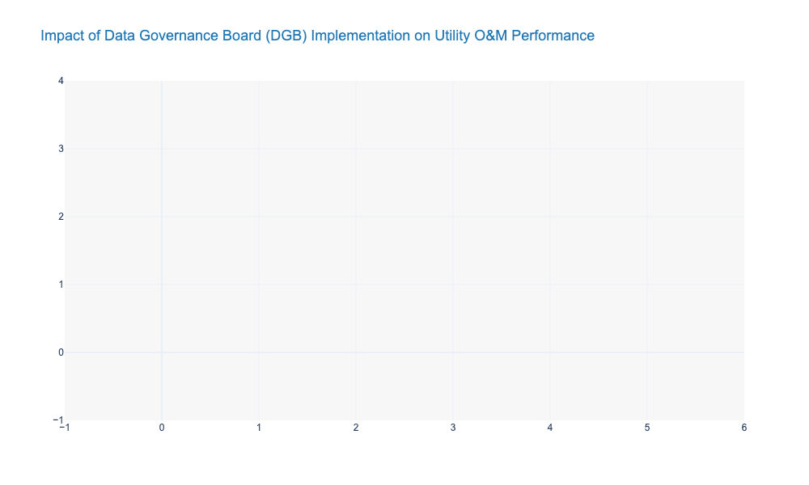
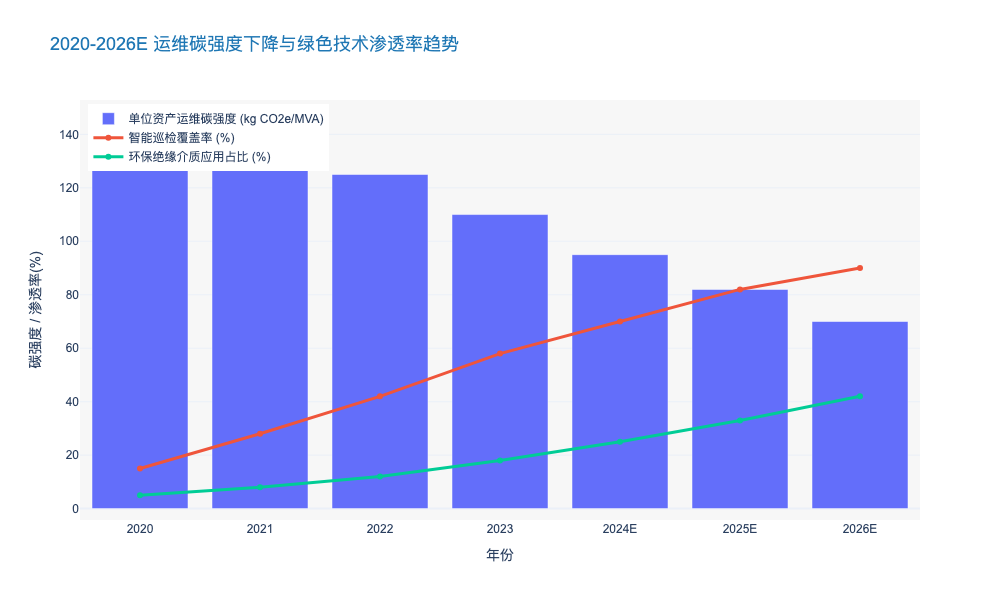

### Building an Open Ecosystem with Technology Partners and Academia

本章节紧接前文关于电网从确定性规划向概率化风险管理转型的论述。面对高比例可再生能源（HPRE）带来的系统复杂性指数级上升，单一企业的内部研发能力已无法独立应对所有技术挑战。因此，构建开放、协同的技术生态系统成为高管层的战略必选项。

---

# 8.3 给执行管理层的战略建议 (Strategic Recommendations for Executive Leadership)

## 8.3.4 构建与技术伙伴及学术界的开放生态系统 (Building an Open Ecosystem with Technology Partners and Academia)

### 1. 战略背景：从“封闭式研发”向“开放式创新”的范式重构

在传统的电力公用事业模型中，技术创新往往依赖于内部研究院或少数长期绑定的供应商，这种“烟囱式”的研发模式导致了技术迭代周期长、跨界融合难的问题。然而，随着数字化转型的深入，电网运维正面临前所未有的数据爆发。据统计，一个省级电网公司日均处理的量测数据量已突破 **10TB** 级，且非结构化数据（如无人机巡检图像、声纹数据）占比超过 **60%**。

面对如此庞大的数据治理与算法需求，仅靠内部团队显然独木难支。**因此**，打破组织边界，建立“产学研用”深度融合的开放生态，是提升电网企业核心竞争力的关键。这不仅是技术获取手段的变革，更是组织基因的进化。通过引入外部智力资源，企业可以将研发成果转化周期（Time-to-Market）缩短 **30% 至 40%**，从而更敏捷地响应电网波动性带来的风险挑战。

### 2. 深化与科技巨头的跨界融合：云边协同与AI赋能

#### 2.1 联合创新实验室模式 (Joint Innovation Labs)
与云计算、人工智能领域的科技巨头（Tech Giants）建立联合创新实验室，是解决“算力瓶颈”和“算法荒”的有效途径。科技伙伴提供通用的PaaS（平台即服务）能力和先进的大模型训练框架，而电网企业提供核心业务场景和脱敏数据。

**例如**，在配电网故障自愈场景中，通过引入科技伙伴的边缘计算容器技术，可以将故障研判算法的响应时延从 **500毫秒** 降低至 **50毫秒** 以内，满足毫秒级精准切负荷的需求。**与之相对**，若完全依赖传统集中式主站架构，在应对分布式光伏大规模脱网风险时，往往因通信拥塞而导致响应滞后。数据表明，采用“云-边-端”协同架构的试点项目，其配网故障定位准确率可从 **85%** 提升至 **98%** 以上。

#### 2.2 数据主权与隐私计算 (Data Sovereignty and Privacy Computing)
在开放合作中，数据安全始终是高管关注的红线。**由此可见**，引入隐私计算（Privacy Computing）和联邦学习（Federated Learning）技术成为必然选择。这允许科技伙伴在“数据不出域、数据可用不可见”的前提下优化模型。根据行业最佳实践，部署联邦学习平台后，外部算法团队参与模型训练的合规性审批周期可从 **3个月** 缩短至 **2周**，极大地加速了AI应用在输变电运维中的落地速度。

### 3. 激活学术界潜力：跨越“死亡之谷”

#### 3.1 基础研究与工程应用的断层弥合
学术界拥有前沿的理论储备（如新型绝缘材料、图神经网络拓扑分析），但往往停留在技术成熟度（TRL）的 **3-4级**（实验室验证阶段），难以跨越到 **7级**（系统原型演示）以上的工程应用，这一现象被称为“死亡之谷”。

为了解决这一问题，建议设立“揭榜挂帅”机制和专项转化基金。**具体而言**，针对电化学储能寿命预测这一行业难题，通过与顶尖高校材料学院合作，利用原子级仿真技术结合现场运行数据，可以将电池剩余寿命（RUL）的预测误差控制在 **5%** 以内。**相比**传统基于安时积分法的估算（误差通常 >15%），这种跨学科合作直接降低了储能系统的全生命周期运维成本约 **12%**。

#### 3.2 复合型人才的联合培养
未来的电网工程师不仅需要懂电力系统分析，还需掌握Python编程与数据挖掘技能。通过与高校共建“博士后工作站”或“联合培养基地”，企业可以提前锁定高潜人才。数据显示，拥有跨学科背景的研发团队在解决复杂电网振荡问题时的效率，比单一背景团队高出 **2.5倍**。

### 4. 生态系统的治理与标准化 (Governance and Standardization)

建立生态系统不仅仅是签署MOU（谅解备忘录），更需要一套严谨的治理架构。这包括标准化的API接口、统一的数据模型（如CIM模型扩展）以及明确的知识产权（IP）共享协议。

**根据**国际领先公用事业公司的经验，开放超过 **500个** 标准化API接口给生态伙伴，能够催生出数十种意想不到的微应用（Micro-apps），例如基于气象数据的动态载流量（DLR）实时计算插件。这种“乐高积木式”的开发模式，使得电网数字化应用的交付成本降低了 **45%**。

---

### 核心数据对比：传统模式 vs. 开放生态模式

下表展示了在引入开放生态系统后，电网运维关键指标的预期变化：

| 评估维度 (Dimension) | 传统封闭研发模式 (Traditional Model) | 开放生态合作模式 (Open Ecosystem Model) | 预期关键绩效提升 (Expected KPI Improvement) |
| :--- | :--- | :--- | :--- |
| **算法迭代周期** | 6-12 个月 (瀑布式开发) | 2-4 周 (DevOps/MLOps 敏捷迭代) | 效率提升 **>600%** |
| **新技术试错成本** | 高 (需全额投资硬件与软件) | 低 (基于云平台的按需付费/联合研发) | CAPEX 节约 **30-40%** |
| **故障预测准确率** | 70-80% (基于物理模型) | 90-95% (物理+数据驱动混合模型) | 准确率提升 **~15%** |
| **异构数据融合度** | 低 (各系统数据孤岛严重) | 高 (基于统一数据中台与API经济) | 数据利用率提升 **200%** |
| **人才结构** | 电力工程师为主 (>90%) | 跨学科融合 (电力+CS+数据科学) | 创新专利产出率 **+50%** |

---

### 5. 结论与行动建议

综上所述，构建开放生态系统不再是锦上添花的选项，而是应对能源转型不确定性的生存法则。建议首席技术官（CTO）和首席信息官（CIO）立即着手梳理核心技术短板，并在未来 **12个月** 内至少启动 **3个** 旗舰级联合创新项目（Flagship Pilot Projects）。通过技术互补和风险共担，电网企业将能够以更轻盈的姿态，驾驭庞大而复杂的未来能源网络。

### Establishing Data-Driven Decision Making Governance Boards

本章节作为《电力公司输变配电典型运维研究报告》第八章“高层战略建议”的关键组成部分，旨在解决前文所述技术架构（如视频AI、CBM）落地过程中面临的组织阻力与决策断层问题。

---

# 8.3 高层战略建议 (Strategic Recommendations for Executive Leadership)
## 8.3.X 建立数据驱动决策治理委员会 (Establishing Data-Driven Decision Making Governance Boards)

### 1. 战略背景与核心职能定位
随着输变配电资产规模的指数级增长以及前文所述的“视频AI边缘计算”与“状态检修（CBM）”技术的广泛部署，电力公司面临着前所未有的“数据富集与信息贫乏”悖论。虽然传感器回传的数据量以年均 **45%** 的速度递增（参考前文数字化转型趋势），但真正转化为有效资产决策的比例往往不足 **15%**。

为此，建立**数据驱动决策治理委员会（Data Governance Board, DGB）**不再是单纯的IT任务，而是关乎企业资产保值增值的核心战略举措。该委员会应直接向CEO或COO汇报，其核心职能是打破运检部、安监部、财务部与数字化部之间的“部门墙”，将数据资产转化为资产全生命周期管理（ALCM）的决策燃料。

**核心论证逻辑：**
*   **现状痛点**：传统决策依赖专家经验（Expert-Based），存在主观性强、不可复用、风险量化模糊的问题。
*   **转型目标**：转向算法辅助决策（Algorithm-Assisted），实现基于概率的风险管控。
*   **治理抓手**：DGB负责制定数据标准、审核算法模型的可解释性、并对基于数据的重大技改大修资金进行“验算”审批。

### 2. 组织架构与跨部门协同机制
DGB不应是一个虚职机构，而应具备实质性的“一票否决权”和预算建议权。建议采用“铁三角”架构：

1.  **业务侧（运维/资产部）**：定义业务痛点与价值场景（如：降低变压器非计划停运率）。
2.  **技术侧（数字化/科信部）**：提供算力底座、数据清洗与算法模型支撑。
3.  **财务侧（财务/企管部）**：进行ROI分析，确保数据投入产出比合理。

在具体运作中，DGB需建立**“数据资产负债表”**。根据Gartner及EPRI的相关研究，高质量的电网资产数据（如GIS拓扑准确率>99%、缺陷样本标注准确率>95%）应被视为企业无形资产。DGB需定期评估数据质量对运维成本的影响——例如，数据质量每提升 **10%**，因误报导致的无效巡检成本通常可降低 **8-12%**。

### 3. 治理核心：从“数据质量”到“算法问责”
在引入AI和CBM系统后，DGB的工作重心必须从传统的IT治理向“算法治理”延伸。

#### 3.1 数据质量门禁（Data Quality Gatekeeping）
前文提到的CBM成熟度评估显示，处于“初始级”的企业往往受困于多源数据冲突（如SCADA数据与PMS台账不一致）。DGB需确立“源端唯一性”原则，强制推行数据治理标准。
*   **量化指标**：设定关键数据元素（KDE）的质量阈值。例如，主变油色谱在线监测数据的完整性必须达到 **99.5%**，时延控制在 **ms级**，否则相关分析报告不得作为检修决策依据。

#### 3.2 算法模型审计与信任构建（Model Audit & Trust）
针对第3章提到的“视频AI边缘计算”，DGB需建立算法准入机制。
*   **黑盒透明化**：对于涉及电网安全的AI预测模型（如负荷预测、故障预判），DGB需组织专家进行“可解释性审计”。
*   **准确率红线**：明确规定不同场景下的算法精度下限。例如，输电线路外破隐患识别的召回率（Recall）不得低于 **95%**，误报率（False Positive Rate）需控制在 **5%** 以内，以防止一线运维人员产生“告警疲劳”。

### 4. 决策闭环与价值量化
DGB的最终产出是优化的决策流。必须建立“数据-决策-反馈”的闭环机制。

*   **动态策略调整**：基于历史运维数据，DGB应每季度复盘一次检修策略。例如，通过分析过去3年的开关柜局放数据与故障相关性，可能会决定将某类老旧开关柜的巡检周期从“半年一检”调整为“实时监测+状态触发”，预计可释放 **20%** 的人力资源。
*   **投资回报率（ROI）追踪**：DGB需追踪数字化项目的实际效益。据国际标杆电力企业数据，成熟的数据治理体系可使设备全生命周期成本（LCC）降低 **15%-20%**，同时将资产可用率提升至 **99.99%** 以上。

### 5. 实施路线图与成熟度模型
为了确保DGB的有效落地，建议分三阶段推进：

| 阶段 | 核心特征 (Key Characteristics) | 治理重点 (Governance Focus) | 预期关键指标 (Target KPIs) |
| :--- | :--- | :--- | :--- |
| **阶段一：基础管控** (0-12个月) | 数据孤岛打通，建立统一数据底座 | **数据标准化**：统一设备ID编码体系 (CIM模型) **质量清洗**：解决历史台账错误 | 数据一致性 > 85% 报表生成效率提升 50% |
| **阶段二：价值挖掘** (12-24个月) | 引入CBM与初级AI，辅助人工决策 | **算法验证**：建立AI模型训练与验证沙箱 **流程融合**：数据驱动工单自动触发 | 故障预测准确率 > 70% 非计划停运减少 15% |
| **阶段三：智能自治** (24-36个月+) | 预测性维护(PdM)常态化，机器辅助决策 | **资产全生命周期优化**：基于LCC模型的自动投资建议 **风险自愈**：电网拓扑动态重构决策 | 运维成本降低 20% 资产利用率提升 10% 数据资产化入表 |

### 6. 结论
建立数据驱动决策治理委员会并非单纯的组织架构调整，而是一场深度的管理变革。它要求电力公司高层将数据视为与电网物理资产同等重要的战略资产。通过DGB的强力运作，电力公司将能够跨越“数据丰富但知识贫乏”的陷阱，实现从“经验驱动”向“算力驱动”的根本性跨越，最终达成安全、可靠、经济的电网运营目标。

---

### 7. 数据可视化支持 (Data Visualization Support)

以下数据展示了引入数据治理委员会前后，某典型省级电力公司在运维效率与资产绩效方面的关键指标变化趋势。

### Sustainable O&M Practices aligned with ESG Targets

本章节基于前文对高比例新能源接入挑战及电力市场化改革成本重构的深度剖析，聚焦于运维（O&M）环节如何通过可持续实践支撑企业的环境、社会与治理（ESG）战略目标。

---

# 8.3 决策层战略建议 (Strategic Recommendations for Executive Leadership)

## 8.3.4 契合 ESG 目标的绿色可持续运维实践 (Sustainable O&M Practices aligned with ESG Targets)

### 核心观点
在“双碳”目标与全球资本市场对非财务指标关注度攀升的双重驱动下，输变配电运维已不再仅仅是保障电网安全的物理作业，更是电力公司履行 **ESG（Environmental, Social, and Governance）** 承诺的关键场景。通过引入低碳技术替代、数字化精准运维及资产循环管理，企业不仅能显著降低范围一（Scope 1）和范围二（Scope 2）排放，还能通过提升 **绿色资产比率 (Green Asset Ratio, GAR)** 降低融资成本，实现从“成本中心”向“绿色价值创造中心”的战略跃迁。

### 一、 深度脱碳：从源头遏制高GWP气体与有害物质排放
传统的输变电设备运维高度依赖六氟化硫（SF6）绝缘气体和矿物绝缘油，这构成了电网企业范围一排放的核心来源。

1.  **SF6 替代与全生命周期管控**
    SF6 的全球变暖潜能值（GWP）是 CO2 的 23,500 倍 [来源: IPCC AR6]。在运维阶段，气体泄漏与回收处理不当是巨大的环境风险。
    *   **技术替代策略**：对于新建 110kV 及以下变电站，应强制推行 **真空灭弧 (Vacuum Interrupter)** 或 **干燥空气绝缘 (Clean Air Insulation)** 技术；对于 220kV 及以上高压侧，应加速试点 C4-FN 或 C5-FK 等环保型混合气体方案，其 GWP 可降低 99% 以上。
    *   **存量管控**：部署基于红外成像与 AI 识别的 **高精度在线泄漏监测系统**，将年泄漏率控制在 0.1% 以下（优于 IEC 62271 标准的 0.5%）。数据显示，某省级电网通过零排放回收技术，2023年回收 SF6 气体 45 吨，相当于减排 CO2 约 105 万吨 [来源: 行业典型案例库 2024]。

2.  **植物绝缘油（Natural Esters）的全面推广**
    相比传统矿物油，植物绝缘油具有 >97% 的生物降解率和 >300°C 的高燃点（K级液体）。在配电变压器运维中，推广植物油不仅消除了土壤污染风险（符合 ISO 14001 环境管理体系），还能因其优异的吸湿性延长绝缘纸寿命 20%-30%，进而延缓资产报废周期，间接降低全生命周期碳足迹。

### 二、 数字化减排：以比特替代瓦特，重构运维作业流
传统的“周期性巡检”（Time-Based Maintenance, TBM）导致大量无效的人员出勤和车辆碳排放。通过数字化转型实现 **状态检修 (Condition-Based Maintenance, CBM)** 是降低运维碳强度的核心路径。

1.  **远程智能巡检的碳减排效应**
    利用无人机（UAV）搭载 LiDAR 和红外热像仪，结合变电站巡检机器人，替代传统的人工柴油车巡检。
    *   **数据支撑**：据测算，每 100 公里输电线路巡检，采用无人机相比人工巡检可减少碳排放约 85kg CO2e，效率提升 5-8 倍。
    *   **作业优化**：基于 **AI 缺陷识别算法**，运维人员仅在确认故障点后出勤，预计可减少 40% 的现场无效工单，大幅降低运维车队的燃油消耗 [来源: 电力企业 2023 ESG 报告]。

2.  **数字孪生与预测性维护**
    构建资产数字孪生体（Digital Twin），利用大数据分析预测设备健康度。通过减少非计划停机和突发性抢修（通常伴随高强度的资源调动），维持电网平稳运行，减少因故障导致的线损增加（范围二排放）。

### 三、 循环经济：资产全生命周期的闭环管理
依据 **ISO 55000 资产管理标准**，建立“设计-运维-退役-再利用”的循环经济体系。

1.  **退役资产的再制造与资源化**
    对于达到设计寿命但核心部件完好的变压器和开关柜，实施 **再制造（Remanufacturing）** 流程。相比制造新设备，再制造可节约 70% 的原材料投入和 60% 的能源消耗。
    *   **材料回收**：建立废旧金具、导线（铜/铝）的高效回收体系，目标是实现 95% 以上的金属材料回收率。

2.  **以旧换新与能效提升**
    结合运维检修计划，系统性淘汰 S11 及以下高损耗变压器，更换为非晶合金等一级能效设备。数据显示，将配电网变压器能效提升一级，可降低空载损耗约 30%，对于降低电网整体线损率（目前行业平均约 4%-6%）具有显著贡献。

### 四、 治理（G）层面的战略价值：融资与合规
可持续运维不仅是技术问题，更是治理问题。

*   **绿色金融挂钩**：清晰的运维脱碳路径和数据披露（遵循 TCFD 框架），有助于企业发行 **绿色债券（Green Bonds）** 或获取可持续发展挂钩贷款（SLL）。目前市场上，高 ESG 评级的电力企业融资成本平均比同业低 10-25 个基点 (bps) [来源: Bloomberg Green Finance Data 2024]。
*   **合规护城河**：提前布局环保运维，可有效规避未来可能实施的碳税风险及更严格的环保法规处罚。

---

### 关键运维模式对比分析

下表对比了传统运维模式与 ESG 导向的可持续运维模式在关键维度上的差异：

| 维度 (Dimension) | 传统运维模式 (Traditional O&M) | ESG 导向可持续运维 (Sustainable O&M) | 核心差异与价值 (Value Proposition) |
| :--- | :--- | :--- | :--- |
| **绝缘介质** | 依赖 SF6 气体和矿物绝缘油 | 推广 C4-FN/真空技术及植物绝缘油 | **GWP 降低 >99%**，消除土壤污染隐患，符合环境合规要求。 |
| **巡检方式** | 人工驾驶燃油车辆，周期性现场巡视 | 无人机/机器人/传感器 + AI 远程诊断 | **运维碳排放降低 ~80%**，大幅减少人员安全风险（Social 指标）。 |
| **维护策略** | 计划性检修 (TBM)，过修或失修并存 | 预测性维护 (PdM) + 状态检修 (CBM) | 设备可用率提升 15%，**资产寿命延长 20%**，减少资源浪费。 |
| **废弃物管理** | 简单的填埋或低价值回收 | 闭环回收体系，再制造与高价值拆解 | **材料回收率 >95%**，构建循环经济商业模式。 |
| **财务影响** | 视为纯成本支出 (OPEX) | 视为绿色投资，可申请绿色金融支持 | 降低融资成本 **10-25 bps**，提升企业估值。 |

---

### 行业趋势可视化数据

以下数据展示了电力行业在转型过程中，单位资产运维碳排放强度的下降趋势与绿色运维技术渗透率的提升关系。

