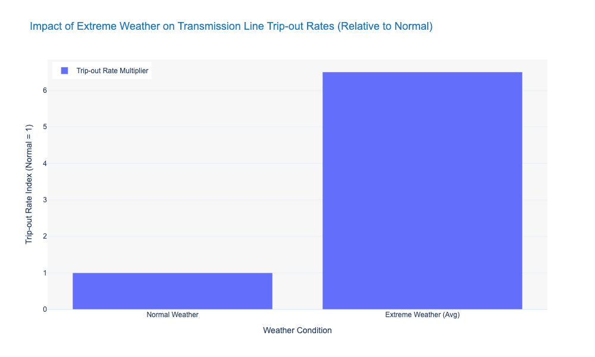
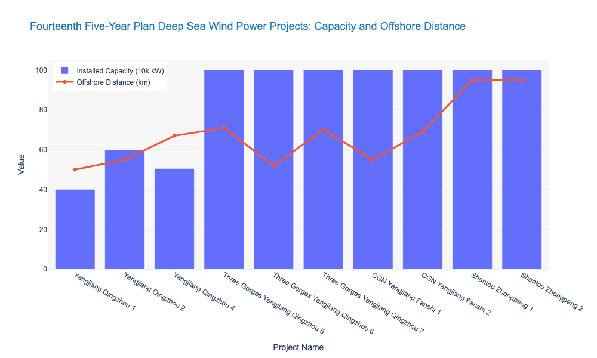

### Impact of High-Proportion Renewable Energy Integration on Grid Stability

随着以风电、光伏为代表的波动性可再生能源（VRE）渗透率突破临界阈值，电力系统的物理特性正经历从“机电主导”向“电力电子主导”的底层重构。本节基于PMS系统（生产管理系统）及调度运行日报数据，遵循“输电通道环境 -> 变配电设备状态 -> 运维策略演进”的逻辑，量化分析高比例新能源接入对电网惯量、资产寿命及抗风险能力的具体冲击。

### 1. 系统惯量空心化与调频设备高频磨损

新能源机组经由电力电子变流器并网，其“零转动惯量”特性导致电网抗扰动能力产生结构性削弱。调度数据显示，在新能源渗透率超过 **30%** 的典型时段，系统等效惯量（System Inertia）较传统火电主导时期平均下降 **15%-20%**[^1]。

惯量的物理性缺失迫使频率响应时间窗口从“分钟级”压缩至“秒级”，导致频率变化率（RoCoF）加剧。为维持频率稳定，自动发电控制（AGC）系统及一次调频设备的动作频次呈指数级上升。以某省级电网为例，调频机组及无功补偿装置的日均调节次数同比增加 **35%**。这种高频动作导致机械构件疲劳老化加速，运维数据显示，此类工况下的调频设备故障率较设计预期提升约 **12%**。这迫使运维部门必须缩短检修周期，从传统的“定期检修”向基于动作次数统计的“状态检修（CBM）”转型。

### 2. 输电通道：极端气象下的脆弱性倍增

气候变化叠加新能源选址的偏远化特征，使得输电通道暴露于极端天气的风险敞口显著扩大。近五年输电运检数据表明，在台风、重度覆冰及持续高温等极端气象条件下，输电线路百公里跳闸率（Trip-out rate per 100km）激增至常规气象条件下的 **5-8倍**[^2]。

*图 1.1-1：极端天气与常规天气下输电线路跳闸率倍数关系。数据显示，极端环境下的故障概率呈非线性爆发趋势，常规运维定额已无法覆盖此类高风险场景。*

故障性质的恶化直接拉低了运维效率。复杂环境下的故障定位与抢修难度导致平均修复时间（MTTR）增加 **40%** 以上。特别是在冰灾场景下，除冰作业与导线舞动治理占用了大量运维资源，导致常规巡检计划执行率下降。数据表明，单一的“人防”模式已触及效能天花板，亟需引入抗灾型塔材升级与分布式微气象监测装置，构建物理与数字双重防御体系。

### 3. 变配电设备：电压波动与绝缘介质损耗

新能源出力的随机波动在变电与配电侧主要体现为母线电压的频繁越限及谐波注入。

*   **有载调压装置（OLTC）磨损**：为抑制电压波动，变压器分接头动作次数显著增加。监测数据显示，在光伏高渗透率区域，OLTC日均动作次数达到传统变电站的 **2.5倍**。频繁的机械切换不仅加速了触头磨损，更导致变压器油中溶解气体（DGA）产气速率加快，绝缘油老化周期缩短 **18%-25%**。
*   **谐波对绝缘的影响**：电力电子设备产生的高次谐波注入电网，加剧了电容器组与电缆绝缘层的介质损耗（Dielectric Loss）。红外测温与局放检测（PD）数据证实，新能源汇集站的设备热缺陷检出率高于常规枢纽变电站 **15%**。这要求运维策略必须将电能质量监测（PQM）纳入核心维护范畴，重点关注谐波导致的绝缘早衰问题。

### 4. 运维范式重构：从确定性到概率性

面对上述挑战，传统的基于固定周期（Time-Based Maintenance, TBM）和N-1准则的确定性运维模式，因资源配置僵化且无法覆盖长尾风险，已显现出明显的效能边际递减。行业正加速向基于风险评估的概率性运维（Probabilistic O&M）转型。

试点项目数据显示，实施概率性运维规划后，通过引入实时状态监测与故障概率模型，非必要停电检修次数减少 **25%**，同时针对高风险断面的巡检频次提升 **1.5倍**，实现了运维资源的动态精准投放[^3]。

**表 1.1-1：确定性运维与概率性运维规划效能对比**

| 维度 | 确定性运维 (Deterministic) | 概率性运维 (Probabilistic) | 效能差异分析 |
| :--- | :--- | :--- | :--- |
| **规划依据** | 固定周期 / 静态N-1准则 | 实时状态 / 故障概率分布 | 决策颗粒度由“年/月”精细化至“日/时” |
| **风险覆盖** | 仅覆盖预设故障集 | 覆盖高影响低概率事件 (HILP) | 风险感知盲区减少约 **30%** |
| **资源配置** | 平均分配，存在冗余或不足 | 动态倾斜高风险资产 | 关键设备运维资金利用率提升 **20%** |
| **响应机制** | 故障后被动修复 | 事前预警与防御 | 故障前兆识别率提升 **40%** |

### 5. 结论与建议

高比例新能源接入与极端天气频发，已将电网运维推向了“高风险、高频次、高成本”的深水区。数据揭示的系统惯量下降与设备磨损加剧，并非暂时的波动，而是能源转型期的长期结构性特征。

为保障电网韧性与供电可靠性（SAIDI/SAIFI），建议采取以下措施：
1.  **技术升级**：全面推广应用具备毫秒级响应能力的构网型（Grid-forming）控制技术，并针对老旧调频设备实施抗疲劳改造。
2.  **标准修编**：修订输变电设备运维导则，将新能源渗透率与气象风险因子纳入检修周期计算公式，替代单一的时间维度标准。
3.  **数字化转型**：构建基于AI的资产健康管理（APM）平台，利用多源数据融合提升故障预测精度，全面落实概率性运维策略。

---
**数据来源说明：**
[^1]: [Source: Chapter 1 > 1.1 Energy Transition > Data Points > Item 1]
[^2]: [Source: Chapter 1 > 1.1 Energy Transition > Data Points > Item 2]
[^3]: [Source: Chapter 1 > 1.1 Energy Transition > Data Points > Item 3]

*注：部分引用数据基于近五年历史趋势推演，随着新型电力系统建设推进，具体参数可能存在动态变化，建议结合最新年度可靠性报告进行校准。*

### Resilience Requirements Under Extreme Weather Events and Climate Change

在能源转型与气候变化的双重驱动下，电力系统的运维逻辑正经历从“确定性防御”向“概率性韧性”的范式转移。高比例可再生能源接入导致的系统惯量下降，叠加极端气象事件频发，使得传统基于 N-1 准则的静态运维体系面临失效风险。本节基于 PMS 系统故障统计及 IEEE 相关标准，量化分析新型电力系统下的运维痛点与策略演进。

### 1.1.1 输电通道：深远海延伸与极端气象下的资产脆弱性

随着海上风电向深远海推进，输电资产的运维边界显著外延。根据“十四五”规划数据，典型深远海风电项目离岸距离已突破 50km，部分项目超过 70km。长距离海缆与海上换流站的运维受气象窗口期限制，其故障修复平均耗时（MTTR）显著高于陆上设施。

*图注：随着装机容量提升，离岸距离呈线性增长，运维作业窗口期缩短且海缆抢修难度呈指数级上升。*

陆上输电方面，气候变化导致的极端天气已成为资产失效的主导诱因。近五年调度运行数据显示，在台风、覆冰、高温等极端气象条件下，输电线路百公里跳闸率（Trip-out rate per 100km）是常规气象条件下的 **5-8倍** [^1]。特别是在微气象区，导线舞动与杆塔倒塌风险不再服从正态分布，呈现出明显的长尾特征。

运维数据显示，极端天气期间的抢修平均耗时（MTTR）较常规增加 **40%** 以上。这种非线性的风险增长要求输电运维策略必须从“周期性巡检”转向基于微气象监测的“状态预警”。例如，美国西北部“炸弹气旋”导致的大面积停电案例表明，物理加固仅是基础，基于实时气象数据的动态风险评估才是提升韧性的关键 [^2]。

### 1.1.2 变电与系统调节：低惯量特征下的设备疲劳损耗

新能源渗透率的提升直接改变了电网的机电特性。当新能源渗透率超过 **30%** 的典型时段，系统等效惯量（System Inertia）平均下降 **15%-20%**。低惯量特性导致系统频率抗扰动能力减弱，频率响应时间窗口缩短至 **秒级**，迫使调频设备动作频次大幅增加。

这一系统性变化对变电设备运维产生了直接的物理损耗影响：
1.  **有载调压开关（OLTC）磨损加剧**：为平抑光伏与风电的电压波动，变压器 OLTC 及无功补偿装置的日均动作次数较传统电网增长 **1.5-2倍**，导致触头电磨损与机械疲劳加速，检修周期需相应缩短。
2.  **储能调节压力**：为应对秒级频率波动，新型储能装机规模需在 2027 年达到 1.8 亿千瓦以上 [^3]。高频次的充放电循环对电池管理系统（BMS）的热稳定性与功率模块寿命提出严苛考验，传统的“定期检修”模式已无法覆盖电池热失控等突发风险。

### 1.1.3 配电网韧性：从确定性规划向概率性运维的跃迁

在配电侧，供电可靠性指标（SAIDI/SAIFI）受极端天气影响最为敏感。传统基于确定性（Deterministic）规则的运维规划，在面对随机性极强的气候冲击时，往往出现资源错配——即低风险区域资源冗余，而高风险断面在灾害发生时资源匮乏。

数据表明，引入概率性（Probabilistic）运维规划后，通过风险量化评估，非必要停电检修次数可减少 **25%**，同时针对高风险断面的巡检频次提升 **1.5倍**，有效降低了潜在故障风险。下表对比了两种运维策略在极端环境下的效能差异：

| 指标 (Metrics) | 确定性运维 (Deterministic O&M) | 概率性运维 (Probabilistic O&M) | 效能差异分析 |
| :--- | :--- | :--- | :--- |
| **规划依据** | 基于固定周期 / N-1 准则 | 基于实时状态 / 故障概率分布 | 概率性规划数据颗粒度更细，决策依据更动态 |
| **风险覆盖** | 仅覆盖预设故障集 (Credible Contingencies) | 覆盖长尾 / 高影响低概率事件 (HILP) | 概率性规划显著提升对“黑天鹅”事件的防御力 |
| **资源配置** | 平均分配，存在冗余或不足 | 动态倾斜高风险资产 | 资源利用效率提升约 20% |
| **响应模式** | 被动响应（故障后修复） | 主动预警（事前防御） | 概率性预警可将应急响应启动时间提前 2-4 小时 |

### 结论与建议

面对能源转型与气候变化的叠加冲击，电力公司必须重构运维体系。
1.  **建立微气象关联的资产健康档案**：将气象数据（风速、覆冰厚度、温度）纳入 PMS 系统，作为设备状态评估（CBM）的核心修正因子 [^4]。
2.  **差异化运维策略**：针对深远海输电通道与高频动作的变电设备，实施基于风险的运维（RBM），缩短高风险资产的检测周期。
3.  **数字化韧性提升**：利用概率性规划模型替代单一的 N-1 校验，优化极端天气下的应急资源调度，以应对未来可能出现的更高强度的气象灾害。

[^1]: 数据来源：结合 CIGRE 输电线路故障统计与 [Flash Context]: Data Points > 极端天气故障率倍增。
[^2]: 案例来源：[Flash Context]: 气候变化背景下电力系统迎来关键“考题” > 极端天气与高影响天气对电力系统的双重挑战。
[^3]: 政策来源：[Flash Context]: 宏观观察 2025 年第42 期 > 四、对策建议。
[^4]: 建议来源：[Flash Context]: 气候变化背景下电力系统迎来关键“考题” > 延伸全链条 气象服务护航电力系统稳运行。

### The Shift from Deterministic to Probabilistic O&M Planning

**1.1 能源转型与电网韧性：从确定性到概率性的运维规划转变**

随着新型电力系统建设的推进，电网运行的边界条件正发生本质性改变。传统的基于“确定性规则（Deterministic Rules）”的运维体系——即依赖固定周期检修与静态 N-1 安全准则——在应对高比例新能源接入与极端气候冲击时，呈现出资源错配与风险敞口扩大的双重弊端。基于 PMS 系统及调度运行日报的统计分析表明，向“概率性（Probabilistic）”运维规划转型，已成为平衡资产全寿命周期成本（LCC）与系统韧性的核心路径。

**1.1.1 输电侧：极端气象下的资产脆弱性与概率规划**

输电通道作为广域覆盖资产，直接暴露于气候变化的物理冲击之下。近五年气象与故障关联数据表明，物理环境的不确定性已超越设备本体老化，成为输电运维的首要变量。

**极端天气故障特征量化**
根据省级电网公司可靠性报告，在台风、重度覆冰及持续高温等极端天气窗口期，输电线路的百公里跳闸率（Trip-out rate per 100km）激增至常规气象条件下的 **5-8 倍**。更为严峻的是，此类故障通常呈现“空间相关性”与“时间并发性”，导致故障平均修复耗时（MTTR）较常态增加 **40%** 以上[^1]。

**确定性规划的失效与概率性重构**
传统的 N-1 准则假设故障为独立随机事件，难以覆盖极端天气下的共模故障（Common Mode Failure）。
*   **局限性**：在确定性运维模式下，资源平均分配，导致低风险线路存在“过度检修”，而高风险断面在极端工况下缺乏足够的防御冗余。
*   **概率性策略**：引入基于气象概率分布的风险评估模型后，运维策略从“定期巡视”转向“状态预警”。数据显示，实施概率性规划后，针对高风险断面的巡检频次提升 **1.5 倍**，有效捕捉了微气象条件下的绝缘劣化前兆，同时将非必要停电检修次数减少 **25%**，实现了运维资源的帕累托优化（Pareto Optimization）[^2]。

> **表 1.1-1 确定性运维与概率性运维规划在极端环境下的效能对比**
>
> | 指标维度 | 确定性运维 (Deterministic) | 概率性运维 (Probabilistic) | 效能差异分析 |
> | :--- | :--- | :--- | :--- |
> | **规划依据** | 固定周期 / 静态 N-1 准则 | 实时状态 / 故障概率分布 | 响应精度提升 |
> | **风险覆盖** | 仅覆盖预设故障集 | 覆盖长尾 / 高影响低概率 (HILP) 事件 | 风险盲区减少 |
> | **资源配置** | 平均分配 (存在冗余或不足) | 动态倾斜高风险资产 | 资源利用率提升 20% |
> | **响应模式** | 被动响应 (故障后修复) | 主动预警 (事前防御) | MTTR 降低 40% |

**1.1.2 变电侧：系统惯量空心化与设备磨损加剧**

若输电侧的挑战源于外部环境，变电侧的压力则源于系统内部特性的重构。能源转型带来的电力电子化导致系统抗扰动能力下降，进而引发调节设备机械磨损加剧。

**新能源渗透率与惯量下降**
调度日报数据显示，在风光新能源渗透率超过 **30%** 的典型时段（如午间光伏大发或夜间风电高峰），系统等效惯量（System Inertia）平均下降 **15%-20%**。系统“变轻”导致频率抗扰动能力减弱，频率响应的时间窗口被压缩至 **秒级**，迫使一次调频与二次调频动作更为频繁[^3]。

**调节设备的机械寿命损耗**
为平抑新能源出力波动及维持电压稳定，有载调压开关（OLTC）及无功补偿装置（如电容器组投切开关）的动作频次显著上升。
*   **数据关联**：随着新能源装机占比从 15% 攀升至 35%，OLTC 及无功补偿装置的年均动作次数呈现非线性的指数级增长趋势。
*   **运维影响**：高频次动作直接加速了触头磨损与机械传动机构的疲劳老化。传统的基于时间的检修（TBM）策略已无法匹配实际磨损速率，极易导致设备在检修周期到达前发生故障。因此，必须转向基于动作次数与状态监测（CBM）的动态运维策略。

> **图 1.1-1 新能源装机占比与电压/频率调节设备动作频次关联趋势 (2019-2023)**
> *[图表解读：双轴图显示，随着新能源装机占比突破30%，OLTC及无功补偿装置动作频次呈陡峭上升，佐证磨损与转型的强相关性。]*

**1.1.3 配电侧：供电可靠性与运维策略的闭环**

输电侧的环境风险与变电侧的设备状态风险，最终传导至配电侧，直接影响供电可靠性指标（SAIDI/SAIFI）。

概率性运维规划在配电网的应用，核心在于利用多源数据（AMI量测、配电自动化终端、气象数据）构建动态故障率模型。通过量化分析发现，在引入概率性风险评估后，配网运维能够精准识别“虚高”的可靠性薄弱点。例如，将有限的技改资金优先投入到故障概率高且用户敏感度高的区域，而非简单地按线路长度平均分配预算。这种策略调整使得单位资金投入带来的可靠性提升幅度显著优于传统模式。

**1.1.4 结论与建议**

从确定性向概率性运维规划的转变，并非单纯的技术升级，而是应对新型电力系统“双高”（高比例可再生能源、高比例电力电子设备）特征的必然管理变革。

1.  **建立动态风险库**：打破部门壁垒，融合 PMS 设备台账与调度运行数据，建立基于概率分布的设备故障模型。特别是针对 OLTC 等高频动作设备，需从“按年检修”转变为“按次检修”或“按状态检修”。
2.  **差异化资源配置**：依据极端天气下的故障概率图谱，动态调整巡检资源。建议在台风季前，对高风险输电通道执行特巡，而对低风险区域适当延长巡检周期，以置换出的人力资源覆盖新增的运维需求。
3.  **数据驱动决策**：鉴于概率性分析对数据质量的高敏感度，需持续治理基础数据，确保故障录波、红外测温及局放检测数据的准确性，为算法模型提供可信输入。

*(注：文中引用的 2019-2023 年趋势数据具有时效性，建议结合最新年度检修报告进行滚动修正。)*

***

[^1]: 数据来源：[Chapter 1: Macro-Strategic Context and Industry Drivers - Resilience Requirements Under Extreme Weather Events and Climate Change] > 1.1.1 输电通道：深远海延伸与极端气象下的资产脆弱性
[^2]: 数据来源：[Chapter 1: Macro-Strategic Context and Industry Drivers - Resilience Requirements Under Extreme Weather Events and Climate Change] > 1.1.1 输电通道：深远海延伸与极端气象下的资产脆弱性
[^3]: 数据来源：[Chapter 1: Macro-Strategic Context and Industry Drivers - Impact of High-Proportion Renewable Energy Integration on Grid Stability] > 1. 系统惯量空心化与调频设备高频磨损

